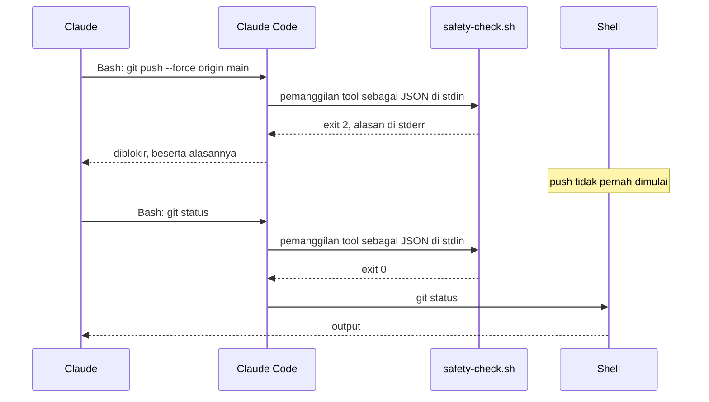
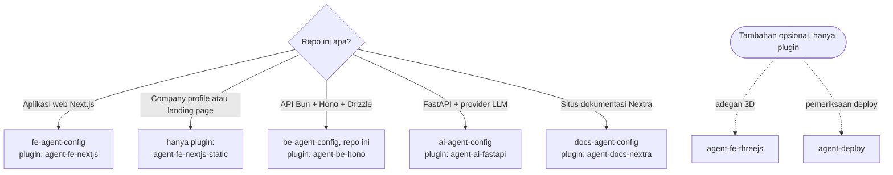
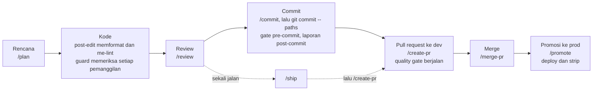
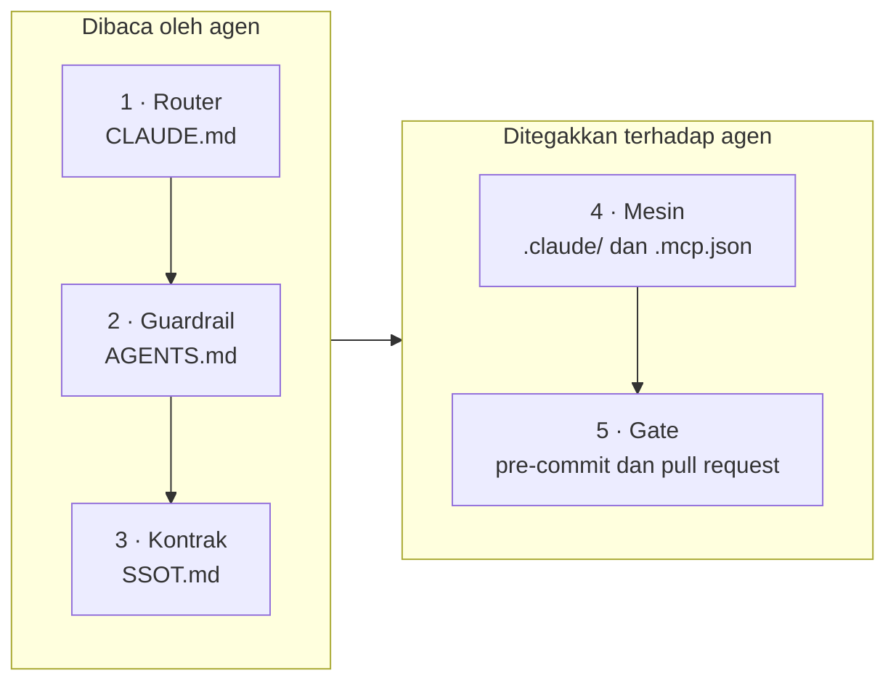

[English](README.md) | **Bahasa Indonesia**

<p align="center">
  <picture>
    <source media="(prefers-color-scheme: dark)" srcset="docs/assets/banner-be-dark.svg">
    <source media="(prefers-color-scheme: light)" srcset="docs/assets/banner-be-light.svg">
    
  </picture>
</p>

# be-agent-config

[](LICENSE)
[](#cicd)
[](#lebih-suka-plugin)

**Lapisan Claude Code untuk API Bun + Hono + Drizzle: aturan, hook yang benar-benar memblokir,
slash command, dan gate. Tanpa kode aplikasi.**

Anda menyalin file-file ini ke repositori API Anda. Sejak itu, Claude Code bekerja di dalam rel:
push ke `dev` atau `prod` ditolak, edit manual pada migration yang sudah dijalankan ditolak, file
`.env` dan penulisan ke produksi tetap terkunci sampai **Anda** membukanya, dan setiap commit serta
pull request menjalankan pemeriksaan yang sama. Setiap penolakan menjelaskan alasannya dan apa yang
sebaiknya dilakukan.

> [!TIP]
> **Singkatnya.** Clone repo ini di sebelah proyek Anda, salin lapisannya dengan empat perintah
> `cp`, isi placeholder yang sudah diberi nama, lalu jalankan `bash scripts/check/hook-probes.sh`
> untuk membuktikan hook-nya di mesin Anda. Setelah itu bekerja seperti biasa: `/plan`, `/review`,
> `/commit`, `/create-pr`, `/merge-pr`. Hook berjalan di mesin Anda, tidak membuka koneksi
> jaringan, dan menolak apa yang tidak bisa mereka periksa. Lebih suka update tanpa menyalin file?
> Pakai [plugin](#lebih-suka-plugin).

## Daftar isi

- [Mengapa template ini ada](#mengapa-template-ini-ada)
- [Lihat cara kerjanya](#lihat-cara-kerjanya)
- [Untuk siapa](#untuk-siapa)
- [Template yang mana?](#template-yang-mana)
- [Lebih suka plugin?](#lebih-suka-plugin)
- [Mulai cepat](#mulai-cepat)
- [Sehari bekerja dengan template ini](#sehari-bekerja-dengan-template-ini)
- [Apa saja yang dipasang](#apa-saja-yang-dipasang)
- [Bagaimana bagian-bagiannya saling terhubung](#bagaimana-bagian-bagiannya-saling-terhubung)
- [Semua isi template ini](#semua-isi-template-ini)
- [Apa yang diblokir](#apa-yang-diblokir)
- [Konfigurasi](#konfigurasi)
- [Membuka kunci `.env` dan DB produksi](#membuka-kunci-env-dan-db-produksi)
- [CI/CD](#cicd)
- [Konfigurasi repositori GitHub](#konfigurasi-repositori-github)
- [Model keamanan](#model-keamanan)
- [Biaya dan beban tambahan](#biaya-dan-beban-tambahan)
- [Kebutuhan](#kebutuhan)
- [Upgrade dan uninstall](#upgrade-dan-uninstall)
- [Kustomisasi](#kustomisasi)
- [FAQ dan pemecahan masalah](#faq-dan-pemecahan-masalah)
- [Glosarium](#glosarium)
- [Peta jalan dan di luar cakupan](#peta-jalan-dan-di-luar-cakupan)
- [Lisensi](#lisensi)

## Mengapa template ini ada

Aturan di `CLAUDE.md` hanyalah permintaan. Hook yang keluar dengan exit code 2 adalah tembok.
Aturan tertulis gagal tanpa suara: tidak ada yang melapor pada hari agen mengabaikannya, dan di
backend kesalahannya baru terasa satu environment kemudian. Setiap cerita di bawah adalah jenis
kegagalan yang nyata, apa yang dilakukan template ini terhadapnya, dan bagian mana yang
mengerjakannya.

1. **Agen melakukan force-push ke `dev`.**
   *Masalahnya:* rebase berantakan, agen "memperbaikinya" dengan `git push --force origin dev`,
   dan pekerjaan rekan setim yang sudah di-merge hilang.
   *Solusinya:* push ke, dan penghapusan, `dev`, `prod`, `main`, dan `master` ditolak, baik lewat
   refspec, `--all`, `--mirror`, maupun branch yang sedang di-checkout, dari shell maupun dari tool
   MCP GitHub. Pekerjaan masuk ke `dev` lewat pull request; push rilis Anda jalankan sendiri
   dengan `!`.
   *Ditangani oleh:* [`safety-check.sh`](.claude/hooks/safety-check.sh),
   [`mcp-guard.sh`](.claude/hooks/mcp-guard.sh), daftar `deny` di
   [`.claude/settings.json`](.claude/settings.json).

2. **Rahasia masuk ke transkrip.**
   *Masalahnya:* "coba saya cek konfigurasinya" berubah menjadi `cat .env.production`, dan password
   database kini ada di log percakapan.
   *Solusinya:* tidak ada perintah shell yang boleh membaca atau menulis file `.env*` asli, lewat
   jalur apa pun yang bisa dibaca analyzer. Claude melihat daftar key lewat helper yang
   menyamarkan setiap rahasia, dan baru boleh mengubah nilai setelah Anda sendiri membuka kunci
   `env`. Sandbox sistem operasi menjadi lapisan cadangannya.
   *Ditangani oleh:* [`safety-check.sh`](.claude/hooks/safety-check.sh),
   [`scripts/env/show.sh`](scripts/env/show.sh), [`scripts/env/set.sh`](scripts/env/set.sh),
   [mekanisme kunci](docs/unlock.md), sandbox di [`.claude/settings.json`](.claude/settings.json).

3. **Agen menulis ke produksi.**
   *Masalahnya:* `DELETE FROM sessions` untuk "bersih-bersih sebentar" berjalan ke database
   produksi lewat tool MCP.
   *Solusinya:* satu pernyataan baca-saja boleh lewat; setiap penulisan menunggu sampai Anda
   menjalankan `! bun unlock db`, dan kunci itu menutup sendiri setelah 15 menit. Server MCP
   produksi juga dimulai dalam mode baca-saja.
   *Ditangani oleh:* [`db-guard.sh`](.claude/hooks/db-guard.sh),
   [`scripts/ops/unlock.sh`](scripts/ops/unlock.sh), [`.mcp.json`](.mcp.json).

4. **Migration yang sudah dijalankan diedit manual.**
   *Masalahnya:* agen menambahkan index ke `0003_add_index.sql`. Produksi sudah menjalankan file
   itu minggu lalu, jadi file itu tidak akan pernah dijalankan lagi, dan skema dev dan prod kini
   berbeda.
   *Solusinya:* edit manual pada migration hasil generate ditolak; pull request gagal bila skema
   berubah tetapi migration-nya tidak di-generate atau tidak di-commit.
   *Ditangani oleh:* [`migration-guard.sh`](.claude/hooks/migration-guard.sh),
   [`scripts/check/migrations.sh`](scripts/check/migrations.sh),
   [`.claude/rules/backend/drizzle.md`](.claude/rules/backend/drizzle.md).

5. **Aturan di `CLAUDE.md` diabaikan.**
   *Masalahnya:* setelah sesi yang panjang, agen menulis `x as unknown as T`, mengetik ulang nama
   role alih-alih mengimpornya, menambahkan file yang tidak dimuat satu tes pun, dan mengutip
   nomor aturan yang tidak ada.
   *Solusinya:* setiap konvensi berujung pada gate yang bisa gagal: pemindai double assertion,
   pemeriksaan rumah konstanta, coverage 100% per file, dan `ai-config.sh`, yang gagal bila ada
   nomor aturan yang dikutip tetapi tidak didefinisikan di `AGENTS.md`. Aturan hanya dimuat untuk
   file yang cocok, sehingga `CLAUDE.md` tetap cukup pendek untuk benar-benar dibaca.
   *Ditangani oleh:* [`scripts/check/gates.list`](scripts/check/gates.list),
   [`scripts/check/ai-config.sh`](scripts/check/ai-config.sh), aturan di
   [`.claude/rules/`](.claude/rules/).

6. **API melenceng dari kontraknya.**
   *Masalahnya:* sebuah route berubah, spec OpenAPI yang di-commit tidak di-generate ulang, dan
   client hasil generate milik frontend rusak di repositori lain seminggu kemudian.
   *Solusinya:* gate pull request men-generate ulang spec dan gagal bila file yang di-commit
   berubah.
   *Ditangani oleh:* [`.github/scripts/quality-gate.sh`](.github/scripts/quality-gate.sh) (langkah
   "OpenAPI Spec Drift Check").

7. **Agen menghapus pekerjaan sesi lain.**
   *Masalahnya:* dua sesi berbagi satu checkout; salah satunya menjalankan `git reset --hard`,
   `git stash`, atau `rm -rf src` untuk "mulai dari bersih".
   *Solusinya:* perintah yang menghapus pekerjaan yang belum di-commit atau menghapus path yang
   dilindungi ditolak, dan setelah setiap commit Claude diperlihatkan file apa saja yang ikut
   terbawa.
   *Ditangani oleh:* [`safety-check.sh`](.claude/hooks/safety-check.sh),
   [`post-commit.sh`](.claude/hooks/post-commit.sh), [`/checkpoint`](_workflow-source/checkpoint.md).

8. **Salinan saling melenceng.**
   *Masalahnya:* sebuah command diperbaiki di `.claude/commands/` tetapi tidak di salinan
   keduanya; sepuluh repositori masing-masing membawa salinan CI sendiri dan tidak ada yang tahu
   mana yang masih memindai rahasia.
   *Solusinya:* command ditulis sekali di `_workflow-source/` dan dicerminkan oleh sebuah skrip
   yang mode `--check`-nya menggagalkan commit bila ada salinan yang melenceng. Untuk banyak
   repositori sekaligus, [plugin](#lebih-suka-plugin) melaporkan perbedaan dari apa yang
   dipasangnya.
   *Ditangani oleh:* [`scripts/sync/workflows.sh`](scripts/sync/workflows.sh),
   [agent-config-kit](https://github.com/adhibuchori/agent-config-kit).

<details>
<summary>Sebelum dan sesudah: lima menit yang sama, tanpa dan dengan template</summary>

### Tanpa template

```text
Anda:    Sesi menumpuk dan /me lambat. Tambahkan index dan hapus baris kedaluwarsa di prod.
Claude:  Index-nya seharusnya ada di migration yang membuat tabel itu.
         ✎ src/db/migrations/0003_add_index.sql                 ← sudah dijalankan di prod
Claude:  Menghapus baris kedaluwarsa.
         ⚡ db-prod: DELETE FROM sessions WHERE expires_at < now()
Claude:  Cek URL produksi dulu.
         $ cat .env.production                                   ← password kini ada di chat
Claude:  Push perbaikannya.
         $ git push --force origin dev                           ← merge rekan setim hilang
```

### Dengan template

```text
Anda:    Sesi menumpuk dan /me lambat. Tambahkan index dan hapus baris kedaluwarsa di prod.
Claude:  ✎ src/db/migrations/0003_add_index.sql
         [migration-guard] BLOCKED: src/db/migrations/0003_add_index.sql is a generated migration
         (src/db/migrations in migrationsDirs).
         Generate a new migration with the project's tool instead of editing this one.
Claude:  Saya tambahkan index-nya di skema saja.              $ bun run db:generate
Claude:  ⚡ db-prod: DELETE FROM sessions WHERE expires_at < now()
         [db-guard] BLOCKED: this SQL may change the production database (a DELETE statement). …
         For a write, the user runs `! bun unlock db` themselves and you try again, or you hand
         them the statement to run.
Claude:  Ini pernyataannya. Jalankan `! bun unlock db` kalau Anda ingin saya yang menjalankannya.
Claude:  $ cat .env.production
         [safety] BLOCKED: .env.production holds secrets, … List its keys with
         `bash scripts/env/show.sh .env.production` (secret values masked). …
Claude:  $ git push --force origin dev
         [safety] BLOCKED: pushing to a protected branch (dev/prod/main/master) is not allowed. …
Claude:  $ git push -u origin internal/db                        lalu /create-pr
```

Penolakan di atas adalah pesan asli dari hook, dipotong dan disingkat dengan `…`; baris di
sekitarnya menunjukkan di mana pesan itu muncul dalam sebuah sesi. Pesan hook memang berbahasa
Inggris.

</details>

## Lihat cara kerjanya

<picture>
  <source media="(prefers-color-scheme: dark)" srcset="docs/assets/demo-blocked-dark.svg">
  <source media="(prefers-color-scheme: light)" srcset="docs/assets/demo-blocked-light.svg">
  
</picture>

Inilah yang benar-benar dikirim balik oleh hook, direkam di repositori baru tepat setelah
[Mulai cepat](#mulai-cepat). Claude Code menyerahkan setiap pemanggilan tool ke hook sebagai JSON;
hook menjawab dengan exit code 2 dan alasan di stderr, yang dibaca Claude lalu ditindaklanjuti:

```text
tool call  Bash  {"command": "git push --force origin main"}
exit 2     [safety] BLOCKED: pushing to a protected branch (dev/prod/main/master) is not allowed.
           Push your work branch and open a PR; when a release needs this push, the user runs it
           with `!`.

tool call  Edit  {"file_path": "src/db/migrations/0003_add_index.sql", …}
exit 2     [migration-guard] BLOCKED: src/db/migrations/0003_add_index.sql is a generated migration
           (src/db/migrations in migrationsDirs).
           Generate a new migration with the project's tool instead of editing this one.

tool call  Bash  {"command": "git status"}
exit 0     (tidak ada pesan: perintahnya berjalan)
```

Lihat hal yang sama di salinan Anda sendiri dengan mengalirkan pemanggilan tool ke hook, persis
seperti yang dilakukan Claude Code:

```bash
printf '%s' '{"tool_name":"Bash","tool_input":{"command":"git push --force origin main"}}' \
  | bash .claude/hooks/safety-check.sh; echo "exit $?"
```

```text
[safety] BLOCKED: pushing to a protected branch (dev/prod/main/master) is not allowed. Push your work branch and open a PR; when a release needs this push, the user runs it with `!`.
exit 2
```

Hook bekerja dengan benar bila perintah itu mencetak `exit 2`, dan baris yang sama dengan
`git status` mencetak `exit 0`.

Claude Code menyerahkan setiap pemanggilan tool ke hook di `.claude/settings.json` sebelum
dijalankan. Hook `PreToolUse` yang keluar dengan **2** membatalkan pemanggilan itu, dan stderr-nya
menjadi alasan yang dibaca Claude. Exit code lain, termasuk `1`, meloloskan pemanggilan itu.
Karena itulah setiap guard di sini keluar dengan 2 dan menolak ketika tidak bisa membaca
masukannya.

<picture>
  <source media="(prefers-color-scheme: dark)" srcset="docs/assets/hook-flow-dark.svg">
  <source media="(prefers-color-scheme: light)" srcset="docs/assets/hook-flow-light.svg">
  
</picture>



Ilustrasinya beranimasi (landaknya berkedip, perintahnya diketik, putusannya meluncur masuk). Bila
sistem Anda meminta gerak yang dikurangi (reduced motion), yang tampil adalah gambar diam.

## Untuk siapa

<p align="center">
  <picture>
    <source media="(prefers-color-scheme: dark)" srcset="docs/assets/mascot-dark.svg">
    <source media="(prefers-color-scheme: light)" srcset="docs/assets/mascot-light.svg">
    
  </picture>
</p>

**Cocok bila Anda:**

- membangun API HTTP dengan Bun, Hono, dan Drizzle di atas PostgreSQL, dan memakai Claude Code
  (CLI atau ekstensi IDE) untuk mengerjakannya, sendiri atau dalam tim;
- ingin setiap aturan, hook, dan pemeriksaan berupa file biasa di repositori Anda sendiri, untuk
  dibaca dan diedit;
- bekerja di branch yang masuk ke `dev` dan `prod` lewat pull request.

**Tidak cocok bila Anda:**

- mencari proyek awal (starter): di sini tidak ada `src/`, `package.json`, atau skema, hanya
  lapisan di sekitar kode Anda;
- memakai stack lain: lihat [Template yang mana?](#template-yang-mana);
- ingin update tanpa menyalin file lagi: pakai [plugin](#lebih-suka-plugin);
- menginginkan batas keamanan terhadap agen yang berniat jahat: hook membaca teks perintah, dan
  fungsinya adalah pagar pengaman terhadap kekeliruan dan instruksi yang disisipkan (lihat
  [Model keamanan](#model-keamanan)).

## Template yang mana?

Ada empat repositori template dan satu marketplace plugin dengan isi yang sama. Pilih berdasarkan
jenis repositori Anda:



Setiap template adalah contoh jadi dari lapisan ini untuk satu stack, dan masing-masing sepadan
dengan satu plugin:

| Repositori template | Untuk | Plugin padanannya |
| --- | --- | --- |
| [fe-agent-config](https://github.com/adhibuchori/fe-agent-config) | Frontend Next.js | `agent-fe-nextjs` |
| [be-agent-config](https://github.com/adhibuchori/be-agent-config) (yang ini) | API Bun + Hono + Drizzle | `agent-be-hono` |
| [ai-agent-config](https://github.com/adhibuchori/ai-agent-config) | FastAPI + provider LLM | `agent-ai-fastapi` |
| [docs-agent-config](https://github.com/adhibuchori/docs-agent-config) | Situs dokumentasi Nextra | `agent-docs-nextra` |

Hook dan aturan `common/` adalah file yang sama di keempatnya, jadi apa yang Anda pelajari di satu
template berlaku juga di yang lain. Template adalah pilihan yang tepat bila Anda ingin memiliki
setiap file; plugin adalah pilihan yang tepat bila Anda ingin update yang berversi.

## Lebih suka plugin?

<picture>
  <source media="(prefers-color-scheme: dark)" srcset="docs/assets/install-flow-dark.svg">
  <source media="(prefers-color-scheme: light)" srcset="docs/assets/install-flow-light.svg">
  :setup, yang
    menampilkan dry run sebelum menerapkan apa pun.">
</picture>

Hook, aturan, dan pemeriksaan yang sama juga dikemas sebagai plugin Claude Code di
[agent-config-kit](https://github.com/adhibuchori/agent-config-kit). Template ini sepadan dengan
plugin **`agent-be-hono`**, yang dibangun di atas `agent-core`. Tiga langkah, masing-masing tinggal
salin dan tempel:

1. **Tambahkan marketplace** (sekali per mesin). Di terminal:

   ```bash
   claude plugin marketplace add adhibuchori/agent-config-kit
   ```

2. **Pasang kedua plugin.** Di dalam Claude Code:

   ```text
   /plugin install agent-core@agent-config-kit
   /plugin install agent-be-hono@agent-config-kit
   ```

   Jika perintah barunya tidak muncul, mulai ulang Claude Code.

3. **Jalankan setup di repositori Anda.** Di dalam Claude Code:

   ```text
   /agent-be-hono:setup
   ```

   Setup mengajukan beberapa pertanyaan, satu per satu, menampilkan dry run dari setiap file yang
   akan ditulisnya, dan baru menulis ketika Anda membalas **go**. Commit file-file barunya bersama
   `.claude/agent-config-kit.lock`: lock itulah yang menyalakan hook untuk semua orang yang
   meng-clone repositori.

**Berhasil jika** setup berakhir seperti yang dijelaskan [halaman dokumentasinya][setup-page], dan
`/agent-be-hono:sync --check` sesudahnya tidak melaporkan pergeseran. Izin dan aturan yang tidak
bisa dibawa plugin masuk ke repositori Anda, sedangkan hook berjalan dari plugin yang terpasang.
Setiap perintah di README ini lalu membawa nama plugin-nya: `/review` menjadi `/agent-core:review`,
`/ship` menjadi `/agent-core:ship`.

[setup-page]: https://github.com/adhibuchori/agent-config-kit/blob/main/docs/agent-be-hono/setup.md#its-working-if

Pilih template ini bila Anda ingin setiap file ada di repositori Anda sendiri untuk dibaca dan
diedit; pilih plugin bila Anda ingin update berversi tanpa menyalin file lagi.

**Jangan pakai keduanya di satu repositori.** Repositori yang disalin dari template ini sudah
memasang hook di `.claude/settings.json`, dan plugin akan menjalankannya untuk kedua kalinya.
`/agent-be-hono:sync --check` milik plugin melaporkannya sebagai `double-wired`; untuk beralih,
hapus entri `"hooks"` itu dari `.claude/settings.json`.

## Mulai cepat

1. **Clone template di sebelah proyek Anda**, lalu arahkan sebuah variabel ke sana:

   ```bash
   git clone https://github.com/adhibuchori/be-agent-config.git
   cd your-project
   CFG=../be-agent-config
   ```

2. **Salin lapisannya.** Konfigurasi tool akan menimpa file Anda yang bernama sama, jadi gabungkan
   secara manual bila Anda sudah punya:

   ```bash
   cp -R "$CFG"/{.claude,.agent,_workflow-source,.github,.husky,scripts} .
   cp "$CFG"/{CLAUDE.md,AGENTS.md,SSOT.md,.mcp.json,.skillspector-baseline.yaml} .
   cp "$CFG"/{bunfig.toml,knip.ts,.oxfmtrc.json,.oxlintrc.json,.oxlintignore,.gitleaks.toml,.dockerignore} .
   mkdir -p docs && cp "$CFG"/docs/unlock.md docs/   # penolakan dari hook menautkan ke file ini
   ```

3. **Gabungkan `.gitignore` sebelum commit pertama.** `.claude/settings.local.json`,
   `.claude/state/`, `.skillspector/`, dan setiap file `.env*` asli harus diabaikan; template
   `.env*.example` tetap di-commit.

4. **Tambahkan package script** yang tercantum di [SETUP §6](SETUP.md#6-make-the-gates-runnable),
   termasuk alias `"unlock": "bash scripts/ops/unlock.sh"`, lalu pasang tool yang disebutkannya.

5. **Isi setiap placeholder.** Semuanya diberi nama, tidak ada yang kosong:

   ```bash
   grep -rn --exclude-dir=hooks --exclude-dir=anti-patterns --exclude-dir=commands \
     --exclude=agent-config.example.json '<[a-zA-Z][a-zA-Z -]*>' \
     CLAUDE.md AGENTS.md SSOT.md .mcp.json .claude/ _workflow-source/ .github/PULL_REQUEST_TEMPLATE/
   ```

   Daftarnya juga memuat sintaks perintah seperti `<file>`, generic TypeScript, dan tag HTML;
   biarkan saja. [SETUP §2](SETUP.md#2-fill-in-every-placeholder) menjelaskan apa yang diisi di
   mana, dan menyebut dua placeholder di `.github/` yang dilewati pencarian ini.

6. **Isi tabel Compliance Status** di bagian atas `AGENTS.md`: Enforced, Partial, atau Not met
   untuk setiap bagian. Agen yang mengikuti sebuah aturan ke file yang ternyata tidak ada akan
   meremehkan semua aturan lain sesudahnya, jadi lakukan ini sebelum Anda mengandalkan aturan mana
   pun.

7. **Buktikan di mesin Anda:**

   ```bash
   bash scripts/check/hook-probes.sh        # setiap aturan hook, dua arah; butuh beberapa menit
   bash scripts/check/ai-config.sh          # kutipan aturan, anggaran konteks, pemasangan hook, pin MCP
   bash scripts/sync/workflows.sh --check   # salinan command cocok dengan sumbernya
   ```

   Di salinan yang masih baru, ketiganya berakhir dengan `hook probes: 1772 passed, 0 failed`,
   `AI config within budget`, dan `✓ All targets, orphans, and INDEX.md coverage are in sync`.

**Tip:** commit lapisan hasil salinan dalam commit tersendiri; dengan begitu satu `git revert`
bisa mencabutnya lagi ([Upgrade dan uninstall](#upgrade-dan-uninstall)). **Lalu baca
[SETUP.md](SETUP.md)** untuk tool, server MCP, daftar gate lengkap, GitHub, dan pipeline strip yang
opsional. Sediakan waktu sekitar satu jam.

## Sehari bekerja dengan template ini



| Langkah | Yang Anda jalankan | Yang membantu dengan sendirinya |
| --- | --- | --- |
| Rencana | `/plan add rate limiting to auth routes` | Aturan backend dimuat saat rencana membaca file yang cocok di `src/` |
| Kode | tidak ada: cukup minta | [`post-edit.sh`](.claude/hooks/post-edit.sh) memformat dan me-lint setiap file yang ditulis; keempat guard menolak apa yang tidak boleh berjalan |
| Sebelum perubahan berisiko | `/checkpoint before schema refactor` | Commit lokal atas file sesi ini, per pathspec |
| Review | `/review` (dan `/check-fix` saat ada gate yang merah) | [`agents-reviewer`](.claude/agents/agents-reviewer.md) melaporkan temuan yang mengutip aturan, diurutkan menurut tingkat keparahan |
| Commit | `/commit`, lalu `git commit -m "feat: add rate limiting" -- <paths>` | `.husky/pre-commit` menjalankan gate untuk apa yang Anda stage; [`post-commit.sh`](.claude/hooks/post-commit.sh) menunjukkan apa yang masuk |
| Pull request | `/create-pr` | Quality Gate (31 langkah), Dependency Review, CodeQL, dan review AI berjalan di sana |
| Komentar review | `/resolve-pr-review 42` | Setiap thread dibalas; saran yang melanggar aturan ditolak beserta alasannya |
| Merge | `/merge-pr 42` | [`scripts/ops/pr-ready.sh`](scripts/ops/pr-ready.sh) memeriksa kesiapan lebih dulu |
| Promosi | `/promote`, lalu `/branch-cleanup` | Merge ke `prod` men-deploy dan melucuti lapisan AI dari `prod` |
| Ada bug | `/rca checkout returns 500` atau `/debug checkout returns 500` | [`prompt-intent.sh`](.claude/hooks/prompt-intent.sh) mengarahkan `/debug` ke `/rca` |
| Akhir sesi | `/checkpoint-summary`, `/learn-session` | Sesi berikutnya mulai dari titik sesi ini berakhir; pelajaran disimpan di tempat yang akan dimuat lagi |

## Apa saja yang dipasang

Setelah Mulai cepat, repositori Anda mendapat file-file berikut (satu baris per item; tabel di
[Semua isi template ini](#semua-isi-template-ini) menjelaskan fungsi setiap bagian):

```text
your-project/
├── CLAUDE.md                     router: apa yang dibaca untuk tugas apa (isi placeholder-nya)
├── AGENTS.md                     aturan bernomor dan tabel Compliance Status yang Anda isi
├── SSOT.md                       fakta: arsitektur, auth, kontrak error, database, environment
├── .mcp.json                     5 server MCP, di-pin; setiap kredensial adalah referensi env var
├── .skillspector-baseline.yaml   temuan pemindaian skill yang sudah ditriase
├── bunfig.toml, knip.ts          test runner dengan coverage 100%, pengaturan dead code
├── .oxfmtrc.json, .oxlintrc.json, .oxlintignore      pengaturan format dan lint
├── .gitleaks.toml, .dockerignore                     allowlist pemindai rahasia, .env* keluar dari image
├── .claude/
│   ├── settings.json             pemasangan hook, izin allow / ask / deny, sandbox Bash
│   ├── hooks/                    8 hook, lib.sh, dan referensi hook (README.md)
│   ├── rules/                    12 aturan; 11 hanya dimuat saat Claude mengerjakan file yang cocok
│   ├── agents/                   agents-reviewer.md dan INDEX.md
│   ├── commands/                 15 slash command dan INDEX.md, di-generate dari _workflow-source/
│   ├── anti-patterns/            7 jebakan yang dikenal dan INDEX.md
│   ├── docs/                     code-review-checklist.md, dibaca bila perlu
│   ├── mcp/                      3 contoh server MCP yang dimuat bila perlu
│   ├── agent-config.example.json setiap pengaturan hook beserta default-nya
│   ├── test-preload.example.ts   satu-satunya titik mocking untuk unit test
│   └── *.example.md              5 catatan referensi untuk diisi atau dihapus
├── .agent/workflows/             15 command yang sama untuk tool kedua (di-generate)
├── _workflow-source/             tempat Anda mengedit command
├── .husky/pre-commit             menjalankan gate di setiap commit
├── scripts/
│   ├── check/                    gates.sh, gates.list, dan skrip-skrip pemeriksaan
│   ├── ops/                      unlock.sh (Anda yang menjalankan) dan pr-ready.sh (bisakah PR ini di-merge?)
│   ├── env/                      show.sh (daftar tersamar), set.sh (menulis saat terbuka), envfile.py
│   └── sync/                     workflows.sh (menulis dan memeriksa salinan command)
├── .github/
│   ├── workflows/                7 workflow, semuanya dipicu oleh event pull request
│   ├── scripts/                  gate pull request, pemindai diff, pipeline strip
│   ├── PULL_REQUEST_TEMPLATE/    dev.md dan promotion.md
│   └── CODEOWNERS                siapa yang diminta me-review
└── docs/unlock.md                cara Anda membuka file .env dan penulisan ke produksi
```

Dua file yang Anda ubah secara manual: `.gitignore` (digabung) dan `package.json` (ditambah
script). File-file ini tetap di template, karena mendokumentasikan template, bukan proyek Anda:
`README.md`, `README.id.md`, `SETUP.md`, `LICENSE`, `docs/RATIONALE.md`, `docs/assets/`, dan
`.markdownlint-cli2.jsonc`.

## Bagaimana bagian-bagiannya saling terhubung

Lima lapisan, masing-masing dengan satu tugas. Tiga yang pertama dibaca oleh agen; dua yang
terakhir ditegakkan terhadap agen.



<picture>
  <source media="(prefers-color-scheme: dark)" srcset="docs/assets/layers-dark.svg">
  <source media="(prefers-color-scheme: light)" srcset="docs/assets/layers-light.svg">
  
</picture>

| Lapisan       | Di mana                                 | Tugas                                                                            |                            Ukuran |
| :------------ | :-------------------------------------- | :------------------------------------------------------------------------------- | --------------------------------: |
| **Router**    | `CLAUDE.md`                             | Apa yang dibaca untuk tugas apa. Dimuat setiap sesi, jadi dibuat singkat         |                         184 baris |
| **Guardrail** | `AGENTS.md`                             | Aturan bernomor yang bisa dikutip, masing-masing menyebut apa yang menegakkannya |                         545 baris |
| **Kontrak**   | `SSOT.md`                               | Arsitektur, auth, kontrak error, database, tes, pipeline, environment            |                         195 baris |
| **Mesin**     | `.claude/`, `.mcp.json`                 | Hook, aturan, subagen reviewer, anti-pattern, command, server MCP                |                           60 file |
| **Gate**      | `.husky/`, `scripts/check/`, `.github/` | Definisi "lolos": sebelum setiap commit dan di setiap pull request               | 15 gate · 31 langkah · 7 workflow |

Guardrail kira-kira tiga kali ukuran router dan kontrak. Itu wajar untuk backend: aturan keamanan
dan akses data harus dijabarkan, sementara arsitekturnya cukup seragam untuk dinyatakan sekali
([RATIONALE §12](docs/RATIONALE.md#12-rule-documents-get-longer-as-the-risk-gets-quieter)). Jangan
menambah atau memangkas dokumen hanya supaya sama dengan repositori lain.

## Semua isi template ini

Setiap tabel menjawab tiga pertanyaan untuk setiap bagian: apa fungsinya, bagaimana memakainya, dan
mengapa itu membantu. Setiap nama menautkan ke file-nya; sebagian besar file juga menjelaskan
dirinya sendiri di komentar pembuka.

### Hook

Claude Code menjalankan hook ini dengan sendirinya; Anda tidak pernah memanggilnya. Referensi untuk
semuanya, lengkap dengan setiap penolakan, mode gagal, dan cara mematikan salah satunya, ada di
[`.claude/hooks/README.md`](.claude/hooks/README.md).

| Nama | Fungsinya | Cara memakai | Mengapa membantu |
| --- | --- | --- | --- |
| [`safety-check.sh`](.claude/hooks/safety-check.sh) | Membaca setiap perintah shell seperti shell membacanya dan menolak yang berbahaya: push ke branch yang dilindungi, git yang menghapus pekerjaan, pre-commit yang dilewati, akses shell ke `.env*`, agen yang menjalankan unlock, pengaturan git yang menjalankan kode, dan apa pun yang tidak bisa diurainya | Berjalan sebelum setiap pemanggilan `Bash`. Coba: `printf '%s' '{"tool_name":"Bash","tool_input":{"command":"git stash"}}' \| bash .claude/hooks/safety-check.sh` mencetak penolakan dan keluar dengan 2 | Satu perintah yang akan Anda sesali tidak pernah berjalan, dan penolakannya menjelaskan apa yang sebaiknya dilakukan |
| [`migration-guard.sh`](.claude/hooks/migration-guard.sh) | Menolak edit manual pada migration hasil generate di bawah `migrationsDirs` (default `src/db/migrations`, `drizzle`, dan folder Alembic) | Berjalan sebelum `Write`, `Edit`, `MultiEdit`, dan tool tulis milik Serena | Migration yang sudah dijalankan tidak pernah ditulis ulang, sehingga dev, prod, dan log migration tetap sepakat |
| [`db-guard.sh`](.claude/hooks/db-guard.sh) | Meloloskan satu pernyataan SQL baca-saja ke database produksi; menahan setiap penulisan sampai Anda membuka kunci `db` | Berjalan sebelum `mcp__db-prod__execute_sql`; Anda membuka penulisan dengan `! bun unlock db` | Tidak ada `DELETE` atau `ALTER` kejutan di produksi |
| [`mcp-guard.sh`](.claude/hooks/mcp-guard.sh) | Menolak `push_files`, `create_or_update_file`, `delete_file`, dan `create_branch` dari MCP GitHub ke branch yang dilindungi | Berjalan sebelum keempat tool MCP GitHub itu | Menutup jalan memutar di sekitar guard shell |
| [`post-edit.sh`](.claude/hooks/post-edit.sh) | Memformat, lalu me-lint, file yang baru ditulis dengan oxfmt dan oxlint milik proyek sendiri | Berjalan setelah setiap penulisan; tool yang tidak dimiliki proyek dilewati | Temuan diperbaiki di edit berikutnya, bukan saat commit |
| [`post-commit.sh`](.claude/hooks/post-commit.sh) | Menunjukkan kepada Claude apa yang dibawa sebuah commit (hash, subjek, file) dan memperingatkan path yang tidak disebut pathspec-nya | Berjalan setelah `git commit` | Pekerjaan yang di-stage sesi lain tidak bisa ikut terbawa tanpa terlihat |
| [`prompt-intent.sh`](.claude/hooks/prompt-intent.sh) | Mengarahkan `/debug` ke `/rca` milik repo ini; membersihkan state sesi yang menganggur dua hari | Ketik `/debug login returns 500` | Debugging dimulai dari reproduksi, bukan dari skill `debug` bawaan Claude Code |
| [`session-start.sh`](.claude/hooks/session-start.sh) | Membuat zsh yang menjalankan perintah Claude berperilaku seperti bash untuk glob yang tidak cocok, `=word`, dan pemisahan kata | Berjalan saat sesi dimulai | Lebih sedikit kegagalan "no matches found" yang membingungkan |
| [`lib.sh`](.claude/hooks/lib.sh) | Helper bersama: pembaca payload, pemuat konfigurasi, analyzer perintah shell | Di-source oleh hook lain; tidak pernah dipasang sendiri | Satu analyzer, dibuktikan sekali, untuk setiap guard |

**Berhasil jika** Anda melihat tanda-tanda ini dalam sesi biasa. Halaman setiap hook di dokumentasi
plugin berisi pemeriksaan yang sama, apa yang ditolak hook itu, dan cara mematikannya; halaman itu
memakai nama perintah plugin, dan hook-nya berperilaku sama di sini.

| Hook | Berhasil jika | Halaman dokumentasi |
| --- | --- | --- |
| `safety-check.sh` | `git status` berjalan tanpa komentar dari hook; `git push origin main` dari Claude ditolak dengan baris `[safety] BLOCKED:`, lalu Claude mem-push branch kerja | [safety-check](https://github.com/adhibuchori/agent-config-kit/blob/main/docs/agent-core/safety-check.md#its-working-if) |
| `migration-guard.sh` | Untuk perubahan skema, Claude menjalankan `bun run db:generate`; edit pada migration yang sudah ada ditolak dengan `[migration-guard] BLOCKED:` | [migration-guard](https://github.com/adhibuchori/agent-config-kit/blob/main/docs/agent-be-hono/migration-guard.md#its-working-if) |
| `db-guard.sh` | `SELECT` lewat `db-prod` berjalan; `DELETE` ditolak sampai Anda menjalankan `! bun unlock db`, dan berjalan setelah `db` terbuka | [db-guard](https://github.com/adhibuchori/agent-config-kit/blob/main/docs/agent-core/db-guard.md#its-working-if) |
| `mcp-guard.sh` | `push_files` MCP GitHub ke branch kerja lolos; panggilan yang sama ke `main` ditolak dengan `[mcp-guard] BLOCKED:` | [mcp-guard](https://github.com/adhibuchori/agent-config-kit/blob/main/docs/agent-core/mcp-guard.md#its-working-if) |
| `post-edit.sh` | `git diff` menunjukkan file yang ditulis Claude sudah bergaya oxfmt, dan error lint yang tertinggal diperbaiki di edit berikutnya tanpa diminta | [post-edit](https://github.com/adhibuchori/agent-config-kit/blob/main/docs/agent-core/post-edit.md#its-working-if) |
| `post-commit.sh` | Setelah Claude commit, balasannya menyebut hash dan file commit itu, sama dengan `git show --stat HEAD`, dan menyebutkannya bila commit membawa file yang tidak disebut siapa pun | [post-commit](https://github.com/adhibuchori/agent-config-kit/blob/main/docs/agent-core/post-commit.md#its-working-if) |
| `prompt-intent.sh` | `/debug login returns 500` memulai penelusuran yang diawali reproduksi lewat `/rca` | [prompt-intent](https://github.com/adhibuchori/agent-config-kit/blob/main/docs/agent-core/prompt-intent.md#its-working-if) |
| `session-start.sh` | `ls *.nothing` di shell Claude gagal seperti di bash, bukan berhenti di `no matches found` | [session-start](https://github.com/adhibuchori/agent-config-kit/blob/main/docs/agent-core/session-start.md#its-working-if) |

### Command

Ketik di Claude Code. Edit di [`_workflow-source/`](_workflow-source/), jangan di salinan hasil
generate. [`_workflow-source/INDEX.md`](_workflow-source/INDEX.md) adalah daftar yang sama untuk
agen.

| Nama | Fungsinya | Cara memakai | Mengapa membantu |
| --- | --- | --- | --- |
| [`/plan`](_workflow-source/plan.md) | Menulis rencana (route, data, index, strategi migration, risiko, pertanyaan terbuka) dan menunggu persetujuan Anda | `/plan add rate limiting to auth routes` | Cakupan, index, dan migration disepakati sebelum kodenya ada |
| [`/check-fix`](_workflow-source/check-fix.md) | Menulis format, menjalankan setiap gate di `gates.list` dan build, lalu memperbaiki yang gagal sampai semuanya lolos | `/check-fix` | Gate yang merah diperbaiki sekarang, bukan ditemukan saat commit |
| [`/review`](_workflow-source/review.md) | Me-review perubahan yang di-stage, atau branch terhadap `origin/dev`, berdasarkan aturan backend, menurut tingkat keparahan; tidak mengubah apa pun | `/review` | Temuan yang mengutip aturan sebelum commit |
| [`/rca`](_workflow-source/rca.md) | Mereproduksi bug di level terendah yang menunjukkannya, menemukan barisnya, dan memperbaikinya dengan tes yang gagal tanpa perbaikan itu; tanpa commit | `/rca login returns 500 after deploy` | Perbaikan yang tidak kambuh |
| [`/checkpoint`](_workflow-source/checkpoint.md) | Commit pengaman lokal atas perubahan sesi ini, per pathspec, dengan timestamp; tidak pernah push | `/checkpoint before schema refactor` | Jalan kembali yang murah sebelum perubahan berisiko |
| [`/checkpoint-summary`](_workflow-source/checkpoint-summary.md) | Mencetak ringkasan serah terima: selesai, tertunda, berikutnya; bisa juga menulis log yang di-gitignore | `/checkpoint-summary auth-sprint` | Sesi berikutnya mulai dari titik sesi ini berakhir |
| [`/learn-session`](_workflow-source/learn-session.md) | Menulis setiap pelajaran yang bertahan ke pemeriksaan, aturan, referensi, atau anti-pattern yang akan dimuat lagi | `/learn-session` | Jebakan yang sama tidak terulang |
| [`/commit`](_workflow-source/commit.md) | Menjalankan `/check-fix`, membaca diff yang di-stage, dan menyusun pesan `type: description`; tidak melakukan commit | `/commit`, lalu `git commit -m "…" -- <paths>` | Gate merah tidak pernah menjadi commit, dan pesan commit punya satu format |
| [`/ship`](_workflow-source/ship.md) | Men-stage semuanya, menjalankan `/review` dan `/security-review`, memperbaiki setiap temuan Medium ke atas dan setiap temuan keamanan, menjalankan ulang gate, lalu commit dan push branch `internal/*`; menolak berjalan di `dev` atau `prod` | `/ship` | Pekerjaan yang selesai meninggalkan mesin dalam keadaan sudah di-review |
| [`/create-pr`](_workflow-source/create-pr.md) | Menyusun judul dan isi dari `.github/PULL_REQUEST_TEMPLATE/dev.md`, bertanya kepada Anda, lalu membuka PR ke `dev` | `/create-pr` | Pull request yang konsisten, tidak pernah push langsung ke `dev` |
| [`/resolve-pr-review`](_workflow-source/resolve-pr-review.md) | Mengambil komentar review, menilainya terhadap aturan, menerapkan yang valid, dan membalas setiap thread | `/resolve-pr-review 42` | Saran yang melanggar aturan Anda ditolak beserta alasannya |
| [`/merge-pr`](_workflow-source/merge-pr.md) | Memeriksa kesiapan, bertanya, merge dengan merge commit, lalu menghapus head `internal/*` berdasarkan namanya | `/merge-pr 42` | Pemeriksaan yang dilewati dan thread yang masih terbuka tertangkap sebelum merge |
| [`/promote`](_workflow-source/promote.md) | `internal/*` → PR ke `dev` → PR promosi ke `prod`; mengaudit env produksi dan migration; memverifikasi deploy berdasarkan timestamp | `/promote` | "Sudah di-merge" tidak pernah disangka "sudah live" |
| [`/promote-deploy`](_workflow-source/promote-deploy.md) | Promosi yang sama saat CI tidak bisa berjalan: membuktikan CI mati, menjalankan gate secara lokal, Anda yang push, melakukan strip dan deploy, lalu menulis log tentang apa yang masih terutang ke CI | `/promote-deploy` | Produksi tidak basi selama CI mati |
| [`/branch-cleanup`](_workflow-source/branch-cleanup.md) | Setelah promosi, menghapus branch yang sudah di-merge kecuali `dev`, `prod`, branch default, dan head PR yang masih terbuka, setelah Anda konfirmasi | `/branch-cleanup` | Remote yang rapi; tidak ada yang belum di-merge yang hilang |

Push ke `dev` dan `prod`, serta migration produksi, diserahkan kepada Anda sebagai perintah `!`.
Salinan di `.claude/commands/` dan `.agent/workflows/` ditulis oleh
`bash scripts/sync/workflows.sh`; mode `--check`-nya adalah gate pre-commit.

### Agen

| Nama | Fungsinya | Cara memakai | Mengapa membantu |
| --- | --- | --- | --- |
| [`agents-reviewer`](.claude/agents/agents-reviewer.md) | Memeriksa file `.ts` yang berubah terhadap `AGENTS.md`: batas lapisan, kontrak error, bentuk query dan cakupan index, hardening runtime, tes, panjang file, tanpa `any`, satu rumah per identifier. Hanya melapor; membaca Compliance Status lebih dulu | `/review` menyerahkan diff kepadanya; atau minta "Use the agents-reviewer subagent on this branch" | Satu reviewer dengan buku aturan yang nyata lebih baik daripada beberapa reviewer dengan mandat yang tumpang tindih |

[`.claude/agents/INDEX.md`](.claude/agents/INDEX.md) mencantumkannya untuk manusia dan command;
tambahkan satu baris saat Anda menambah agen.

### Skill

Template ini **tidak membawa skill**. Alur kerjanya berupa command yang Anda panggil, dan skill
desain tidak punya pekerjaan di repositori tanpa antarmuka. Bila Anda menambahkan skill di
`.claude/skills/`, [`scripts/check/skills.sh`](scripts/check/skills.sh) memindainya seperti command
dan hook.

### Aturan

Aturan adalah file Markdown yang dimuat Claude Code sebagai instruksi. Sebelas dari dua belas
diawali daftar `paths:`, sehingga hanya dimuat setelah sesi membaca file yang cocok.

| Nama | Fungsinya | Cara memakai | Mengapa membantu |
| --- | --- | --- | --- |
| [`common/working-agreements.md`](.claude/rules/common/working-agreements.md) | Cara bekerja: komunikasi, cakupan, bukti, urutan kerja, checkout bersama, sistem live, jebakan tool; satu baris per koreksi | Dimuat setiap sesi (satu-satunya aturan tanpa cakupan, 4.278 byte) | Setiap koreksi dilakukan sekali, bukan setiap sesi |
| [`common/patterns.md`](.claude/rules/common/patterns.md) | Pola yang dipakai repo ini dan yang sengaja dihindari, serta di mana masing-masing dijabarkan | Dimuat untuk `src/**` | Kode baru meniru modul referensi, bukan bentuk baru |
| [`common/error-codes.md`](.claude/rules/common/error-codes.md) | Setiap kode error tinggal di `ERROR_CODES`, dan setiap kode yang dibaca frontend punya baris di sana | Dimuat untuk `src/lib/errors/**`, `src/modules/**`, middleware, dan hook | Tidak ada "Something went wrong" untuk kode yang tidak dipetakan siapa pun |
| [`common/folder-shape.md`](.claude/rules/common/folder-shape.md) | Path sebuah file menyatakan fungsinya (SHAPE-1 sampai SHAPE-4) | Dimuat untuk `src/**`, `tests/**`, `scripts/**`; ditegakkan oleh `check:folder-shape` | File berada di tempat yang Anda tebak |
| [`common/testing.md`](.claude/rules/common/testing.md) | 100% per file, tes lebih dulu, bentuk Arrange-Act-Assert, nama tes | Dimuat untuk `src/**/__tests__/**`, `src/test/**`, `bunfig.toml` | Tes membuktikan perilaku, bukan sekadar menambah angka |
| [`typescript/types.md`](.claude/rules/typescript/types.md) | Tanpa `any` dalam bentuk apa pun; oxlint `no-explicit-any` di level error, termasuk tes | Dimuat untuk setiap file `.ts`, `.tsx`, `.mts`, `.cts` | Compiler tetap menangkap kesalahan |
| [`typescript/dead-code.md`](.claude/rules/typescript/dead-code.md) | Temuan Knip diperbaiki, tidak pernah dibungkam | Dimuat untuk file TypeScript dan `.mjs`, `knip.ts`, dan `package.json` | Kode dan dependensi yang tidak terpakai tidak menumpuk |
| [`typescript/coverage.md`](.claude/rules/typescript/coverage.md) | Apa yang diukur coverage 100%, sedikit pengecualiannya, cara mengubah gate-nya | Dimuat untuk `src/**`, `tests/**`, `scripts/check/**`, `bunfig.toml` | Gate yang dilemahkan ditolak, bukan dibiarkan lewat |
| [`backend/drizzle.md`](.claude/rules/backend/drizzle.md) | Driver dan pool, konvensi skema, strategi index, query, transaksi, membuktikan query, migration | Dimuat untuk `src/db/**`, repository, service, `drizzle.config.ts` | Query lambat dan index yang hilang tertangkap saat menulis |
| [`backend/hono.md`](.claude/rules/backend/hono.md) | `createRouter()`, definisi route, handler yang tipis, urutan middleware di `app.ts`, pembuatan spec | Dimuat untuk `src/app.ts`, `src/index.ts`, `src/modules/**`, `src/middlewares/**` | Kontrak error dan urutan middleware tetap utuh |
| [`backend/performance.md`](.claude/rules/backend/performance.md) | Anggaran request, daftar periksa N+1, cache-aside dengan Redis, biaya logging, ukur dulu | Dimuat untuk `src/modules/**`, `src/db/**`, `src/lib/**`, `src/middlewares/**` | Anggaran latensi dirancang sejak awal, bukan ditambal belakangan |
| [`backend/testing.md`](.claude/rules/backend/testing.md) | Tier unit (tanpa jaringan) dan tier integrasi, tes query dan route, satu-satunya titik mocking | Dimuat untuk `src/**/__tests__/**`, `src/test/**`, `bunfig.toml` | Mock tidak pernah bocor ke file tes lain |

Daftar periksa review untuk manusia bukan aturan: tempatnya di
[`.claude/docs/code-review-checklist.md`](.claude/docs/code-review-checklist.md) dan dibaca bila
perlu.

### Anti-pattern

Satu file per jebakan yang dikenal: gejala, penyebab, perbaikan.
[`INDEX.md`](.claude/anti-patterns/INDEX.md) menyebut kapan masing-masing dimuat; `/rca`
membacanya lebih dulu dan `/learn-session` menambahkannya.

| Nama | Yang dicatat | Cara memakai | Mengapa membantu |
| --- | --- | --- | --- |
| [`postgres-max-1-pool.md`](.claude/anti-patterns/postgres-max-1-pool.md) | `postgres(url, { max: 1 })` di luar runner migration membuat setiap request mengantre | Muat saat menyentuh `src/db/client/index.ts` atau pengaturan pool | Latensi yang naik seiring beban, ditemukan dalam hitungan menit |
| [`rate-limit-double-next.md`](.claude/anti-patterns/rate-limit-double-next.md) | `await next()` di dalam try/catch milik middleware itu sendiri | Muat saat menyentuh middleware rate-limit, atau yang bentuknya serupa | Tidak ada handler yang berjalan dua kali |
| [`bun-mock-module-is-process-wide.md`](.claude/anti-patterns/bun-mock-module-is-process-wide.md) | `mock.module` berlaku untuk setiap file tes berikutnya, dalam urutan yang berbeda antarversi bun | Muat saat sebuah tes perlu mengganti modul | Tidak ada tes yang hanya lolos di satu mesin |
| [`a-check-that-matches-nothing-passes.md`](.claude/anti-patterns/a-check-that-matches-nothing-passes.md) | Pemindai yang tidak membaca apa pun melaporkan sukses | Muat saat menulis pemeriksaan di `scripts/check/` atau `.github/scripts/` | Pemeriksaan baru gagal bila tidak membaca apa pun |
| [`better-auth-user-hook-runs-first.md`](.claude/anti-patterns/better-auth-user-hook-runs-first.md) | better-auth menjalankan `hooks.after` Anda lebih dulu, lalu membiarkan plugin menimpa responsnya | Muat saat menambah ke `hooks.after` atau mengubah urutan plugin | Penolakan yang diam-diam berubah menjadi sukses |
| [`session-rows-are-a-mirror-not-the-session.md`](.claude/anti-patterns/session-rows-are-a-mirror-not-the-session.md) | Menghapus baris `session` tidak mengakhiri sesi bila Redis yang memegangnya | Muat saat mengakhiri sesi atau mengubah kolom yang dibawa sesi | Pengguna yang diblokir tetapi masih login |
| [`queue-job-id-cannot-contain-colon.md`](.claude/anti-patterns/queue-job-id-cannot-contain-colon.md) | Job id kustom BullMQ yang mengandung `:` ditolak sebelum sampai ke Redis | Muat saat memberi `jobId` ke sebuah queue | Job yang ternyata tidak pernah masuk antrean |

### Pemeriksaan dan gate

`.husky/pre-commit` menjalankan `bash scripts/check/gates.sh --hook`, yang memilih gate di
[`scripts/check/gates.list`](scripts/check/gates.list) yang dibutuhkan file yang di-stage.
Jalankan satu gate saja dengan `--only` dan sebagian dari perintahnya, misalnya
`bash scripts/check/gates.sh --only type-check`. SETUP §6 mencantumkan package script yang
dipanggilnya.

| Nama | Fungsinya | Cara memakai | Mengapa membantu |
| --- | --- | --- | --- |
| [`.husky/pre-commit`](.husky/pre-commit) | Menjalankan gate runner atas file yang di-stage | Berjalan sendiri saat `git commit` setelah `bun install` menjalankan `prepare` milik husky | Tidak ada yang masuk tanpa diperiksa; hook safety menolak `--no-verify` dari agen |
| [`gates.sh`](scripts/check/gates.sh) + [`gates.list`](scripts/check/gates.list) | Menjalankan daftar: satu log per gate, tabel di akhir, ekor setiap kegagalan. `--hook`, `--paths`, `--only`, `--fix`, `--fail-fast` | `bash scripts/check/gates.sh` | Satu daftar untuk mesin Anda, hook, dan agen |
| `@format` | Pemeriksaan format dan lint baca-saja dengan oxfmt dan `oxlint --type-aware` | Berjalan bila ada apa pun yang di-stage; `bash scripts/check/gates.sh --only @format` | File yang belum diformat dan `await` yang hilang pada query tidak pernah masuk |
| `gitleaks git --staged` ([`.gitleaks.toml`](.gitleaks.toml)) | Memindai diff yang di-stage untuk mencari rahasia | Berjalan bila ada apa pun yang di-stage | Sebuah key dihentikan sebelum commit-nya ada |
| `bun run type-check` | `tsc --noEmit` | Berjalan untuk kode yang di-stage | Error tipe tidak pernah sampai ke review |
| `bun run check:dead-code` ([`knip.ts`](knip.ts)) | Knip: file, export, dan dependensi yang tidak terpakai | Berjalan untuk kode yang di-stage | Kode mati dihapus, bukan dibawa-bawa |
| [`constants.ts`](scripts/check/constants.ts) + [`constants.config.json`](scripts/check/constants.config.json) | Nama role, queue, atau cache yang diketik ulang alih-alih diimpor dari satu rumahnya | Berjalan untuk kode yang di-stage; isi config-nya dulu (SETUP §6) | Penggantian nama tidak bisa melewatkan satu salinan pun |
| [`module-mocks.ts`](scripts/check/module-mocks.ts) | `mock.module` yang akan bocor ke setiap file tes berikutnya | Berjalan untuk kode yang di-stage | Tes lolos dengan cara yang sama di setiap mesin |
| [`double-assertion.sh`](scripts/check/double-assertion.sh) | Menolak `x as unknown as T` | Berjalan untuk kode yang di-stage | Pemeriksaan overlap milik compiler tetap aktif |
| [`folder-shape.mjs`](scripts/check/folder-shape.mjs) | File yang path-nya tidak menyatakan fungsinya (SHAPE-1 sampai SHAPE-4) | Berjalan untuk kode yang di-stage | File berada di tempat yang Anda tebak |
| [`coverage-policy.mjs`](scripts/check/coverage-policy.mjs) | Menolak ambang yang diturunkan, cakupan yang dipersempit, atau pengecualian tanpa alasan | Berjalan untuk kode yang di-stage | 100% tetap berarti 100% |
| `bun run test:coverage` + [`coverage-files.mjs`](scripts/check/coverage-files.mjs) | Seluruh tes dengan coverage, dan setiap file sumber dimuat oleh minimal satu tes | Berjalan untuk kode yang di-stage | Handler tanpa satu tes pun tidak bisa lolos |
| [`ai-config.sh`](scripts/check/ai-config.sh) | Setiap aturan yang dikutip ada di `AGENTS.md`; konteks yang selalu dimuat di bawah 15.000 byte; pemasangan hook; pin MCP yang persis | Berjalan bila ada apa pun yang di-stage; `bash scripts/check/ai-config.sh` | Instruksi untuk agen tetap benar dan ringkas |
| [`ai-config-probes.sh`](scripts/check/ai-config-probes.sh) | Membuktikan aturan pin MCP dari dua arah di repo sementara | Berjalan untuk kode yang di-stage | Pemeriksaan pin yang meloloskan versi bergerak gagal dengan jelas |
| `workflows.sh --check` ([`workflows.sh`](scripts/sync/workflows.sh)) | Gagal bila salinan command atau baris `INDEX.md` melenceng dari `_workflow-source/` | Berjalan bila command di-stage | Setiap salinan command mengatakan hal yang sama |
| [`hook-probes.sh`](scripts/check/hook-probes.sh) + [`hook-probes.tsv`](scripts/check/hook-probes.tsv) | Memberikan 1.772 probe ke hook seperti yang dilakukan Claude Code dan memeriksa setiap putusannya | Berjalan bila hook, `settings.json`, probe, atau file unlock di-stage; `bash scripts/check/hook-probes.sh` | Guard yang berhenti memblokir, atau mulai memblokir terlalu banyak, tertangkap |
| [`skills.sh`](scripts/check/skills.sh) + [`.skillspector-baseline.yaml`](.skillspector-baseline.yaml) | SkillSpector, di-pin ke satu commit, atas command, agen, skill, dan hook | Berjalan bila command atau hook di-stage; `bash scripts/check/skills.sh --staged` | Baris prompt injection atau langkah shell yang tidak aman tertangkap seperti dependensi yang buruk |

Yang berikut hanya berjalan di gate pull request,
[`.github/scripts/quality-gate.sh`](.github/scripts/quality-gate.sh), yang juga mengulang gate di
atas:

| Nama | Fungsinya | Cara memakai | Mengapa membantu |
| --- | --- | --- | --- |
| [`quality-gate.sh`](.github/scripts/quality-gate.sh) | 31 langkah pull request secara berurutan; `--strict` menggagalkan langkah yang tidak bisa berjalan (selalu aktif di CI) | `bash .github/scripts/quality-gate.sh origin/dev` | Gate yang sama berjalan di mesin Anda sebelum Anda push |
| [`migrations.sh`](scripts/check/migrations.sh) | Men-generate ulang migration dari skema dan gagal bila berbeda dengan yang di-commit | Di gate; tersendiri: `bash scripts/check/migrations.sh` | Perubahan skema selalu dikirim bersama migration-nya |
| [`index-coverage.sh`](scripts/check/index-coverage.sh) | Setiap kolom foreign key punya index | Di gate; tersendiri: `bash scripts/check/index-coverage.sh` | Postgres tidak memberi index pada kolom `REFERENCES`; join dan cascade tetap cepat |
| Hardening runtime (di `quality-gate.sh`) | `cors()` tanpa argumen; middleware request-id, secure-headers, body-limit, atau timeout yang hilang; pool berukuran 1–2; tanpa statement timeout | Di gate | Pengaturan produksi tidak bisa hilang dari `src/app.ts` diam-diam |
| Audit raw SQL (di `quality-gate.sh`) | `sql` terinterpolasi di luar `*.repository.ts` dan `src/db/schema/` | Di gate | SQL injection hanya punya satu tempat bersembunyi, dan tempat itu di-review |
| Drift spec OpenAPI (di `quality-gate.sh`) | Men-generate ulang spec dengan `spec:export` dan gagal bila file yang di-commit berubah | Di gate | Kontrak yang dipakai repositori lain untuk membuat client tetap benar |
| [`diff-scan.sh`](.github/scripts/diff-scan.sh) + [`diff-scan-probes.sh`](.github/scripts/diff-scan-probes.sh) | Membaca setiap baris yang ditambahkan diff untuk mencari `eval`, `new Function`, HTML yang tidak aman, dan injeksi URL scheme; probe-nya membuktikan pemindai pada diff 40.000 baris | Di gate | Diff besar tidak bisa lagi mencetak "Clean" di atas sebuah temuan |
| [`check-comment-style.ts`](.github/scripts/check-comment-style.ts) | Standar komentar: `//` hanya untuk direktif | Di gate | Komentar tetap mudah dibaca dan seragam |
| [`check-comment-blocks.sh`](.github/scripts/check-comment-blocks.sh) | Membatasi rangkaian komentar di `.github/` maksimal dua baris | Di gate | Alasannya tinggal di README ini, bukan di YAML yang tidak dibaca siapa pun |
| Audit, `.env`, pemindaian riwayat, build | `bun audit --audit-level high`; tidak ada `.env` yang di-commit; gitleaks atas seluruh riwayat; build produksi; tanpa source map di dalamnya | Di gate | Jaring terakhir sebelum merge |

<details>
<summary>31 langkah pull request, berurutan</summary>

1. Pasang dependensi (`--frozen-lockfile --ignore-scripts`)
2. Format dan lint
3. Bentuk folder
4. Kebijakan coverage
5. Pemeriksaan tipe
6. Kode mati
7. Gaya komentar
8. Panjang blok komentar (maksimal dua baris di `.github/`)
9. Mock modul
10. Unit test dengan coverage
11. Rumah konstanta
12. Drift salinan command
13. Drift migration
14. Cakupan index
15. Hardening runtime
16. Konfigurasi AI
17. Probe konfigurasi AI: aturan pin MCP, dibuktikan dari dua arah
18. Probe hook
19. Tanpa double assertion
20. Pemindaian keamanan skill, hanya bila command, agen, atau hook berubah
21. Audit dependensi (`bun audit --audit-level high`)
22. Tidak ada file `.env` yang di-commit
23. Probe pemindai diff: pemindai di balik tiga langkah berikutnya, dibuktikan pada diff 40.000 baris
24. API JavaScript berbahaya (`eval`, `new Function`) di baris yang ditambahkan
25. Pola injeksi HTML yang tidak aman di baris yang ditambahkan
26. Injeksi URL scheme di baris yang ditambahkan
27. Interpolasi raw SQL
28. Pemindaian rahasia atas seluruh riwayat (gitleaks yang di-pin, diverifikasi dengan checksum)
29. Drift spec API
30. Build produksi
31. Source map di output build

</details>

"Kode" di tabel gate berarti apa pun selain dokumen, command, dan hook. Men-stage kode menjalankan
setiap gate kecuali probe hook, yang butuh beberapa menit: probe itu berjalan bila hook,
`.claude/settings.json`, probe, `scripts/ops/unlock.sh`, atau `scripts/env/` di-stage.

> **Nama yang bertabrakan.** "Cakupan index" di sini berarti **index database**. Di bagian lain
> lapisan ini, index adalah file `INDEX.md` yang mendaftar command, agen, atau anti-pattern.

### Skrip pembantu

| Nama | Fungsinya | Cara memakai | Mengapa membantu |
| --- | --- | --- | --- |
| [`unlock.sh`](scripts/ops/unlock.sh) | Membuka `env` (20 menit) atau `db` (15 menit) untuk sementara; menampilkan atau menutup kunci | Anda mengetik `! bun unlock env`, `! bun unlock status`, `! bun unlock off` | Hanya Anda yang bisa membuka kunci, dan kunci itu menutup sendiri |
| [`show.sh`](scripts/env/show.sh) | Mendaftar key sebuah file `.env*` dengan rahasia disamarkan, serta key yang ada di template `.example`-nya tetapi tidak ada di file itu | `bash scripts/env/show.sh .env` | Claude melihat apa yang dikonfigurasi tanpa melihat rahasia |
| [`set.sh`](scripts/env/set.sh) | Mengisi satu key dari stdin saat `env` terbuka; membuat cadangan file lebih dulu; hanya mencatat nama key | `printf '%s' "$VALUE" \| bash scripts/env/set.sh .env KEY` | Perubahan yang Anda izinkan, dengan jalan kembali |
| [`envfile.py`](scripts/env/envfile.py) | Parser dan penyamar `.env` di balik `show.sh` dan `set.sh` | Dipakai oleh kedua skrip itu | Satu parser, sehingga daftar dan edit selalu sepakat |
| [`pr-ready.sh`](scripts/ops/pr-ready.sh) | Satu tabel baca-saja: pemeriksaan, kemampuan merge, thread yang belum selesai, head branch yang diharapkan | `/merge-pr` dan `/promote` menjalankannya; manual: `bash scripts/ops/pr-ready.sh 42` | Pemeriksaan yang dilewati atau masih tertunda tidak pernah dihitung lolos |
| [`workflows.sh`](scripts/sync/workflows.sh) | Menulis salinan command dari `_workflow-source/` | `bash scripts/sync/workflows.sh` setelah Anda mengedit command | Anda mengedit satu file, bukan tiga |
| [`strip-paths.sh`](.github/scripts/strip-paths.sh), [`strip-ai.sh`](.github/scripts/strip-ai.sh), [`verify-strip.sh`](.github/scripts/verify-strip.sh), [`back-merge-prod.sh`](.github/scripts/back-merge-prod.sh) | Melucuti lapisan ini dari `prod` setelah promosi, membuktikan kedua branch, lalu merge `prod` kembali ke `dev` | `strip-ai-on-pr.yml` menjalankannya; `/promote-deploy` menjalankannya secara manual | Branch yang di-deploy tidak membawa konfigurasi AI, dan `dev` tetap menyimpannya |
| [`trigger-deploy.sh`](.github/scripts/trigger-deploy.sh) | Memanggil webhook deploy platform Anda, dengan percobaan ulang | `ci-cd.yml` menjalankannya setelah merge ke `prod` | Deploy tanpa terkunci ke satu vendor |

### Workflow CI

Setiap workflow dimulai dari event pull request; detail dan token ada di [CI/CD](#cicd).

| Nama | Fungsinya | Cara memakai | Mengapa membantu |
| --- | --- | --- | --- |
| [`quality-gate.yml`](.github/workflows/quality-gate.yml) | Menjalankan `quality-gate.sh`, ke-31 langkahnya, dalam mode strict | Berjalan sendiri pada pull request ke `dev` atau `prod` | Definisi "lolos" sama untuk semua orang |
| [`dependency-review.yml`](.github/workflows/dependency-review.yml) | Menggagalkan pull request yang menambah atau menaikkan dependensi dengan advisory high atau critical | Setiap pull request | Paket yang dikenal rentan dihentikan di tempat ia ditambahkan |
| [`codeql.yml`](.github/workflows/codeql.yml) | CodeQL untuk workflow, dan untuk kode setelah `tsconfig.json` ada | Setiap pull request | Bug keamanan diberi anotasi di baris yang Anda ubah |
| [`workflows-lint.yml`](.github/workflows/workflows-lint.yml) | actionlint, zizmor, dan pinact atas workflow | Pull request yang mengubah `.github/**` | Action yang tidak di-pin dan ekspresi yang bisa diinjeksi tidak pernah di-merge |
| [`deepseek-review.yml`](.github/workflows/deepseek-review.yml) | Komentar review AI atas diff | Pull request ke `dev` dibuka atau dibuka ulang; komentari `/ask-deepseek` untuk review lagi | Pembaca kedua di setiap perubahan; hapus file-nya bila Anda tidak menginginkannya |
| [`ci-cd.yml`](.github/workflows/ci-cd.yml) | Memicu webhook deploy | Pull request ke `prod` di-merge | Hanya promosi yang sudah di-merge yang men-deploy |
| [`strip-ai-on-pr.yml`](.github/workflows/strip-ai-on-pr.yml) | Melucuti lapisan ini dari `prod`, merge balik ke `dev`, memverifikasi keduanya | Pull request ke `prod` di-merge | Produksi tidak pernah membawa instruksi untuk agen |

### File konfigurasi

| Nama | Fungsinya | Cara memakai | Mengapa membantu |
| --- | --- | --- | --- |
| [`CLAUDE.md`](CLAUDE.md) | Router: apa yang dibaca untuk tugas apa, gate, model branch, file yang dilindungi | Dimuat setiap sesi; isi placeholder-nya | Claude membaca file yang tepat lebih dulu |
| [`AGENTS.md`](AGENTS.md) | Aturan bernomor yang bisa dikutip review, masing-masing menyebut apa yang menegakkannya; tabel Compliance Status | Isi tabelnya; kutip aturan sebagai "Rule 32" | Aturan yang menyatakan apakah sudah ditegakkan atau belum |
| [`SSOT.md`](SSOT.md) | Arsitektur, auth, kontrak error, database, tes, pipeline, environment | Dibaca per tugas, sesuai arahan `CLAUDE.md` | Satu tempat untuk fakta, sehingga tidak ada yang mengetik ulang |
| [`.claude/settings.json`](.claude/settings.json) | Pemasangan hook; izin `allow`, `ask`, dan `deny`; sandbox Bash | Edit untuk memasang, melepas, atau memperketat; override pribadi masuk ke `.claude/settings.local.json` | Penolakan yang tidak bergantung pada prompt |
| [`.claude/agent-config.example.json`](.claude/agent-config.example.json) | Setiap pengaturan hook beserta default dan penjelasannya | Salin ke `.claude/agent-config.json`, simpan hanya key yang Anda ubah | Lindungi branch atau folder lain tanpa mengedit hook |
| [`.mcp.json`](.mcp.json) | Lima server MCP (Serena, GitHub, Context7, `db-dev`, `db-prod`), di-pin, kredensial dari env var | Isi env var yang disebutnya; hapus server yang tidak Anda pakai | Tool dimulai dengan cara yang sama di mana pun, tanpa rahasia di file |
| [`deploy-platform.example.json`](.claude/mcp/deploy-platform.example.json), [`vps-provider.example.json`](.claude/mcp/vps-provider.example.json), [`cloudflare.example.json`](.claude/mcp/cloudflare.example.json) di `.claude/mcp/` | Tiga server MCP yang dimuat untuk satu sesi saja: platform deploy, penyedia VPS Anda, dan Cloudflare | Salin tanpa `.example`, isi, lalu `claude --mcp-config .claude/mcp/<name>.json` | Tool yang jarang dipakai tidak memenuhi konteks setiap sesi |
| [`OPERATIONS`](.claude/OPERATIONS.example.md), [`DATABASE`](.claude/DATABASE.example.md), [`CI-RUNNERS`](.claude/CI-RUNNERS.example.md), [`ANALYTICS`](.claude/ANALYTICS.example.md), [`SERENA-WORKSPACE`](.claude/SERENA-WORKSPACE.example.md) `.example.md` di `.claude/` | Lima catatan referensi: operasi, database, runner CI, analitik, cakupan Serena | Salin tanpa `.example` lalu isi, atau hapus bersama barisnya di `CLAUDE.md` | Fakta operasional dibaca saat perlu, bukan setiap sesi |
| [`.claude/test-preload.example.ts`](.claude/test-preload.example.ts) | Satu-satunya tempat tier unit mengganti Postgres, Redis, auth, dan SDK provider | Salin ke `src/test/preload.ts` lalu sesuaikan | Tidak ada file tes yang me-mock ulang client, jadi tidak ada mock yang bocor |
| [`.claude/docs/code-review-checklist.md`](.claude/docs/code-review-checklist.md) | Daftar periksa review untuk manusia, dikaitkan dengan aturan `AGENTS.md` | `/review` membacanya lebih dulu; manusia juga membacanya | Review memeriksa hal yang sama setiap kali |
| [`bunfig.toml`](bunfig.toml) | Penemuan tes di bawah `src/`, preload, coverage 100% | Dipakai oleh `bun test` | Coverage ditegakkan oleh runner itu sendiri |
| [`knip.ts`](knip.ts) | Entry point untuk pemeriksaan kode mati, masing-masing dengan alasannya | Dipakai oleh `check:dead-code` | Knip tahu apa yang dijalankan shell lewat path |
| [`.oxfmtrc.json`](.oxfmtrc.json), [`.oxlintrc.json`](.oxlintrc.json), [`.oxlintignore`](.oxlintignore) | Pengaturan format dan lint | Dipakai oleh `bun run fl` dan `post-edit.sh` | Satu gaya, diterapkan saat Anda menulis |
| [`.gitleaks.toml`](.gitleaks.toml) | Konfigurasi pemindai rahasia dan allowlist-nya yang sempit | Dipakai oleh gate gitleaks | Temuannya nyata, dan allowlist tetap kecil |
| [`.dockerignore`](.dockerignore) | Menjauhkan `.env*`, `.git`, lapisan AI, dan tes dari image | Dipakai oleh `docker build` | Rahasia tidak pernah ikut di dalam image |
| [`.gitignore`](.gitignore) | Mengabaikan `.claude/state/`, pengaturan lokal, dan setiap `.env*` asli | Gabungkan ke milik Anda | File unlock dan cadangan tidak pernah di-commit |
| [`.github/PULL_REQUEST_TEMPLATE/`](.github/PULL_REQUEST_TEMPLATE/dev.md) | `dev.md` dan `promotion.md`: hanya apa yang tidak bisa diputuskan gate | `/create-pr` dan `/promote` mengisinya | Reviewer membaca bagian yang manusiawi, bukan daftar periksa yang sudah dijalankan CI |
| [`.github/CODEOWNERS`](.github/CODEOWNERS) | Siapa yang diminta me-review apa | Ganti `@your-github-handle` | Setiap perubahan mendapat reviewer yang tepat |
| [`.markdownlint-cli2.jsonc`](.markdownlint-cli2.jsonc) | Pengaturan lint untuk dokumen repositori ini sendiri | `markdownlint-cli2 README.md README.id.md SETUP.md "docs/*.md"` | Dokumen template tetap rapi; tidak disalin ke proyek Anda |

### Panduan

| Nama | Fungsinya | Cara memakai | Mengapa membantu |
| --- | --- | --- | --- |
| [`SETUP.md`](SETUP.md) | Panduan pemasangan berurutan: tool, placeholder, tabel compliance, server MCP, hook, gate, GitHub, pipeline strip | Baca setelah [Mulai cepat](#mulai-cepat); sediakan sekitar satu jam | Tidak ada yang terpasang setengah jalan |
| [`docs/unlock.md`](docs/unlock.md) | Cara Anda membuka edit `.env*` dan penulisan ke produksi, apa persisnya yang dikunci, dan apa yang tidak dihentikan kunci itu | Penolakan dari hook menautkan ke sini; disalin ke proyek Anda oleh Mulai cepat | Anda tahu apa yang dilindungi kunci sebelum mengandalkannya |
| [`.claude/hooks/README.md`](.claude/hooks/README.md) | Referensi hook: kontrak, mode gagal, setiap penolakan, sandbox, konfigurasi, cara mengubah hook | Baca sebelum mengedit atau mematikan sebuah hook | Perubahan pada guard tetap membawa buktinya |
| [`docs/RATIONALE.md`](docs/RATIONALE.md) | 23 keputusan yang tampak aneh sampai Anda tahu harganya, masing-masing dengan kegagalan di baliknya | Baca entrinya sebelum Anda "menyederhanakan" sesuatu | Bug lama tetap terperbaiki |

## Apa yang diblokir

`safety-check.sh` menolak hal-hal berikut, dan setiap penolakan menjelaskan apa yang sebaiknya
dilakukan:

| Ditolak | Contohnya | Sebagai gantinya |
| :-- | :-- | :-- |
| Pekerjaan yang mungkin tidak disimpan git | `rm -r` pada path yang dilindungi atau repo, `find -delete`, hard reset, `clean -f`, `checkout .`, `stash` tanpa pathspec | `git rm -r <path>`; sebut path milik Anda |
| Melewati gate pre-commit | `--no-verify`, `commit -n`, `HUSKY=0`, `core.hooksPath` yang dialihkan | Perbaiki apa yang dilaporkan gate |
| Branch yang dilindungi | Push ke, atau penghapusan, `dev`, `prod`, `main`, atau `master`; `gh pr merge --delete-branch` | Push branch kerja dan buka pull request; push rilis Anda jalankan sendiri dengan `!` |
| Rahasia | Pembacaan atau penulisan shell apa pun atas file `.env*` asli atau cadangannya: `cat`, `grep -r`, redirect, salinan, `python -c`, `bun -e` yang mencetak apa yang dimuat bun, termasuk di dalam wrapper atau package runner | `bash scripts/env/show.sh <file>` (tersamar); `scripts/env/set.sh` saat kunci terbuka |
| Unlock | Agen menjalankan `unlock.sh` atau script `unlock` secara langsung, lewat shell, wrapper, package runner, alias git, atau `find -exec`, atau menulis di bawah `.claude/state/unlock/` | Anda yang menjalankan `! bun unlock env` |
| Pengaturan git yang mengubah perilaku | Alias, include, perintah yang dijalankan git (`core.sshCommand`, `core.fsmonitor`, pager yang bukan penampil biasa, credential helper), proxy, atau `url.*.insteadOf`, yang diset dengan `-c` atau `GIT_CONFIG_*` atau ditulis dengan `git config` | Anda yang mengesetnya sendiri; `user.*`, `color.*`, dan pager `less` tetap terbuka |
| Apa pun yang tidak bisa diurai | `eval` atau kode yang di-decode, `cat x \| sh`, `$( )` sebagai nama perintah atau operand file, path yang disusun lewat `IFS` atau array, perintah package runner yang disusun dari `$( )`, kode inline yang membuka file, `xargs` ke program pembaca | Jalankan sendiri dengan `!` bila memang dimaksudkan |

**Wrapper dan package runner dikupas.** `env`, `sudo`, `timeout`, `nice`, `xargs`, dan wrapper umum
lainnya dikupas, begitu juga `npx`, `bunx`, `pnpx`, serta bentuk `exec`, `dlx`, dan `x` dari `npm`,
`pnpm`, `yarn`, dan `bun`. Perintah di dalamnya dinilai sebagai perintah, dan teks shell yang
dijalankannya (string `-c`, atau kata-kata yang digabung `bun exec` dan `yarn exec` menjadi satu
skrip) dinilai sebagai skrip. Daftarkan wrapper Anda sendiri di `commandWrappers` pada
`.claude/agent-config.json` ([resep](#kustomisasi)).

**Gagal tertutup, dengan `!` sebagai jalan keluar.** Saat analyzer tidak bisa memastikan apa yang
disentuh sebuah perintah, ia menolak alih-alih menebak, entah ada rahasia yang disebut secara
gamblang atau tidak, dan begitu juga guard yang crash, macet, atau tidak bisa membaca masukannya.
Penolakan itu meminta Claude menyerahkan perintahnya kepada Anda; `!` menjalankannya sebagai Anda,
dengan akses Anda sendiri, di luar hook dan (dalam sesi biasa) di luar sandbox. Menolak terlalu
banyak adalah harga yang memang disengaja. Satu-satunya daftar file yang boleh diambil program
pembaca dari substitusi adalah `git ls-files` atau `git diff --name-only` polos, karena git
mengonfirmasinya lebih dulu: `cat $(git ls-files '*.md')` tetap berjalan. Tanpa python3 hanya
beberapa aturan teks polos yang berlaku (push ke branch yang dilindungi, hapus rekursif, hard reset
atau clean paksa, gate yang dilewati, nama `.env*`, dan unlock), jadi pasanglah python3.

**Sandbox di bawah hook, aktif secara default.** `.claude/settings.json` menyalakan
[sandbox Bash milik Claude Code](https://code.claude.com/docs/en/sandboxing), dengan
`sandbox.enabled` bernilai `true`. Sistem operasi lalu menghentikan setiap perintah yang
di-sandbox, beserta apa pun yang dijalankannya, dari membaca file `.env*` atau cadangannya dan dari
menulis di bawah `.claude/state/unlock/`, bagaimanapun baris perintahnya disusun. Hanya
`scripts/env/show.sh` dan `scripts/env/set.sh` yang berjalan di luarnya.

- **Di mana ia berjalan**: macOS apa adanya; Linux dan WSL2 dengan `bubblewrap` dan `socat`
  terpasang; tidak di WSL1 atau Windows native. Bila sandbox tidak bisa dimulai, Claude Code
  memberi peringatan dan menjalankan perintah tanpanya, kecuali `sandbox.failIfUnavailable`
  bernilai `true`; hook tetap berlaku bagaimanapun juga.
- **Percobaan ulang di luar sandbox**: perintah yang gagal di dalam sandbox bisa dicoba ulang di
  luarnya lewat permintaan izin, dan begitulah aplikasi Anda sendiri membaca `.env`. Set
  `sandbox.allowUnsandboxedCommands` ke `false` untuk melarangnya.
- **Mematikannya**: set `"sandbox": {"enabled": false}` di `.claude/settings.json`, atau di
  `.claude/settings.local.json` milik Anda. Hook tetap berjalan.

**Batas yang diketahui.** Aplikasi membaca `.env` saat berjalan, dan output-nya sendiri bisa
memperlihatkan sebuah nilai. File skrip yang ditulis lalu dijalankan Claude dieksekusi, bukan
dibaca. Program yang tidak dikenal hook dan menjalankan perintahnya sendiri (`watch`, `script`,
`flock`, `parallel`) hanya dinilai dari namanya. Hook adalah file di repo yang bisa diubah lewat
shell. Di tempat sandbox berjalan, sandbox tetap menjaga file `.env*` dan file unlock dari tiga hal
terakhir itu. [docs/unlock.md](docs/unlock.md#what-the-lock-does-not-stop) memuat daftar
lengkapnya.

Setiap aturan dibuktikan dari dua arah, apa yang harus dihentikan dan apa yang harus diloloskan,
oleh `bash scripts/check/hook-probes.sh`, juga di bawah bash 3.2 milik macOS.

## Konfigurasi

Tiga tempat, dari yang paling sering sampai yang paling jarang:

- **`.claude/agent-config.json`** (opsional): apa yang dilindungi hook. Salin
  [`.claude/agent-config.example.json`](.claude/agent-config.example.json) dan simpan hanya key
  yang Anda ubah. Key yang Anda set menggantikan default-nya secara utuh, jadi cantumkan default
  yang masih Anda inginkan. File atau key yang rusak kembali ke default, dan Claude diberi
  peringatan.
- **`.claude/settings.json`**: hook mana yang berjalan, izin `allow` / `ask` / `deny`, dan sandbox.
  Taruh override pribadi di `.claude/settings.local.json`, yang di-gitignore.
- **`scripts/check/gates.list`**: gate mana yang berjalan sebelum commit.

| Key di `agent-config.json` | Dibaca oleh | Default |
| --- | --- | --- |
| `protectedBranches` | `safety-check.sh`, `mcp-guard.sh` | `dev`, `prod`, `main`, `master` |
| `protectedPaths` | `safety-check.sh` (`rm -r`, `git clean`) | `src`, `app`, `components`, `content`, `tests`, `scripts`, `.claude`, `.agent`, `.agents`, `_workflow-source`, `.github`, `.git`, `AGENTS.md`, `SSOT.md`, `CLAUDE.md`, `PRODUCT.md`, `DESIGN.md` |
| `migrationsDirs` | `migration-guard.sh` | `src/db/migrations`, `drizzle`, `src/app/db/migrations/versions`, `alembic/versions`, `migrations/versions` |
| `commandWrappers` | `safety-check.sh` | tidak ada selain wrapper dan package runner bawaan |
| `dbWriteGuard.toolPattern` | `db-guard.sh` | `mcp__db-prod__execute_sql` |
| `localePairs` | `post-edit.sh` | tidak ada, jadi pemeriksaannya mati |
| `generatedPaths` | `generated-guard.sh`, yang ada di template frontend dan dokumentasi, tidak di sini | `src/lib/api/generated`, `src/generated`, `openapi.json`, `openapi.yaml`, `openapi.yml` |

Dua environment variable opsional: `AGENT_WORKSPACE_ROOT` menyalakan mode multi-repo untuk folder
yang berisi beberapa repositori, dan `AGENT_HOOK_STATE_DIR` memindahkan state per sesi milik hook.
[Referensi hook](.claude/hooks/README.md#configuration) menjelaskan keduanya. Resep langkah demi
langkah yang memakai key-key ini ada di [Kustomisasi](#kustomisasi).

## Membuka kunci `.env` dan DB produksi

Hook menolak pembacaan dan penulisan shell oleh agen atas file `.env*`, dan menahan penulisan SQL
oleh agen ke produksi. Hanya Anda yang bisa membuka salah satunya, untuk beberapa menit, dengan
perintah yang Anda ketik sendiri: awalan `!` menjalankannya sebagai Anda, di luar hook dan sandbox,
yang menolak perintah itu bila datang dari agen.

| Repo Anda memakai  | Buka edit `.env*` (20 menit)    | Buka penulisan produksi (15 menit) | Lihat yang terbuka · kunci semuanya                                  |
| :----------------- | :------------------------------ | :--------------------------------- | :------------------------------------------------------------------- |
| bun                | `! bun unlock env`              | `! bun unlock db`                  | `! bun unlock status` · `! bun unlock off`                           |
| npm                | `! npm run unlock env`          | `! npm run unlock db`              | `! npm run unlock status` · `! npm run unlock off`                   |
| pnpm               | `! pnpm unlock env`             | `! pnpm unlock db`                 | `! pnpm unlock status` · `! pnpm unlock off`                         |
| yarn               | `! yarn unlock env`             | `! yarn unlock db`                 | `! yarn unlock status` · `! yarn unlock off`                         |
| tanpa package.json | `! ./scripts/ops/unlock.sh env` | `! ./scripts/ops/unlock.sh db`     | `! ./scripts/ops/unlock.sh status` · `! ./scripts/ops/unlock.sh off` |

Bentuk package manager membutuhkan `"unlock": "bash scripts/ops/unlock.sh"` di `scripts` pada
`package.json`. Tambahkan jumlah menit untuk memilih durasinya (`bun unlock env 5`); kunci menutup
sendiri saat waktunya habis.

<picture>
  <source media="(prefers-color-scheme: dark)" srcset="docs/assets/unlock-flow-dark.svg">
  <source media="(prefers-color-scheme: light)" srcset="docs/assets/unlock-flow-light.svg">
  
</picture>

Selama `env` terkunci, agen tetap bisa melihat daftar key sebuah file, dengan rahasia disamarkan:

```text
$ bash scripts/env/show.sh .env
.env: 4 keys
  DATABASE_URL        postgresql://app:…(20 chars)@localhost:5432/app
  REDIS_URL           redis://localhost:6379
  PORT                3000
  BETTER_AUTH_SECRET  dumm…(34 chars)
checked against .env.example: missing SENTRY_DSN
env is locked: to change a value, the user first runs `! bun unlock env`.
```

Selama kunci terbuka, agen mengubah satu nilai lewat `scripts/env/set.sh`, yang membuat cadangan
file lebih dulu dan mencetak nilai barunya dalam bentuk tersamar:

```text
$ bun unlock status
$ bash scripts/ops/unlock.sh status
🔓 env  .env open until 23:00 (20 min left) — lock now: bun unlock off env
🔒 db   db writes locked
$ printf '%s' "$NEW_URL" | bash scripts/env/set.sh .env DATABASE_URL
✓ DATABASE_URL updated in .env: postgresql://app:…(20 chars)@localhost:5432/app · backup .claude/state/env-backups/.env.20260926T224002
```

Server produksi juga dimulai dalam mode baca-saja (`--access-mode=restricted`), jadi `unlock db`
baru berarti setelah Anda memberinya akses tulis. [Apa yang diblokir](#apa-yang-diblokir) membahas
kebijakan gagal tertutup dan sandbox di bawah hook; [docs/unlock.md](docs/unlock.md) menjelaskan
mekanismenya dan mendaftar apa yang tidak dihentikannya.

## CI/CD

Setiap workflow dimulai dari event pull request. File workflow membatasi komentarnya maksimal dua
baris (`.github/scripts/check-comment-blocks.sh` menegakkannya); alasan yang dirujuknya ada di
sini.

### Setiap trigger adalah event pull request

| Workflow                | Berjalan saat                                                            | Token                                   | Fungsinya                                                                         |
| :---------------------- | :----------------------------------------------------------------------- | :-------------------------------------- | :-------------------------------------------------------------------------------- |
| `quality-gate.yml`      | pull request ke `dev` atau `prod`                                        | `contents: read`                        | `.github/scripts/quality-gate.sh`, setiap langkah dalam mode strict               |
| `deepseek-review.yml`   | pull request ke `dev` dibuka atau dibuka ulang; komentar `/ask-deepseek` | `pull-requests: write` di job           | komentar review AI                                                                |
| `ci-cd.yml`             | pull request ke `prod` **di-merge**                                      | `contents: read`                        | webhook deploy                                                                    |
| `strip-ai-on-pr.yml`    | pull request ke `prod` **di-merge**                                      | `contents: write` di job                | melucuti lapisan AI dari `prod`, merge balik ke `dev`, memverifikasi keduanya     |
| `workflows-lint.yml`    | pull request yang mengubah `.github/**`                                  | `contents: read`                        | actionlint, zizmor, pinact                                                        |
| `dependency-review.yml` | setiap pull request                                                      | `contents: read`                        | gagal pada dependensi baru atau yang dinaikkan dengan advisory high atau critical |
| `codeql.yml`            | setiap pull request                                                      | `security-events: write` di job analyze | CodeQL untuk workflow, dan untuk kode setelah `tsconfig.json` ada                 |

Tidak ada yang berjalan saat push, terjadwal, `workflow_dispatch`, `workflow_run`, atau
`pull_request_target`, dan tidak ada bot yang membuka pull request update: push tidak memulai apa
pun, siapa pun pelakunya, dan update terjadi lewat pull request yang dibuka manusia
(`pinact run -u --min-age 7` untuk action yang di-pin, `bun update` untuk dependensi). Setiap
`uses:` di-pin ke SHA commit lengkap dengan rilis persisnya di komentar, token level atas adalah
`contents: read`, setiap checkout membuang kredensialnya kecuali milik job strip (skripnya push
dengan token itu), dan tidak ada ekspresi `${{ }}` yang sampai ke blok `run:`. Tiga workflow
terakhir dibagikan tanpa perubahan dengan template saudara dan mendokumentasikan dirinya sendiri,
sehingga pemeriksaan komentar mengecualikannya berdasarkan path persisnya.
[SETUP §8](SETUP.md#8-github-pull-request-only-ci) menjelaskan mengapa tidak ada yang berjalan
dengan pengatur waktu.

### Workflow review dan secret-nya

| Event                                     | File workflow dari              | `DEEPSEEK_CODE_REVIEW_TOKEN` | Yang terjadi                                                                       |
| :---------------------------------------- | :------------------------------ | :--------------------------- | :--------------------------------------------------------------------------------- |
| `pull_request` dari branch repositori ini | merge commit milik pull request | tersedia                     | review berjalan                                                                    |
| `pull_request` dari fork                  | merge commit milik pull request | ditahan                      | dilewati oleh `if:` di job                                                         |
| `issue_comment` pada pull request         | branch default                  | tersedia                     | review berjalan, hanya untuk `/ask-deepseek` dari owner, member, atau collaborator |

Tidak ada langkah yang men-checkout atau menjalankan kode pull request: action membaca diff lewat
API, dan itulah yang membuat jalur komentar tetap aman juga untuk pull request dari fork. Edit
deskripsi repositori di prompt (baris `<...>` di `sys-prompt`) sebelum mengandalkannya.

### Setelah merge ke `prod`

`ci-cd.yml` dan `strip-ai-on-pr.yml` terpicu oleh pull request yang sama setelah di-merge, di grup
concurrency yang terpisah (`deploy-prod`, `prod-strip-ai`): run strip yang mengantre di belakang
deploy dalam satu grup bersama pernah dibatalkan tanpa suara. Keduanya tidak pernah dibatalkan saat
sedang berjalan.

Baik commit strip di `prod` maupun commit merge balik di `dev` tidak membawa penanda skip-CI. Tidak
ada workflow yang dimulai oleh push, jadi penanda itu tidak mencegah apa pun, dan commit merge
balik bisa menjadi head dari pull request promosi berikutnya, tempat penanda itu membuat tidak ada
pemeriksaan yang berjalan sama sekali
([RATIONALE §7](docs/RATIONALE.md#7-the-skip-ci-marker-that-disarms-gates-silently)).
`/promote-deploy` juga tidak menulis penanda: push-nya tidak membuka pull request, jadi tidak
memulai workflow.

Pipeline strip bersifat opsional dan diletakkan paling akhir di [SETUP.md](SETUP.md), karena
hanya bagian itu yang menghapus file. `strip-paths.sh` adalah satu-satunya daftar apa yang
dihapus; tiga skrip lainnya men-source-nya.

### Detail gate

- **Pemindai diff hanya membaca baris yang ditambahkan, dan semuanya.** `diff-scan.sh` membaca
  seluruh diff sebelum mencocokkan, dan hanya membaca baris yang ditambahkan sebuah branch: pull
  request yang menghapus `eval` lolos, dan path tempat sebuah baris berada tidak pernah dihitung
  sebagai teksnya. Versi sebelumnya mengalirkan `git diff` ke `grep -q` di bawah `pipefail`. Pada
  diff yang lebih besar dari buffer pipe, `grep` berhenti di temuan pertama, `git diff` mati
  karena `SIGPIPE`, dan langkahnya mencetak "Clean" di atas temuan itu. `diff-scan-probes.sh`
  membuktikan pemindai pada diff 40.000 baris sebelum pemindaian berjalan.
- **Audit raw SQL mengecualikan berdasarkan path.** `sql` terinterpolasi diizinkan di
  `*.repository.ts` dan `src/db/schema/`, ditentukan oleh file tempat sebuah hunk diff berada.
  Menyaring baris `+` dari diff berdasarkan nama file, seperti yang dilakukan versi sebelumnya,
  tidak pernah cocok: sebuah baris tidak membawa nama file-nya.
- **Gate juga berjalan secara lokal.** `bash .github/scripts/quality-gate.sh origin/dev`
  menjalankan langkah yang sama; tambahkan `--strict` agar gagal pada pemeriksaan yang tidak bisa
  berjalan, yang selalu aktif di CI.
- **Bila hanya bisa memasang satu, pasang drift spec lebih dulu.** Spec yang di-commit adalah
  satu-satunya kontrak lintas repo Anda, dan konsumennya membuat client dari spec itu; tanpa
  pemeriksaan ini kualitasnya menurun diam-diam dan biayanya jatuh di repositori orang lain.

## Konfigurasi repositori GitHub

Semua yang dibutuhkan workflow, dalam urutan penyiapannya. **Tidak ada di sini yang diperlukan
untuk meng-clone dan membaca lapisan ini**; ini untuk memasang gate ke repositori sungguhan.
Repositori backend butuh **satu** secret, ditambah satu lagi bila Anda mempertahankan review AI.
Lompat ke [daftar periksa](#daftar-periksa) bila hanya itu yang Anda perlukan.

<details>
<summary>Apa yang berbayar, dan apa yang tidak</summary>

**Semua yang dibutuhkan agar lapisan ini bekerja gratis.** Hanya penegakan di atasnya yang
bergantung pada paket langganan, dan hanya untuk **repositori privat**.

| Fitur                                      | Repo publik          | Repo privat di paket gratis              |
| :----------------------------------------- | :------------------- | :--------------------------------------- |
| Menit Actions                              | Gratis, tidak diukur | Jatah bulanan, lalu ditagih              |
| Workflow, secret, variabel                 | Gratis               | Gratis                                   |
| Secret scanning + push protection          | Gratis               | Add-on berbayar                          |
| Dependency review + code scanning (CodeQL) | Gratis               | Add-on berbayar (GitHub Code Security)   |
| Permintaan review otomatis `CODEOWNERS`    | Gratis               | Berbayar: Pro, Team, atau Enterprise     |
| **Branch protection / ruleset**            | **Gratis**           | **Berbayar: Pro, Team, atau Enterprise** |

- **Repositori publik:** setiap langkah di bawah tersedia tanpa biaya.
- **Repositori privat, paket gratis:** Langkah 0–3 berfungsi. Dependency review dan CodeQL
  melewati dirinya sendiri sampai Anda membeli Code Security dan mengeset `CODE_SECURITY`
  (Langkah 2); secret scanning dan branch protection tidak tersedia.

Paket dan batasnya bisa berubah. Periksa harga GitHub terkini sebelum menyimpulkan sebuah fitur di
luar jangkauan; tabel ini adalah potret sesaat, bukan janji.

</details>

### Langkah 0: Buat branch-nya (inilah yang menyalakan workflow)

```bash
git checkout -b dev  && git push -u origin dev
git checkout -b prod && git push -u origin prod
```

Tidak ada workflow yang dimulai oleh push, jadwal, atau clone: setiap trigger adalah event pull
request. Workflow gate, deploy, strip, dan review juga menunggu pull request ke `dev` atau `prod`,
jadi sampai branch ini ada hanya tiga pemeriksaan baca-saja (`workflows-lint`,
`dependency-review`, `codeql`) yang bisa berjalan, dan hanya pada pull request yang Anda buka.

Lalu jadikan `dev` sebagai branch default di **Settings → General → Default branch**. Pull request
menargetkan `dev`; `prod` adalah target promosi, bukan tempat membuka pekerjaan.

### Langkah 1: Secret repositori

Tambahkan di **Settings → Secrets and variables → Actions → New repository secret**.

| Secret                       | Dibutuhkan untuk       | Cara mendapatkannya                                                                                                        |
| :--------------------------- | :--------------------- | :------------------------------------------------------------------------------------------------------------------------- |
| `GITHUB_TOKEN`               | semuanya               | **Jangan dibuat.** GitHub menyuntikkannya ke setiap run                                                                    |
| `DEPLOY_WEBHOOK_URL`         | job deploy `ci-cd.yml` | Webhook deploy dari platform deployment Anda. Perlakukan sebagai kredensial: siapa pun yang memegangnya bisa memicu deploy |
| `DEEPSEEK_CODE_REVIEW_TOKEN` | `deepseek-review.yml`  | API key dari provider apa pun yang kompatibel dengan OpenAI. **Atau hapus workflow-nya**                                   |

**Secret milik aplikasi Anda sendiri (URL database, secret auth, key pihak ketiga) tidak
diletakkan di sini.** Tempatnya di environment platform deployment Anda. Sebagai secret Actions,
semuanya akan berada dalam jangkauan setiap run workflow, tanpa manfaat apa pun: gate tidak pernah
terhubung ke database sungguhan. `SSOT.md` § Env Variables mendaftar apa yang dibutuhkan aplikasi
saat berjalan, yang merupakan daftar lain dengan tempat lain.

### Langkah 2: Variabel repositori (bukan secret)

Tambahkan di tab **Variables** pada halaman yang sama. Label runner tidak sensitif, jadi ia adalah
variabel; variabel terlihat di log, secret disamarkan.

| Variabel         | Tujuan                                                                                                                                                                     |
| :--------------- | :------------------------------------------------------------------------------------------------------------------------------------------------------------------------- |
| `CI_RUNNER`      | Label runner. Setiap job membaca `${{ vars.CI_RUNNER \|\| 'ubuntu-latest' }}`, jadi **membiarkannya kosong itu sah**; set hanya untuk runner self-hosted atau pihak ketiga |
| `CI_RUNNER_FAST` | Label opsional untuk job yang ditunggu orang: quality gate membaca `vars.CI_RUNNER_FAST \|\| vars.CI_RUNNER \|\| 'ubuntu-latest'` (`.claude/CI-RUNNERS.example.md`)        |
| `CODE_SECURITY`  | `true` di repositori **privat** yang memiliki GitHub Code Security. Sampai saat itu `dependency-review.yml` dan `codeql.yml` melewati job-nya alih-alih gagal              |

### Langkah 3: Deployment

`ci-cd.yml` tidak membangun apa pun. Saat pull request ke `prod` **di-merge**, ia memanggil webhook
platform deployment Anda lewat `.github/scripts/trigger-deploy.sh`, dan platform itu membangun dari
git. Pull request yang ditutup tanpa merge, dan push langsung ke `prod`, tidak men-deploy apa pun.
Bila platform Anda justru menarik image yang sudah dibangun dari registry, tambahkan sendiri job
build-and-push itu; template ini tidak mengasumsikannya.

### Langkah 4: Dependency review, code scanning, dan secret scanning

Setiap pemeriksaan terjadi di pull request yang membuat perubahan; tidak ada yang berjalan dengan
pengatur waktu.

| Fitur                             | Di mana                      | Mengapa penting di backend                                                                                                |
| :-------------------------------- | :--------------------------- | :------------------------------------------------------------------------------------------------------------------------ |
| Dependency review                 | `dependency-review.yml`      | Menggagalkan pull request yang menambah atau menaikkan dependensi dengan advisory high atau critical yang sudah dikenal   |
| Code scanning                     | `codeql.yml`                 | CodeQL di setiap pull request, untuk workflow dan, setelah `tsconfig.json` ada, untuk kode                                |
| Secret scanning + push protection | **Settings → Code security** | Menghentikan kredensial yang dikenali **sebelum** sampai ke remote; pemindaian riwayat di gate hanya bisa bilang "rotasi" |

> **Saat audit berbunyi, tahan diri dari flag ignore.** Periksa dulu dari mana advisory-nya
> berasal; sering kali semuanya datang lewat satu dependensi induk. Paksa paket transitifnya ke
> rilis yang sudah ditambal dengan `overrides`, lalu hapus flag-nya. Flag yang tertinggal akan
> menyembunyikan laporan berikutnya yang berbeda.

### Bagus untuk dimiliki: branch protection

Opsional, dan di repositori privat merupakan fitur berbayar. Semua di atas berfungsi tanpanya;
yang ditambahkannya adalah perbedaan antara gate yang **melaporkan** kegagalan dan gate yang
**mencegah** merge. Di **Settings → Rules → Rulesets → New branch ruleset**, untuk `dev` dan
`prod`:

| Pengaturan                            | Nilai                                                                                                                 | Alasan                                                                                                                          |
| :------------------------------------ | :-------------------------------------------------------------------------------------------------------------------- | :------------------------------------------------------------------------------------------------------------------------------ |
| Require a pull request before merging | aktif                                                                                                                 | Gate dipicu oleh `pull_request`; push langsung melewatinya                                                                      |
| Require status checks to pass         | **Quality Gate**; tambahkan **Dependency Review** dan **Analyze (…)** di repo publik atau dengan `CODE_SECURITY=true` | Tanpanya gate melapor tetapi merge tetap terjadi. Jangan wajibkan **Workflows Lint**: ia hanya berjalan saat `.github/` berubah |
| Require branches to be up to date     | aktif                                                                                                                 | Kalau tidak, gate lolos terhadap base yang sudah basi                                                                           |
| Block force pushes                    | aktif                                                                                                                 | Riwayat pipeline strip tidak bisa dipulihkan dari force push                                                                    |

Job yang dilewati melaporkan sukses, jadi mewajibkan Dependency Review atau CodeQL di repositori
privat tanpa Code Security tidak membuktikan apa-apa. `scripts/ops/pr-ready.sh` tidak menghitung
pemeriksaan yang dilewati atau netral sebagai lolos: `/merge-pr` dan `/promote` mendaftarnya dan
bertanya kepada Anda sebelum menerimanya.

<details>
<summary>Tanpa branch protection</summary>

Gate tetap berjalan di setiap pull request dan tetap menunjukkan merah atau hijau; yang hilang
hanya pemblokirannya. Tiga hal menutup sebagian besar celahnya secara gratis:

1. **Hook pre-commit sudah berjalan.** `.husky/pre-commit` menjalankan
   `scripts/check/gates.sh --hook` di setiap commit. Hook safety milik agen menolak `--no-verify`;
   manusia masih bisa melewatinya, jadi ini soal disiplin, bukan tembok, tetapi ia menangkap kasus
   yang paling umum: lupa.
2. **Jalankan gate pull request sebelum push**: `bash .github/scripts/quality-gate.sh origin/dev`
   adalah skrip yang dijalankan CI.
3. **`CODEOWNERS` tetap meminta reviewer.** Tanpa branch protection ia hanya pengingat, bukan gate,
   dan pengingat tetap berguna.

Bila repositorinya bisa publik, itulah jalan termurah menuju penegakan yang nyata: branch
protection, secret scanning, dan push protection semuanya menjadi gratis.

</details>

### Daftar periksa

```text
□ Branch dev dan prod dibuat dan di-push               ← tidak ada yang berjalan sebelum ini
□ Branch default diset ke dev
□ Squash merging dimatikan                             ← command merge memakai merge commit
□ Secret:   DEPLOY_WEBHOOK_URL           (atau hapus job deploy)
□ Secret:   DEEPSEEK_CODE_REVIEW_TOKEN   (atau hapus deepseek-review.yml)
□ Variabel: CI_RUNNER                    (atau biarkan kosong: ubuntu-latest)
□ Variabel: CI_RUNNER_FAST               (opsional: pool untuk quality gate)
□ Variabel: CODE_SECURITY=true           (hanya repo privat dengan Code Security)
□ Secret runtime aplikasi ada di platform deploy Anda, BUKAN di secret Actions

Bagus untuk dimiliki (gratis di repo publik, berbayar di repo privat):
□ Ruleset branch untuk dev dan prod; Quality Gate diwajibkan (drift spec adalah salah satu langkahnya)
□ Secret scanning + push protection aktif
□ CODEOWNERS diperbarui dari @your-github-handle
```

Untuk memeriksa semuanya tanpa membuang menit, buka satu pull request coba-coba ke `dev` dengan
perubahan spasi: ia menjalankan gate lengkap sekali, bersama dependency review dan CodeQL. Jangan
menguji jalur deploy dengan cara itu; merge ke `prod` benar-benar men-deploy dan melakukan strip.

## Model keamanan

- **Hook berjalan di mesin Anda, offline.** Hook adalah skrip bash (dengan python3 untuk analyzer
  perintah) yang membaca masukan JSON-nya dan file di repositori Anda. Hook tidak membuka koneksi
  jaringan, tidak mengirim telemetri, dan tidak memasang apa pun. Hook menjalankan git, python3,
  jq, tool Unix standar, serta formatter dan linter milik proyek Anda sendiri.
- **Apa lagi yang menyentuh jaringan, dan kapan.** Claude Code memulai server MCP di `.mcp.json`
  lewat `npx` dan `uvx`, di-pin ke rilis yang persis (`ai-config.sh` menolak versi yang bergerak).
  Pemindaian skill memasang SkillSpector dari commit yang di-pin dengan `uv`. CI hanya berjalan
  pada pull request.
- **Guard gagal tertutup.** Hanya exit 2 yang memblokir di Claude Code; crash atau timeout akan
  meloloskan pemanggilan. Karena itu setiap guard menolak apa yang tidak bisa diperiksanya
  (masukan rusak, python3 yang hilang, proses yang macet), dan setiap hook umpan balik diam saat
  gagal. [Tabel mode gagal](.claude/hooks/README.md#fail-modes) mendaftar setiap kasusnya.
- **Setiap aturan dibuktikan dari dua arah, dan Anda bisa mengauditnya.**
  `bash scripts/check/hook-probes.sh` menjalankan 1.772 probe.
  [`scripts/check/hook-probes.tsv`](scripts/check/hook-probes.tsv) berisi 598 probe perintah untuk
  `safety-check.sh` (402 harus diblokir, 196 harus lolos); harness-nya menambahkan hook lain, mode
  gagal, worktree yang ditautkan, dan gate mode plugin.
  [`ai-config-probes.sh`](scripts/check/ai-config-probes.sh) dan
  [`diff-scan-probes.sh`](.github/scripts/diff-scan-probes.sh) membuktikan pemeriksaannya dengan
  cara yang sama.
- **Berlapis, bukan satu tembok.** Hook membaca teks perintah. Daftar `deny` di
  `.claude/settings.json` dan sandbox Bash milik Claude Code, yang ditegakkan sistem operasi,
  menjadi cadangannya. Apa yang tidak dihentikan lapisan mana pun didaftar di
  [docs/unlock.md](docs/unlock.md#what-the-lock-does-not-stop).
- **Tidak ada yang membaca izin dari chat.** Perintah yang ditolak tetap ditolak siapa pun yang
  memintanya; Anda sendiri yang menjalankannya dengan `!`.
- **Menemukan cara melewati guard?** Laporkan secara privat lewat kebijakan keamanan
  [agent-config-kit](https://github.com/adhibuchori/agent-config-kit/blob/main/SECURITY.md), yang
  membawa hook yang sama.

## Biaya dan beban tambahan

Diukur di salinan baru pada Apple M5 dengan `/bin/bash` 3.2 milik macOS dan python3 3.14, median
dari 25 kali jalan per hook, sementara pekerjaan lain membuat load average sekitar 6, jadi mesin
yang menganggur lebih cepat:

| Apa | Biaya |
| --- | --- |
| Konteks yang dimuat setiap sesi | 13.114 byte: `CLAUDE.md` (8.836) dan `common/working-agreements.md` (4.278); `ai-config.sh` gagal di atas 15.000 |
| Aturan yang hanya dimuat untuk file yang cocok | 11 file, total 39.715 byte, masing-masing hanya saat Claude mengerjakan file yang disebutnya |
| Deskripsi command dan agen yang didaftar Claude Code | 2.982 byte untuk 15 command dan reviewer |
| `safety-check.sh` untuk satu perintah | sekitar 140 ms: `git status`, force-push yang ditolak, dan test run dengan pipe sama saja |
| `db-guard.sh`, `mcp-guard.sh`, `migration-guard.sh` | sekitar 85 sampai 105 ms masing-masing |
| `post-edit.sh` tanpa formatter terpasang | sekitar 115 ms; formatter atau linter menambah waktunya sendiri (timeout 60 detik) |
| `post-commit.sh`, `prompt-intent.sh`, `session-start.sh` | sekitar 60 sampai 85 ms masing-masing |
| `hook-probes.sh` | 1.772 probe dalam 4 menit 23 detik |
| Pre-commit | kode yang di-stage menjalankan setiap gate kecuali probe hook; probe itu hanya berjalan bila file hook di-stage |
| CI | hanya pada pull request: tidak ada saat push, tidak ada yang terjadwal; `workflows-lint` hanya bila `.github/**` berubah |

Hook pada event yang sama berjalan berdampingan, dan pemanggilan `Bash` hanya diperiksa oleh
`safety-check.sh`, jadi sebuah perintah shell menunggu satu hook, bukan empat.

## Kebutuhan

Tidak ada yang wajib. Setiap bagian menurun menjadi "hapus file ini", bukan merusak bagian lain.

| Untuk                      | Anda butuh                                                                       |
| :------------------------- | :------------------------------------------------------------------------------- |
| Hook, command, subagen     | Claude Code; bash 3.2 atau lebih baru, git, dan python3 3.8+ (jq opsional)       |
| Gate                       | Bun, Node.js 20+, gitleaks, uv untuk pemindaian skill, dan script di SETUP §6    |
| `/merge-pr` dan `/promote` | `gh` yang sudah login: `scripts/ops/pr-ready.sh` membaca pull request lewat `gh` |
| Sandbox di Linux dan WSL2  | `bubblewrap` dan `socat` (macOS tidak butuh apa-apa)                             |
| Pemeriksaan drift spec     | Spec API yang di-commit dan script yang men-generate ulang spec itu              |
| Migration guard            | Folder migration; cantumkan milik Anda di `migrationsDirs` bila bukan default    |
| Server MCP                 | Env var yang disebut di `.mcp.json`; hapus server yang tidak Anda pakai          |

## Upgrade dan uninstall

**Upgrade.** Template ini tidak punya nomor versi atau changelog: ia berubah lewat commit di
`main`, dan setiap subjek commit menyatakan jenis perubahannya (`fix:`, `feat:`, `docs:`, …). Tarik
template-nya, baca apa yang berubah, lalu bandingkan:

```bash
git -C ../be-agent-config pull
git -C ../be-agent-config log --oneline -20
diff -ru ../be-agent-config/.claude/hooks .claude/hooks
```

Salin file yang tidak pernah Anda edit (hook, skrip pemeriksaan, `_workflow-source/`), gabungkan
file yang Anda isi secara manual (`CLAUDE.md`, `AGENTS.md`, `SSOT.md`, `.claude/settings.json`,
`scripts/check/gates.list`), lalu jalankan lagi tiga bukti dari langkah 7
[Mulai cepat](#mulai-cepat). Ingin rilis berversi dengan changelog dan baris **Breaking:**? Itulah
yang ditawarkan [plugin](#lebih-suka-plugin).

**Rollback.** Bila Anda menambahkan lapisan ini dalam commit tersendiri, `git revert <commit itu>`
mencabutnya dalam satu langkah.

**Uninstall.** Untuk menghentikan hook saja, hapus objek `"hooks"` dari `.claude/settings.json`;
aturan dan command tetap ada. Untuk mencabut seluruh lapisan, simpan file yang sudah Anda jadikan
milik sendiri, lalu jalankan:

```bash
git rm -r -q -- .claude .agent _workflow-source .husky/pre-commit \
  scripts/check scripts/ops scripts/env scripts/sync docs/unlock.md \
  CLAUDE.md AGENTS.md SSOT.md .mcp.json .skillspector-baseline.yaml \
  bunfig.toml knip.ts .oxfmtrc.json .oxlintrc.json .oxlintignore .gitleaks.toml .dockerignore \
  .github/scripts .github/PULL_REQUEST_TEMPLATE .github/CODEOWNERS \
  .github/workflows/{quality-gate,ci-cd,strip-ai-on-pr,deepseek-review,workflows-lint,dependency-review,codeql}.yml
```

Lalu hapus script yang Anda tambahkan ke `package.json` dan baris yang Anda gabungkan ke
`.gitignore`.

## Kustomisasi

Setiap resep di bawah dijalankan di salinan baru; output yang ditampilkan adalah hasil cetaknya.
Dua bagian terakhir menjelaskan cara memindahkan lapisan ini ke stack lain dan keputusan desain
yang perlu diketahui sebelum Anda mengedit.

**Lindungi branch lain.** Buat `.claude/agent-config.json`:

```json
{
  "protectedBranches": ["dev", "prod", "main", "master", "release"]
}
```

```bash
printf '%s' '{"tool_name":"Bash","tool_input":{"command":"git push origin release"}}' \
  | bash .claude/hooks/safety-check.sh; echo "exit $?"
```

```text
[safety] BLOCKED: pushing to a protected branch (dev/prod/main/master/release) is not allowed. Push your work branch and open a PR; when a release needs this push, the user runs it with `!`.
exit 2
```

**Matikan satu hook.** Hapus entrinya dari `"hooks"` di `.claude/settings.json`; skripnya boleh
tetap ada. `bash scripts/check/ai-config.sh` tetap lolos, karena ia hanya gagal pada hook yang
terpasang tetapi file-nya hilang. Untuk menghentikan sandbox Bash, lihat
[Apa yang diblokir](#apa-yang-diblokir).

**Jaga folder migration lain.** Tambahkan ke `migrationsDirs`, bersama default yang masih Anda
pakai. Folder yang tidak dimiliki repositori tidak menjaga apa pun, jadi buat foldernya lebih dulu:

```json
{
  "migrationsDirs": ["src/db/migrations", "drizzle", "db/migrations"]
}
```

```text
[migration-guard] BLOCKED: db/migrations/0001_init.sql is a generated migration (db/migrations in migrationsDirs).
Generate a new migration with the project's tool instead of editing this one.
```

`generatedPaths`, key untuk file hasil generate lainnya, dibaca oleh `generated-guard.sh`, yang
tidak dibawa template ini; salin dari [fe-agent-config](https://github.com/adhibuchori/fe-agent-config)
bila Anda men-generate client di sini.

**Daftarkan wrapper perintah.** Tool yang tidak dikenal analyzer menyembunyikan perintah yang
dijalankannya: `dotenvx run -f .env.local -- git push origin main` keluar dengan 0 sampai Anda
mendaftarkannya:

```json
{
  "commandWrappers": ["dotenvx run -f= --env-file="]
}
```

Setelah itu perintah yang sama mencetak `[safety] BLOCKED: pushing to a protected branch …` dan
keluar dengan 2.

**Tulis aturan Anda sendiri.** Tambahkan file Markdown di `.claude/rules/` dengan daftar `paths:`,
supaya hanya dimuat saat relevan dan tidak memakan biaya di sesi lain:

```markdown
---
paths:
  - 'src/queues/**'
---

# Queues

- Every job name is a constant in `src/lib/constants/queues.ts`; never retype it.
```

`bash scripts/check/ai-config.sh` tetap melaporkan `Always-loaded context: 13114 bytes`. Aturan
tanpa `paths:` dimuat di setiap sesi dan dihitung terhadap anggaran 15.000 byte. Tulis aturannya
dalam bahasa Inggris, seperti aturan lain di repo ini.

**Tambahkan anti-pattern.** Buat `.claude/anti-patterns/<scope>-<short-description>.md` berisi
gejala, penyebab, perbaikan, dan kapan berlaku, lalu tambahkan satu baris ke Loading Guide di
`.claude/anti-patterns/INDEX.md`. `/learn-session` mengerjakan keduanya untuk Anda di akhir sesi.
Tambahkan hanya bila sebuah jebakan benar-benar menghabiskan waktu dan kemungkinan akan muncul lagi.

**Tambahkan gate.** Tambahkan package script yang dijalankannya, lalu tambahkan satu baris ke
`scripts/check/gates.list`: file apa yang di-stage yang membutuhkannya, satu tab, lalu perintahnya.
`code` menjalankannya untuk kode yang di-stage:

```bash
printf 'code\tbun run check:queues\n' >> scripts/check/gates.list
bash scripts/check/gates.sh --only check:queues
```

Selama `check:queues` belum ada di `package.json`, gate-nya gagal dengan
`error: Script not found "check:queues"`, dan dari situ Anda tahu gate itu sudah terpasang.

### Menyesuaikan dengan stack Anda

Aturannya sengaja ditulis untuk stack yang konkret (Hono, Drizzle, PostgreSQL): aturan yang diubah
menjadi `{{ORM}}` tidak bisa dipakai sampai diisi, dan kebanyakan orang tidak pernah mengisinya.

- `.claude/rules/common/` dipakai bersama template lain, dan `patterns.md` serta `testing.md`
  menunjuk ke tier backend. `.claude/rules/typescript/` berisi aturan yang dinyatakan setiap bahasa
  dengan caranya sendiri (tipe, kode mati, coverage); template Python membawa miliknya sendiri di
  `python/`.
- `.claude/rules/backend/` adalah tier yang diganti untuk ORM atau framework HTTP lain, bersama
  bagian `AGENTS.md` yang terpetakan ke sana.
- **Jangan pernah menomori ulang aturan yang dipakai bersama beberapa repositori.** Review yang
  mengutip "Rule 12" akan berarti dua hal berbeda tergantung pembacanya. Hanya tambahkan di akhir.
- File workflow di sini berakhiran `.yml`; repositori saudara bisa memakai `.yaml`. Skrip yang
  mencarinya sebaiknya cocok dengan keduanya: `ls .github/workflows/quality-gate.y*ml`.
- `.agent/workflows/` adalah salinan command untuk tool kedua yang membaca path itu. Bila Anda
  tidak memakai tool semacam itu, hapus folder itu dan buang `".agent/workflows"` dari
  `TARGETS_ALL` di `scripts/sync/workflows.sh`; kalau tidak, `--check` melaporkan setiap salinan
  sebagai hilang ([SETUP §7](SETUP.md#7-slash-commands-and-their-mirrors)).

### Keputusan desain yang perlu diketahui sebelum mengedit

[docs/RATIONALE.md](docs/RATIONALE.md) berisi 23 entri, masing-masing sesuatu yang pernah
menghabiskan waktu sungguhan. Empat yang paling sering menjebak:

- **Aturan dimuat berdasarkan path, dan yang selalu dimuat punya anggaran.** Glob yang tidak cocok
  dengan apa pun tidak pernah memuat aturannya, tanpa error; `CLAUDE.md` ditambah aturan tanpa
  cakupan tetap di bawah 15.000 byte.
- **Mode `--check` ada karena mode tulis tidak bisa menggantikannya.** Sinkronisasi mode tulis
  menimpa salinan basi sebelum sempat mengamatinya. Pasang `--check` ke gate, dan jangan pasang
  mode tulis ke mana pun.
- **Pipeline strip memverifikasi kedua arah**, dan memakai merge, bukan rebase, saat kembali.
- **Guard membaca perintah seperti shell, dan gagal tertutup.** Pencocokan substring memblokir
  perintah yang tidak berbahaya dan melewatkan yang berbahaya; guard yang crash harus menolak,
  karena hanya exit 2 yang memblokir, dan perintah yang tidak bisa diurai ditolak lalu diserahkan
  kepada Anda sebagai perintah `!`.

## FAQ dan pemecahan masalah

**Sebuah hook memblokir sesuatu yang sah. Bagaimana melihat alasannya, dan apa yang harus saya
lakukan?**
Baca penolakannya: ia menyebut aturannya dan apa yang sebaiknya dilakukan. Untuk melihatnya lagi di
luar Claude, alirkan pemanggilan yang sama ke hook, seperti di
[Lihat cara kerjanya](#lihat-cara-kerjanya). Lalu pilih salah satu:

1. Perintahnya memang dimaksud dan aman: jalankan sendiri dengan `!` di depannya, misalnya
   `! git push origin prod` untuk rilis.
2. Aturannya tidak cocok untuk repositori Anda: ubah pengaturannya, bukan hook-nya. Tambahkan
   branch, folder migration, atau wrapper di `.claude/agent-config.json` ([resep](#kustomisasi)).
3. Hook-nya keliru: tambahkan perintah itu sebagai baris `allow` di
   `scripts/check/hook-probes.tsv`, perbaiki hook-nya sampai `bash scripts/check/hook-probes.sh`
   lolos, lalu laporkan ([Model keamanan](#model-keamanan)).

Jangan pernah melonggarkan `.claude/settings.json` atau meminta Claude mengakali penolakan: tidak
ada yang membaca izin dari chat.

**Apakah hook berfungsi dengan bash 3.2 milik macOS?**
Ya. Hook ditulis untuk bash 3.2, dan `/bin/bash scripts/check/hook-probes.sh` membuktikannya:
1.772 lolos, 0 gagal di `/bin/bash` 3.2.57 milik macOS. macOS tidak punya perintah `timeout`;
`lib.sh` menghentikan proses yang lambat dengan sendirinya.

**Apa yang terjadi tanpa jq atau python3?**
jq opsional. python3 tidak: tanpanya `safety-check.sh` kembali ke beberapa aturan teks polos (push
ke branch yang dilindungi, hapus rekursif, hard reset atau clean paksa, gate yang dilewati, nama
`.env*`, dan unlock), `db-guard.sh` menolak setiap pemanggilan, termasuk pembacaan, dan
`migration-guard.sh` menolak `replace_in_files` milik Serena yang mencakup satu folder. Pasang
python3 3.8 atau lebih baru. [Tabel mode gagal](.claude/hooks/README.md#fail-modes) memuat setiap
kasusnya.

**Saya sudah menjalankan unlock, tetapi Claude masih ditolak.**
Periksa apa yang terbuka dengan `! bun unlock status`. Penyebab yang biasa:

- Kuncinya sudah habis waktunya: `env` menutup setelah 20 menit dan `db` setelah 15 menit. Buka
  lagi.
- Anda menjalankannya di checkout lain. Unlock tersimpan di `.claude/state/unlock/` milik
  repositori yang `scripts/ops/unlock.sh`-nya Anda jalankan; jalankan di repositori tempat Claude
  bekerja.
- `bun unlock` menjawab `error: Script not found "unlock"`: tambahkan
  `"unlock": "bash scripts/ops/unlock.sh"` ke `package.json`, atau jalankan
  `! ./scripts/ops/unlock.sh env`.
- `set.sh` menjawab `.claude/state/ is not in .gitignore`: tambahkan `.claude/state/` ke
  `.gitignore` lebih dulu; cadangannya berisi rahasia.
- Di sesi latar belakang dengan mode strict milik sandbox, perintah `!` juga di-sandbox, dan
  sandbox menolak penulisannya. Jalankan unlock di terminal Anda sendiri.

**Apakah meng-clone repo ini akan menjalankan GitHub Actions?**
Tidak. Setiap trigger adalah event pull request, dan workflow gate, deploy, strip, dan review juga
menunggu pull request ke `dev` atau `prod`, yang tidak dimiliki repositori ini. Tiga pemeriksaan
baca-saja berjalan pada pull request yang Anda buka; di repositori privat, dependency review dan
CodeQL melewati dirinya sendiri sampai `CODE_SECURITY` diset.

**Apakah saya harus memakai semuanya?**
Tidak. [SETUP.md](SETUP.md) §1–§6 adalah minimum yang berguna: salin, placeholder, tabel
compliance, tool, hook, dan gate. Pipeline strip opsional dan diletakkan paling akhir karena hanya
bagian itu yang menghapus file.

**Bisakah agen membuka kunci `.env` atau penulisan produksi sendiri?**
Tidak, lewat jalur apa pun yang bisa dibaca hook. Hook menolak `unlock.sh` yang dijalankan
langsung atau lewat package script, lewat wrapper seperti `timeout` atau `sudo`, lewat package
runner (`npx`, `bun exec '…'`, `npm exec`, `pnpm dlx`, dengan atau tanpa `-c`), diserahkan sebagai
string ke `bash -c`, atau lewat alias git, serta penulisan apa pun ke file yang menyimpan unlock.
Perintah yang tidak bisa diurai juga ditolak. Program yang tidak dikenal hook dan menjalankan
perintahnya sendiri (`watch`, `script`, `flock`, `parallel`) hanya dinilai dari namanya; untuk
kasus itu, sandbox di `.claude/settings.json` tetap mencegah perintah yang di-sandbox menulis
unlock atau membaca `.env*`. [docs/unlock.md](docs/unlock.md) mendaftar apa yang tidak dihentikan
kedua lapisan itu.

**Untuk apa tabel Compliance Status?**
Kebanyakan repositori mengadopsi aturan setelah domainnya tumbuh nyata, jadi sebagian aturan
menggambarkan keadaan sekarang dan sebagian lagi sebuah target. Tabel itu menyatakan mana yang mana.
Itulah bagian paling berharga dari `AGENTS.md`, dan juga yang paling sering dilewati.

**Apakah ini khusus untuk satu runtime agen?**
Aturan, gate, dan skripnya portabel. Pemasangan hook di `.claude/settings.json` dan format
`.mcp.json` ditujukan untuk Claude Code.

## Glosarium

- **Hook**: skrip yang dijalankan Claude Code dengan sendirinya pada saat tertentu: sebelum tool
  berjalan (PreToolUse), setelah tool berjalan (PostToolUse), saat Anda mengirim prompt, atau saat
  sesi dimulai. Bukan git hook: `.husky/pre-commit` adalah git hook, dan ia menjalankan gate.
- **Guard**: hook PreToolUse yang bisa menolak pemanggilan, dengan exit 2 dan sebuah alasan. Guard
  gagal tertutup.
- **Hook umpan balik (feedback hook)**: hook yang hanya menambah konteks dan tidak pernah memblokir.
  Hook ini gagal terbuka.
- **Gate**: pemeriksaan yang memutuskan apakah sebuah perubahan boleh masuk: gate pre-commit dan
  gate pull request. Gate menjalankan tool proyek Anda; guard berjalan di dalam Claude Code.
- **Aturan (rule)**: file Markdown di `.claude/rules/` yang dimuat sebagai instruksi. Aturan hanyalah
  teks; gate atau guard-lah yang menegakkannya.
- **Anti-pattern**: satu jebakan yang dicatat di `.claude/anti-patterns/`: gejala, penyebab,
  perbaikan.
- **Unlock**: pembukaan sementara `env` atau `db` oleh Anda, dijalankan dengan `!`; ia menutup
  sendiri.
- **Salinan (mirror)**: salinan hasil generate dari sebuah command di `.claude/commands/` atau
  `.agent/workflows/`.
- **Strip**: melucuti lapisan ini dari `prod` setelah promosi.

Repositori plugin menyimpan glosarium lengkapnya, beserta kata-kata yang sebaiknya dihindari, di
[CONTEXT.md](https://github.com/adhibuchori/agent-config-kit/blob/main/CONTEXT.md).

## Peta jalan dan di luar cakupan

Sengaja tidak disertakan:

- **Tidak ada kode aplikasi**: tidak ada `src/`, skema, migration, `package.json`, lockfile, atau
  `Dockerfile`. Ini konfigurasi, bukan proyek awal.
- **Tidak ada rahasia, dan tidak ada yang dibutuhkan.** Setiap kredensial di `.mcp.json` adalah
  referensi environment variable.
- **Tidak ada skill dan tidak ada salinan `.agents/skills/`.** Skill desain tidak punya pekerjaan
  di repositori tanpa antarmuka.
- **Tidak ada CI terjadwal atau yang dipicu push, dan tidak ada bot update.** Update terjadi lewat
  pull request yang dibuka manusia
  ([RATIONALE §20](docs/RATIONALE.md#20-ci-starts-only-from-pull-requests)).

Rilis berversi, lengkap dengan changelog, ada di
[agent-config-kit](https://github.com/adhibuchori/agent-config-kit) dalam bentuk plugin. Ide yang
pernah dipertimbangkan lalu ditolak, misalnya membaca izin dari chat atau guard yang gagal terbuka,
ada di [daftar di luar cakupan](https://github.com/adhibuchori/agent-config-kit/tree/main/.out-of-scope)
miliknya, beserta alasan masing-masing.

<details>
<summary>Pohon lengkap repositori ini</summary>

```text
be-agent-config/
├── CLAUDE.md                    Router: apa yang dibaca untuk tugas apa
├── AGENTS.md                    Guardrail: aturan bernomor dan tabel Compliance Status
├── SSOT.md                      Kontrak: arsitektur, kontrak, environment
├── SETUP.md                     Panduan pemasangan berurutan
├── README.md · README.id.md     Halaman ini, dalam bahasa Inggris dan bahasa Indonesia
├── LICENSE                      Lisensi MIT
├── .mcp.json                    5 server MCP, di-pin, nama env var yang netral
│
├── .claude/
│   ├── settings.json            Pemasangan hook, daftar izin allow, ask, dan deny, sandbox
│   ├── rules/                   12 file · common, typescript, backend · 11 dengan cakupan path
│   ├── docs/                    code-review-checklist.md, dibaca bila perlu
│   ├── agents/                  agents-reviewer.md + INDEX.md
│   ├── anti-patterns/           7 jebakan terdokumentasi + INDEX.md
│   ├── hooks/                   8 hook + lib.sh + README.md; migration-guard.sh yang terpenting
│   ├── mcp/                     3 server sesuai kebutuhan, dimuat dengan claude --mcp-config
│   ├── commands/                15 slash command + INDEX.md (di-generate)
│   ├── agent-config.example.json
│   │                            Pengaturan hook per repo; salin hanya key yang Anda ubah
│   ├── test-preload.example.ts  Satu-satunya titik mocking untuk tier unit
│   └── *.example.md             5 dokumen bersama, dibaca bila perlu; salin dan isi, atau hapus
│
├── .agent/workflows/            Salinan command untuk tool kedua (di-generate)
├── _workflow-source/            15 sumber command + INDEX.md; edit di sini
│
├── .husky/pre-commit            Menjalankan scripts/check/gates.sh --hook di setiap commit
├── bunfig.toml · knip.ts        Pengaturan coverage tes (100%) dan kode mati
├── .oxfmtrc.json · .oxlintrc.json · .oxlintignore
├── .gitleaks.toml · .gitignore · .dockerignore · .skillspector-baseline.yaml
├── .markdownlint-cli2.jsonc     Pengaturan lint untuk dokumen repositori ini sendiri
│
├── scripts/
│   ├── check/                   gates.sh + gates.list: runner gate lokal dan daftarnya
│   │                            ai-config.sh: kutipan aturan, anggaran konteks, pemasangan hook, pin MCP
│   │                            ai-config-probes.sh: aturan pin MCP, dibuktikan dari dua arah
│   │                            hook-probes.sh + hook-probes.tsv: setiap aturan hook, dua arah
│   │                            skills.sh: SkillSpector atas command, agen, dan hook
│   │                            migrations.sh: drift skema terhadap migration
│   │                            index-coverage.sh: cakupan index foreign key
│   │                            coverage-policy.mjs · coverage-files.mjs: gate 100%
│   │                            module-mocks.ts · constants.ts + constants.config.json
│   │                            folder-shape.mjs · double-assertion.sh
│   ├── ops/                     unlock.sh: pembukaan kunci sementara oleh Anda (env, db)
│   │                            pr-ready.sh: satu tabel baca-saja, bisakah PR ini di-merge?
│   ├── env/                     show.sh · set.sh · envfile.py: baca tersamar, tulis saat terbuka
│   └── sync/                    workflows.sh: menyalin command, dengan mode drift --check
│
├── .github/
│   ├── workflows/               quality-gate · ci-cd · strip-ai-on-pr · deepseek-review
│   │                            workflows-lint · dependency-review · codeql
│   ├── scripts/                 quality-gate.sh · diff-scan.sh + diff-scan-probes.sh
│   │                            strip-paths.sh · strip-ai.sh · verify-strip.sh
│   │                            back-merge-prod.sh · trigger-deploy.sh
│   │                            check-comment-blocks.sh · check-comment-style.ts
│   ├── PULL_REQUEST_TEMPLATE/   dev.md · promotion.md: hanya yang tidak bisa diputuskan gate
│   └── CODEOWNERS
│
└── docs/
    ├── RATIONALE.md             Mengapa bagian yang tampak aneh dibentuk seperti itu
    ├── unlock.md                Mekanisme kunci, untuk orang yang memakai repo
    └── assets/                  Ilustrasi di halaman ini, versi terang dan gelap
```

**168 file. Tanpa kode aplikasi.**

</details>

## Lisensi

MIT License. Lihat [LICENSE](LICENSE).
