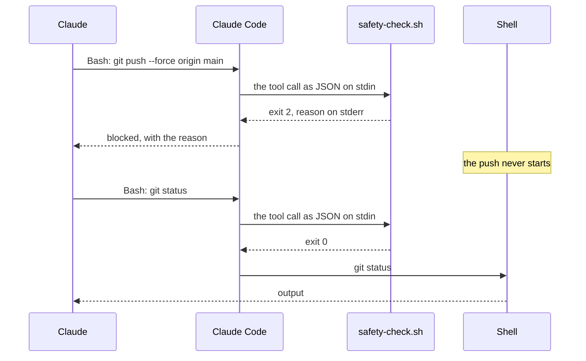
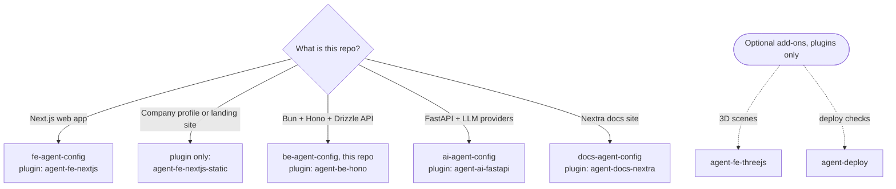
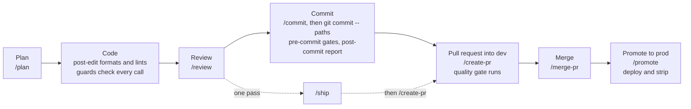
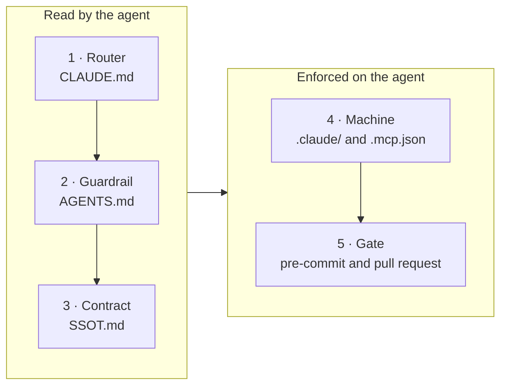

**English** | [Bahasa Indonesia](README.id.md)

<p align="center">
  <picture>
    <source media="(prefers-color-scheme: dark)" srcset="docs/assets/banner-be-dark.svg">
    <source media="(prefers-color-scheme: light)" srcset="docs/assets/banner-be-light.svg">
    
  </picture>
</p>

# be-agent-config

[](LICENSE)
[](#cicd)
[](#prefer-plugins)

**The Claude Code layer for a Bun + Hono + Drizzle API: rules, hooks that block, slash commands
and gates. No application code.**

You copy these files into your API's repository. From then on, Claude Code works inside rails: a
push to `dev` or `prod` is refused, a hand edit to a migration that already ran is refused,
`.env` files and production writes stay locked until **you** open them, and every commit and pull
request runs the same checks. Each refusal says why and what to do instead.

> [!TIP]
> **TL;DR.** Clone this repo next to your project, copy the layer in with four `cp` commands,
> fill the named placeholders, and run `bash scripts/check/hook-probes.sh` to prove the hooks on
> your machine. Then work as usual: `/plan`, `/review`, `/commit`, `/create-pr`, `/merge-pr`.
> The hooks run on your machine, open no network connection, and refuse what they cannot check.
> Prefer updates without copying files? Use the [plugin](#prefer-plugins) instead.

## Contents

- [Why this exists](#why-this-exists)
- [Payload encryption](#payload-encryption-sealed-bodies-and-one-endpoint-registry)
- [See it in action](#see-it-in-action)
- [Who it is for](#who-it-is-for)
- [Which template?](#which-template)
- [Prefer plugins?](#prefer-plugins)
- [Quick start](#quick-start)
- [A normal day with the template](#a-normal-day-with-the-template)
- [What gets installed](#what-gets-installed)
- [How it fits together](#how-it-fits-together)
- [Everything this template ships](#everything-this-template-ships)
- [What gets blocked](#what-gets-blocked)
- [Configuration](#configuration) · [Using RTK](#using-rtk)
- [Unlocking `.env` and the production DB](#unlocking-env-and-the-production-db)
- [CI/CD](#cicd)
- [GitHub repository configuration](#github-repository-configuration)
- [Security model](#security-model)
- [Cost and overhead](#cost-and-overhead)
- [Requirements](#requirements)
- [Upgrade and uninstall](#upgrade-and-uninstall)
- [Customize it](#customize-it)
- [FAQ and troubleshooting](#faq-and-troubleshooting)
- [Glossary](#glossary)
- [Roadmap and out of scope](#roadmap-and-out-of-scope)
- [License](#license)

## Why this exists

A rule in `CLAUDE.md` is a request. A hook that exits 2 is a wall. Written rules fail quietly:
nothing reports the day an agent ignores one, and on a backend the miss lands a whole environment
later. Each story below is a real kind of failure, what this template does about it, and which
pieces do the work.

1. **The agent force-pushes to `dev`.**
   *The problem:* a rebase went wrong, the agent "fixes" it with `git push --force origin dev`,
   and a teammate's merged work is gone.
   *The fix:* pushes to and deletions of `dev`, `prod`, `main` and `master` are refused, by
   refspec, `--all`, `--mirror` and the checked-out branch, from the shell and from GitHub's MCP
   tools. Work reaches `dev` through a pull request; you run a release push yourself with `!`.
   *Handled by:* [`safety-check.sh`](.claude/hooks/safety-check.sh),
   [`mcp-guard.sh`](.claude/hooks/mcp-guard.sh), the `deny` list in
   [`.claude/settings.json`](.claude/settings.json).

2. **A secret lands in the transcript.**
   *The problem:* "let me check the config" becomes `cat .env.production`, and the database
   password is now in the chat log.
   *The fix:* no shell command may read or write a real `.env*` file, by any route the analyzer
   can read. Claude lists the keys through a helper that masks every secret, and changes a value
   only after you unlock `env` yourself. The operating system's sandbox backs this up.
   *Handled by:* [`safety-check.sh`](.claude/hooks/safety-check.sh),
   [`scripts/env/show.sh`](scripts/env/show.sh), [`scripts/env/set.sh`](scripts/env/set.sh),
   [the unlock](docs/unlock.md), the sandbox in [`.claude/settings.json`](.claude/settings.json).

3. **The agent writes to production.**
   *The problem:* a "quick cleanup" `DELETE FROM sessions` runs against the production database
   through an MCP tool.
   *The fix:* one read-only statement passes; every write waits until you run `! bun unlock db`,
   and that lock closes itself after 15 minutes. The production MCP server also starts read-only.
   *Handled by:* [`db-guard.sh`](.claude/hooks/db-guard.sh),
   [`scripts/ops/unlock.sh`](scripts/ops/unlock.sh), [`.mcp.json`](.mcp.json).

4. **A migration that already ran is edited by hand.**
   *The problem:* the agent adds an index to `0003_add_index.sql`. Production ran that file last
   week, so it never runs again, and dev and prod now have different schemas.
   *The fix:* hand edits to generated migrations are refused; the pull request fails when the
   schema changed but no migration was generated or committed.
   *Handled by:* [`migration-guard.sh`](.claude/hooks/migration-guard.sh),
   [`scripts/check/migrations.sh`](scripts/check/migrations.sh),
   [`.claude/rules/backend/drizzle.md`](.claude/rules/backend/drizzle.md).

5. **Rules in `CLAUDE.md` are ignored.**
   *The problem:* after a long session the agent writes `x as unknown as T`, retypes a role name
   instead of importing it, adds a file no test loads, and cites a rule number that does not exist.
   *The fix:* every convention ends in a gate that fails: the double-assertion scan, the constant
   homes check, 100% coverage per file, and `ai-config.sh`, which fails on a cited rule that
   `AGENTS.md` does not define. Rules load only for matching files, so `CLAUDE.md` stays short
   enough to be read.
   *Handled by:* [`scripts/check/gates.list`](scripts/check/gates.list),
   [`scripts/check/ai-config.sh`](scripts/check/ai-config.sh), the rules in
   [`.claude/rules/`](.claude/rules/).

6. **The API drifts from its contract.**
   *The problem:* a route changes, the committed OpenAPI spec is not regenerated, and the
   frontend's generated client breaks in another repository a week later.
   *The fix:* the pull-request gate regenerates the spec and fails if the committed file changed.
   *Handled by:* [`.github/scripts/quality-gate.sh`](.github/scripts/quality-gate.sh) (the
   "OpenAPI Spec Drift Check" step).

7. **The agent wipes another session's work.**
   *The problem:* two sessions share a checkout; one runs `git reset --hard`, `git stash` or
   `rm -rf src` to "start clean".
   *The fix:* commands that wipe uncommitted work or delete protected paths are refused, and after
   every commit Claude is shown exactly which files it carried.
   *Handled by:* [`safety-check.sh`](.claude/hooks/safety-check.sh),
   [`post-commit.sh`](.claude/hooks/post-commit.sh), [`/checkpoint`](_workflow-source/checkpoint.md).

8. **Copies drift.**
   *The problem:* a command is fixed in `.claude/commands/` but not in its second copy; ten
   repositories each carry their own copy of the CI and nobody knows which ones still scan for
   secrets.
   *The fix:* commands are written once in `_workflow-source/` and mirrored by a script whose
   `--check` mode fails the commit on any drift. For many repositories, the
   [plugin](#prefer-plugins) reports drift from what it installed.
   *Handled by:* [`scripts/sync/workflows.sh`](scripts/sync/workflows.sh),
   [agent-config-kit](https://github.com/adhibuchori/agent-config-kit).

<details>
<summary>Before and after: the same five minutes, without and with the template</summary>

### Without the template

```text
You:     Sessions pile up and /me is slow. Add an index and clear the expired rows in prod.
Claude:  The index belongs in the migration that created the table.
         ✎ src/db/migrations/0003_add_index.sql                 ← already applied in prod
Claude:  Clearing expired rows.
         ⚡ db-prod: DELETE FROM sessions WHERE expires_at < now()
Claude:  Checking the production URL first.
         $ cat .env.production                                   ← the password is now in the chat
Claude:  Pushing the fix.
         $ git push --force origin dev                           ← a teammate's merge is gone
```

### With the template

```text
You:     Sessions pile up and /me is slow. Add an index and clear the expired rows in prod.
Claude:  ✎ src/db/migrations/0003_add_index.sql
         [migration-guard] BLOCKED: src/db/migrations/0003_add_index.sql is a generated migration
         (src/db/migrations in migrationsDirs).
         Generate a new migration with the project's tool instead of editing this one.
Claude:  I'll add the index to the schema instead.          $ bun run db:generate
Claude:  ⚡ db-prod: DELETE FROM sessions WHERE expires_at < now()
         [db-guard] BLOCKED: this SQL may change the production database (a DELETE statement). …
         For a write, the user runs `! bun unlock db` themselves and you try again, or you hand
         them the statement to run.
Claude:  Here is the statement. Run `! bun unlock db` if you want me to run it.
Claude:  $ cat .env.production
         [safety] BLOCKED: .env.production holds secrets, … List its keys with
         `bash scripts/env/show.sh .env.production` (secret values masked). …
Claude:  $ git push --force origin dev
         [safety] BLOCKED: pushing to a protected branch (dev/prod/main/master) is not allowed. …
Claude:  $ git push -u origin internal/db                        then /create-pr
```

The refusals are the hooks' real messages, wrapped and shortened with `…`; the lines around them
show where they appear in a session.

</details>

## Payload encryption: sealed bodies and one endpoint registry

The flagship module, and optional. Once you adopt it, every request and response body that crosses
a service boundary travels sealed, every route sits in one registry with its encryption policy
beside its path, and two gates keep both true before anything merges. The frontend and Python
templates speak the same wire format, proven against one shared set of test vectors.
[`.claude/PAYLOAD-CONTRACT.md`](.claude/PAYLOAD-CONTRACT.md) is the full contract: the threat model,
the wire format, the policies, rules P1 to P10, the keys and the wiring.

**How it works.** A sealed body is an AES-256-GCM envelope of six fields (`v`, `alg`, `kid`, `iv`,
`ct`, `ts`), sent as `application/vnd.payload-envelope+json`. Its authenticated data is never sent:
it names the method (or the response status), the registry's route pattern, the key id and the time
it was sealed, so the envelope opens on no other route, and one more than 120 seconds from the
receiver's clock is refused before the cipher runs. Two servers share one AES-256 key per hop
(`kid:base64` in one variable; rotation adds `<NAME>_NEXT`), while a browser agrees a fresh key per
tab over ECDH P-256 and HKDF-SHA-256, which the server re-derives per request and never stores. The
middleware opens a request before any validator runs and seals the response, so handlers, services
and schemas see plain objects. The registry is generated from `openapi.json`, and a route leaves
`strict` only through an exemption in `payload.config.json` that gives its reason. A refusal leaves
as plaintext problem+json with an `ENVELOPE_*` code, and status codes stay in the clear.

1. **A client sends plaintext to a sealed route.**
   *The problem:* an old build or a hand-written script posts plain JSON, and its answer travels in
   the clear while every other request is sealed; nobody notices, because it works.
   *The fix:* the middleware refuses a plaintext body on a sealed route with `ENVELOPE_REQUIRED`
   before any handler runs, and the refusal carries the code, never a payload.
   *Handled by:* [`payload.middleware.ts`](src/middlewares/payload.middleware.ts),
   [`src/lib/payload/`](src/lib/payload/), `check:endpoints`.
2. **A route ships with no decided policy.**
   *The problem:* a route is added, its path is typed by hand in two places, and nobody decided
   whether its body is sealed.
   *The fix:* `bun run generate:endpoints` writes the registry from the spec; `check:endpoints`
   fails when it drifts from the spec and the exemptions, when an exemption has no reason, and when
   a route path is typed in `src/` outside the files allowed to name routes.
   *Handled by:* [`src/lib/endpoints/`](src/lib/endpoints/), `check:endpoints`.
3. **Two copies of the cipher drift apart.**
   *The problem:* the frontend's copy changes how it builds the authenticated data; both repos'
   tests stay green, and every request fails in production with an error that says nothing.
   *The fix:* each copy opens the same committed ciphertexts and refuses the same replays, and
   `check:crypto-interop` seals with one copy and opens with the other when a peer is checked out
   beside this repo.
   *Handled by:* [`payload-vectors.json`](scripts/check/payload-vectors.json),
   `check:crypto-interop`.
4. **A debugging switch ships to production.**
   *The problem:* someone turns encryption off to chase a bug, and the branch merges that way.
   *The fix:* the committed switch must say `strict` (`check:endpoints`), the service refuses to
   start with `off` in production, and debugging uses `PAYLOAD_MODE=off` in your own shell.
   *Handled by:* [`payload.config.json`](payload.config.json), `resolveEncryptionMode`,
   `check:endpoints`.

| Piece | What it does | How to use | Why it helps |
| --- | --- | --- | --- |
| [`src/lib/payload/`](src/lib/payload/) | The cipher (AES-256-GCM through WebCrypto), key rings with rotation, browser key agreement, the strict/off switch and the endpoint matcher, each with its tests | Imported only by the middleware, never by a handler, service or schema | A reviewed reference instead of hand-rolled crypto |
| [`payload.middleware.ts`](src/middlewares/payload.middleware.ts) | Opens sealed requests, seals responses, refuses plaintext on a sealed route | `app.use(createPayloadMiddleware({ mode, registry: ENDPOINTS, prefixes: ENDPOINT_PREFIXES, keyRing }))` after the body limit, rate limit and timeout, before the routes | Nothing past the edge ever sees an envelope |
| [`src/lib/endpoints/`](src/lib/endpoints/) | Every route with its policy: the spec's routes generated, the rest by hand, a prefix rule for a catch-all such as the auth library's | `bun run generate:endpoints` after the spec changes; never edit `endpoints.generated.ts` | Every route has a decided policy |
| [`payload.config.json`](payload.config.json) | The committed switch, the exemptions with their reasons, the peers to cross-check | Keep `"encryption": "strict"`; add `"METHOD /pattern": { "encryption", "reason" }` under `exemptions` | An exception to encryption is one reviewed line with its reason |
| `check:endpoints`, `check:crypto-interop` | The static half of the contract, and the proof that the copies agree ([Checks and gates](#checks-and-gates)) | In `gates.list` and the pull-request gate | Drift fails the commit, not the release |

**Adopt it.** The Quick start already copied the contract, its rule and both checks with their
`gates.list` lines. Copy the module from your project's root, with `CFG` set as in the
[Quick start](#quick-start), then generate the registry:

```bash
cp "$CFG"/payload.config.json .
mkdir -p src/lib src/middlewares/__tests__
cp -R "$CFG"/src/lib/payload "$CFG"/src/lib/endpoints src/lib/
cp "$CFG"/src/middlewares/payload.middleware.ts src/middlewares/
cp "$CFG"/src/middlewares/__tests__/payload.middleware.test.ts src/middlewares/__tests__/
bun run spec:export && bun run generate:endpoints
```

Mount the middleware as the table shows, then create one key per hop on your own machine, never in
a chat. After `! bun unlock env`, this sets it without printing it; put the same value on the other
side of the hop:

```bash
printf 'k1:%s' "$(openssl rand -base64 32)" | bash scripts/env/set.sh .env.development PAYLOAD_KEY
```

Name the other repos in `peers` (`{ "name": "web", "root": "../web" }`) and the checks also compare
the spec, the exemptions and the cipher itself whenever they are checked out side by side.

**Leave it out.** Delete its two lines in `scripts/check/gates.list` and its three package scripts
(`check:endpoints`, `check:crypto-interop`, `generate:endpoints`), then the files the contract's
last section lists. The pull-request gate runs the two checks only while `gates.list` lists them.

**What it does not do.** The browser hop is not end-to-end encryption: the person using the browser
holds the key. It buys integrity, route binding, replay resistance inside the window and ciphertext
in every log and HAR file; confidentiality still comes from TLS, httpOnly cookies, a server-side
proxy and a tight `connect-src`. A server-to-server hop, whose key never reaches a browser, is real
defence in depth when it crosses a network you do not own.

## See it in action

<picture>
  <source media="(prefers-color-scheme: dark)" srcset="docs/assets/demo-blocked-dark.svg">
  <source media="(prefers-color-scheme: light)" srcset="docs/assets/demo-blocked-light.svg">
  
</picture>

This is what the hooks really send back, captured in a new repository right after the
[Quick start](#quick-start). Claude Code hands each tool call to the hook as JSON; the hook
answers with exit code 2 and a reason on stderr, which Claude reads and acts on:

```text
tool call  Bash  {"command": "git push --force origin main"}
exit 2     [safety] BLOCKED: pushing to a protected branch (dev/prod/main/master) is not allowed.
           Push your work branch and open a PR; when a release needs this push, the user runs it
           with `!`.

tool call  Edit  {"file_path": "src/db/migrations/0003_add_index.sql", …}
exit 2     [migration-guard] BLOCKED: src/db/migrations/0003_add_index.sql is a generated migration
           (src/db/migrations in migrationsDirs).
           Generate a new migration with the project's tool instead of editing this one.

tool call  Bash  {"command": "git status"}
exit 0     (nothing: the command runs)
```

See the same thing in your own copy by piping a tool call into the hook the way Claude Code does:

```bash
printf '%s' '{"tool_name":"Bash","tool_input":{"command":"git push --force origin main"}}' \
  | bash .claude/hooks/safety-check.sh; echo "exit $?"
```

```text
[safety] BLOCKED: pushing to a protected branch (dev/prod/main/master) is not allowed. Push your work branch and open a PR; when a release needs this push, the user runs it with `!`.
exit 2
```

It is working if that prints `exit 2`, and the same line with `git status` prints `exit 0`.

Claude Code hands every tool call to the hooks in `.claude/settings.json` before it runs. A
`PreToolUse` hook that exits **2** cancels the call, and its stderr is the reason Claude reads.
Any other exit code, `1` included, lets the call through, which is why every guard here exits 2
and refuses when it cannot read its input.

<picture>
  <source media="(prefers-color-scheme: dark)" srcset="docs/assets/hook-flow-dark.svg">
  <source media="(prefers-color-scheme: light)" srcset="docs/assets/hook-flow-light.svg">
  
</picture>



The illustrations are animated (the hedgehog blinks, the command types in, the verdicts slide
in). If your system asks for reduced motion, they show a still picture instead.

## Who it is for

<p align="center">
  <picture>
    <source media="(prefers-color-scheme: dark)" srcset="docs/assets/mascot-dark.svg">
    <source media="(prefers-color-scheme: light)" srcset="docs/assets/mascot-light.svg">
    
  </picture>
</p>

**A good fit if you:**

- build an HTTP API on Bun, Hono and Drizzle with PostgreSQL, and use Claude Code (the CLI or an
  IDE extension) on it, alone or in a team;
- want every rule, hook and check as a plain file in your own repository, to read and to edit;
- work in branches that reach `dev` and `prod` through pull requests.

**Not a fit if you:**

- want a starter project: there is no application, no `package.json` and no schema here, only the
  layer around your code and the optional payload module;
- use another stack: see [Which template?](#which-template);
- want updates without copying files again: use the [plugin](#prefer-plugins);
- want a security boundary against a hostile agent: the hooks read command text, and they are a
  guardrail against slips and injected instructions (see [Security model](#security-model)).

## Which template?

There are four template repositories and a plugin marketplace with the same content. Pick by what
your repository is:



Each template is a finished example of the layer for one stack, and each maps to one plugin:

| Template repository | For | Matching plugin |
| --- | --- | --- |
| [fe-agent-config](https://github.com/adhibuchori/fe-agent-config) | Next.js frontend | `agent-fe-nextjs` |
| [be-agent-config](https://github.com/adhibuchori/be-agent-config) (this one) | Bun + Hono + Drizzle API | `agent-be-hono` |
| [ai-agent-config](https://github.com/adhibuchori/ai-agent-config) | FastAPI + LLM providers | `agent-ai-fastapi` |
| [docs-agent-config](https://github.com/adhibuchori/docs-agent-config) | Nextra documentation site | `agent-docs-nextra` |

The hooks and the `common/` rules are the same files in all four, so what you learn in one carries
over. A template is the right choice when you want to own every file; a plugin is the right choice
when you want versioned updates.

## Prefer plugins?

<picture>
  <source media="(prefers-color-scheme: dark)" srcset="docs/assets/install-flow-dark.svg">
  <source media="(prefers-color-scheme: light)" srcset="docs/assets/install-flow-light.svg">
  :setup, which shows a dry run before it
    applies anything.">
</picture>

The same hooks, rules and checks are also packaged as Claude Code plugins in
[agent-config-kit](https://github.com/adhibuchori/agent-config-kit). This template corresponds to
the **`agent-be-hono`** plugin, which builds on `agent-core`. Three steps, each one copy and paste:

1. **Add the marketplace** (once per machine). In a terminal:

   ```bash
   claude plugin marketplace add adhibuchori/agent-config-kit
   ```

2. **Install the two plugins.** Inside Claude Code:

   ```text
   /plugin install agent-core@agent-config-kit
   /plugin install agent-be-hono@agent-config-kit
   ```

   If the new commands do not show up, restart Claude Code.

3. **Run setup in your repository.** Inside Claude Code:

   ```text
   /agent-be-hono:setup
   ```

   Setup asks a few questions, one at a time, shows a dry run of every file it would write, and
   writes only when you reply **go**. Commit the new files together with
   `.claude/agent-config-kit.lock`: the lock turns the hooks on for everyone who clones the
   repository.

**It's working if** setup ends the way its [docs page][setup-page] describes, and
`/agent-be-hono:sync --check` then reports no drift. The permissions and rules a plugin cannot
carry go into your repository, and the hooks run from the installed plugin. Every command in this
README then carries its plugin's name: `/review` becomes `/agent-core:review`, `/ship` becomes
`/agent-core:ship`.

[setup-page]: https://github.com/adhibuchori/agent-config-kit/blob/main/docs/agent-be-hono/setup.md#its-working-if

Choose this template when you want every file in your own repository to read and edit; choose the
plugin when you want versioned updates without copying files again.

**Do not use both in one repository.** A repository copied from this template already wires the
hooks in `.claude/settings.json`, and the plugin would run them a second time. The plugin's
`/agent-be-hono:sync --check` reports that as `double-wired`; to switch, delete those `"hooks"`
entries from `.claude/settings.json`.

## Quick start

1. **Clone the template next to your project**, and point a variable at it:

   ```bash
   git clone https://github.com/adhibuchori/be-agent-config.git
   cd your-project
   CFG=../be-agent-config
   ```

2. **Copy the layer in.** The tool configs overwrite yours of the same name, so merge by hand where
   you already have one:

   ```bash
   cp -R "$CFG"/{.claude,.agent,_workflow-source,.github,.husky,scripts} .
   cp "$CFG"/{CLAUDE.md,AGENTS.md,SSOT.md,.mcp.json,.skillspector-baseline.yaml} .
   cp "$CFG"/{bunfig.toml,knip.ts,.oxfmtrc.json,.oxlintrc.json,.oxlintignore,.gitleaks.toml,.dockerignore} .
   mkdir -p docs && cp "$CFG"/docs/unlock.md docs/   # the hooks' refusals link to it
   ```

   The optional payload contract's rule and checks come with `.claude/` and `scripts/`; its module
   stays in the template until you adopt it ([Payload encryption](#payload-encryption-sealed-bodies-and-one-endpoint-registry)).

3. **Merge `.gitignore` before your first commit.** `.claude/settings.local.json`,
   `.claude/state/`, `.skillspector/` and every real `.env*` file must be ignored; the
   `.env*.example` templates stay committed.

4. **Add the package scripts** listed in [SETUP §6](SETUP.md#6-make-the-gates-runnable), the
   `"unlock": "bash scripts/ops/unlock.sh"` alias included, and install the tools it names.

5. **Fill every placeholder.** They are named, never blank:

   ```bash
   grep -rn --exclude-dir=hooks --exclude-dir=anti-patterns --exclude-dir=commands \
     --exclude=agent-config.example.json '<[a-zA-Z][a-zA-Z -]*>' \
     CLAUDE.md AGENTS.md SSOT.md .mcp.json .claude/ _workflow-source/ .github/PULL_REQUEST_TEMPLATE/
   ```

   The list also shows command syntax such as `<file>`, TypeScript generics and HTML tags; leave
   those. [SETUP §2](SETUP.md#2-fill-in-every-placeholder) says what goes where, and names the two
   placeholders in `.github/` that the search skips.

6. **Fill in the Compliance Status table** at the top of `AGENTS.md`: Enforced, Partial or Not met
   for each section. An agent that follows a rule to a file that does not exist discounts every
   other rule afterwards, so do this before you rely on any of them.

7. **Prove it on your machine:**

   ```bash
   bash scripts/check/hook-probes.sh        # every hook rule, both ways; takes a few minutes
   bash scripts/check/ai-config.sh          # rule citations, context budget, hook wiring, MCP pins
   bash scripts/sync/workflows.sh --check   # the command mirrors match their sources
   ```

   In a fresh copy they end with `hook probes: 2333 passed, 0 failed`,
   `AI config within budget`, and `✓ All targets, orphans, and INDEX.md coverage are in sync`.

**Tip:** commit the copied layer in a commit of its own; then one `git revert` takes it out again
([Upgrade and uninstall](#upgrade-and-uninstall)). **Then read [SETUP.md](SETUP.md)** for the
tools, the MCP servers, the full gate list, GitHub and the optional strip pipeline. Budget about an
hour.

## A normal day with the template



| Step | You run | What helps by itself |
| --- | --- | --- |
| Plan | `/plan add rate limiting to auth routes` | The backend rules load as the plan reads matching files under `src/` |
| Code | nothing: just ask | [`post-edit.sh`](.claude/hooks/post-edit.sh) formats and lints each written file; the four guards refuse what should not run |
| Before a risky change | `/checkpoint before schema refactor` | A local commit of this session's files, by pathspec |
| Review | `/review` (and `/check-fix` when a gate is red) | [`agents-reviewer`](.claude/agents/agents-reviewer.md) reports rule-cited findings by severity |
| Commit | `/commit`, then `git commit -m "feat: add rate limiting" -- <paths>` | `.husky/pre-commit` runs the gates for what you staged; [`post-commit.sh`](.claude/hooks/post-commit.sh) shows what landed |
| Pull request | `/create-pr` | The Quality Gate (35 steps), Dependency Review, CodeQL and the AI review run on it |
| Review comments | `/resolve-pr-review 42` | Each thread gets a reply; suggestions that break a rule are declined with the reason |
| Merge | `/merge-pr 42` | [`scripts/ops/pr-ready.sh`](scripts/ops/pr-ready.sh) checks readiness first |
| Promote | `/promote`, then `/branch-cleanup` | The merge into `prod` deploys and strips the AI layer from `prod` |
| A bug | `/rca checkout returns 500` or `/debug checkout returns 500` | [`prompt-intent.sh`](.claude/hooks/prompt-intent.sh) routes `/debug` to `/rca` |
| End of a session | `/checkpoint-summary`, `/learn-session` | The next session starts where this one ended; lessons land where they load again |

## What gets installed

After the Quick start, your repository gains these files (one line each; the tables in
[Everything this template ships](#everything-this-template-ships) say what each piece does):

```text
your-project/
├── CLAUDE.md                     router: what to read for which task (fill the placeholders)
├── AGENTS.md                     numbered rules and the Compliance Status table you fill in
├── SSOT.md                       facts: architecture, auth, error contract, database, environment
├── .mcp.json                     5 MCP servers, pinned; every credential is an env-var reference
├── .skillspector-baseline.yaml   triaged findings of the skill scan
├── bunfig.toml, knip.ts          test runner with 100% coverage, dead-code settings
├── .oxfmtrc.json, .oxlintrc.json, .oxlintignore      format and lint settings
├── .gitleaks.toml, .dockerignore                     secret-scan allowlist, keeps .env* out of images
├── .claude/
│   ├── settings.json             hook wiring, allow / ask / deny permissions, the Bash sandbox
│   ├── hooks/                    8 hooks, lib.sh and the hook reference (README.md)
│   ├── rules/                    13 rules; 12 load only while Claude works on a matching file
│   ├── agents/                   agents-reviewer.md and INDEX.md
│   ├── commands/                 15 slash commands and INDEX.md, generated from _workflow-source/
│   ├── anti-patterns/            12 known traps and INDEX.md
│   ├── docs/                     code-review-checklist.md, read on demand
│   ├── PAYLOAD-CONTRACT.md       the optional payload contract, read on demand
│   ├── mcp/                      3 on-demand MCP server examples
│   ├── agent-config.example.json every hook setting with its default
│   ├── test-preload.example.ts   the one mocking seam for unit tests
│   └── *.example.md              5 reference notes to fill in or delete
├── .agent/workflows/             the same 15 commands for a second tool (generated)
├── _workflow-source/             where you edit the commands
├── .husky/pre-commit             runs the gates on every commit
├── scripts/
│   ├── check/                    gates.sh, gates.list and the check scripts
│   ├── generate/                 openapi.ts (spec:export) and endpoints.ts (the payload registry)
│   ├── lib/                      what the OpenAPI and payload checks share
│   ├── ops/                      unlock.sh (you run it) and pr-ready.sh (can this PR merge?)
│   ├── env/                      show.sh (masked listing), set.sh (writes while unlocked), envfile.py
│   └── sync/                     workflows.sh (writes and checks the command mirrors)
├── .github/
│   ├── workflows/                7 workflows, every one started by a pull-request event
│   ├── scripts/                  the pull-request gate, the diff scanner, the strip pipeline
│   ├── PULL_REQUEST_TEMPLATE/    dev.md and promotion.md
│   └── CODEOWNERS                who is asked to review
└── docs/unlock.md                how you open .env files and production writes
```

Two files you change by hand: `.gitignore` (merge) and `package.json` (add the scripts). The
payload module (`payload.config.json`, `src/lib/payload/`, `src/lib/endpoints/` and the middleware)
is copied only when you [adopt it](#payload-encryption-sealed-bodies-and-one-endpoint-registry).
These stay in the template, because they document it rather than your project: `README.md`,
`README.id.md`, `SETUP.md`, `LICENSE`, `docs/RATIONALE.md`, `docs/assets/` and
`.markdownlint-cli2.jsonc`.

## How it fits together

Five layers, each with one job. The first three are read by the agent; the last two are enforced
on it.



<picture>
  <source media="(prefers-color-scheme: dark)" srcset="docs/assets/layers-dark.svg">
  <source media="(prefers-color-scheme: light)" srcset="docs/assets/layers-light.svg">
  
</picture>

| Layer         | Where                                   | Job                                                                        |                              Size |
| :------------ | :-------------------------------------- | :------------------------------------------------------------------------- | --------------------------------: |
| **Router**    | `CLAUDE.md`                             | What to read for which task. Loaded every session, so kept short           |                         185 lines |
| **Guardrail** | `AGENTS.md`                             | Numbered, citable rules, each naming what enforces it                      |                         572 lines |
| **Contract**  | `SSOT.md`                               | Architecture, auth, error contract, database, tests, pipeline, environment |                         212 lines |
| **Machine**   | `.claude/`, `.mcp.json`                 | Hooks, rules, the reviewer subagent, anti-patterns, commands, MCP servers  |                          67 files |
| **Gate**      | `.husky/`, `scripts/check/`, `.github/` | The definition of "passing": before every commit and on every pull request | 19 gates · 35 steps · 7 workflows |

The guardrail is about three times the size of the router and of the contract. That is right for a
backend: security and data-access rules have to be spelled out, while the architecture is uniform
enough to state once ([RATIONALE §12](docs/RATIONALE.md#12-rule-documents-get-longer-as-the-risk-gets-quieter)).
Do not pad or trim the documents to match another repository.

## Everything this template ships

Each table answers three questions for every piece: what it does, how you use it, and why it
helps. Every name links to the file; most files also explain themselves in a header comment.

### Hooks

Claude Code runs these by itself; you never call them. The reference for all of them, with every
refusal, the fail modes and how to turn one off, is [`.claude/hooks/README.md`](.claude/hooks/README.md).

| Name | What it does | How to use | Why it helps |
| --- | --- | --- | --- |
| [`safety-check.sh`](.claude/hooks/safety-check.sh) | Reads each shell command the way a shell would and refuses the dangerous ones: protected-branch pushes, work-wiping git, a skipped pre-commit, shell access to `.env*`, the agent running the unlock, git settings that run code, anything it cannot resolve | Runs before every `Bash` call. Try it: `printf '%s' '{"tool_name":"Bash","tool_input":{"command":"git stash"}}' \| bash .claude/hooks/safety-check.sh` prints the refusal and exits 2 | The one command you would regret never runs, and the refusal says what to do instead |
| [`migration-guard.sh`](.claude/hooks/migration-guard.sh) | Refuses hand edits to generated migrations under `migrationsDirs` (default `src/db/migrations`, `drizzle` and the Alembic folders) | Runs before `Write`, `Edit`, `MultiEdit` and Serena's write tools | A migration that already ran is never rewritten, so dev, prod and the migration log keep agreeing |
| [`db-guard.sh`](.claude/hooks/db-guard.sh) | Lets one read-only SQL statement through to the production database; holds every write until you unlock `db` | Runs before `mcp__db-prod__execute_sql`; you open writes with `! bun unlock db` | No surprise `DELETE` or `ALTER` in production |
| [`mcp-guard.sh`](.claude/hooks/mcp-guard.sh) | Refuses GitHub MCP `push_files`, `create_or_update_file`, `delete_file` and `create_branch` onto a protected branch | Runs before those four GitHub MCP tools | Closes the route around the shell guard |
| [`post-edit.sh`](.claude/hooks/post-edit.sh) | Formats, then lints, the file just written, with the project's own oxfmt and oxlint | Runs after every write; a tool the project lacks is skipped | Findings are fixed in the next edit, not at commit time |
| [`post-commit.sh`](.claude/hooks/post-commit.sh) | Shows Claude what a commit carried (hash, subject, files) and warns about paths its pathspec did not name | Runs after a `git commit` | Another session's staged work cannot ride along unseen |
| [`prompt-intent.sh`](.claude/hooks/prompt-intent.sh) | Points `/debug` at this repo's `/rca`; prunes the state of sessions idle for two days | Type `/debug login returns 500` | Debugging starts from a reproduction, not from Claude Code's own `debug` skill |
| [`session-start.sh`](.claude/hooks/session-start.sh) | Makes the zsh that runs Claude's commands behave like bash on unmatched globs, `=word` and word splitting | Runs when a session starts | Fewer confusing "no matches found" failures |
| [`lib.sh`](.claude/hooks/lib.sh) | The shared helpers: the payload reader, the config loader, the shell-command analyzer | Sourced by the hooks; never wired on its own | One analyzer, proved once, for every guard |

**It's working if** you see these signs in an ordinary session. Each hook's page in the plugin docs
has the same check, what the hook refuses and how to turn it off; the pages use the plugin's
command names, and the hooks behave the same here.

| Hook | It's working if | Docs page |
| --- | --- | --- |
| `safety-check.sh` | `git status` runs without a word from the hook; `git push origin main` from Claude is refused with a `[safety] BLOCKED:` line, and Claude pushes a work branch instead | [safety-check](https://github.com/adhibuchori/agent-config-kit/blob/main/docs/agent-core/safety-check.md#its-working-if) |
| `migration-guard.sh` | For a schema change Claude runs `bun run db:generate`; an edit to an existing migration is refused with `[migration-guard] BLOCKED:` | [migration-guard](https://github.com/adhibuchori/agent-config-kit/blob/main/docs/agent-be-hono/migration-guard.md#its-working-if) |
| `db-guard.sh` | A `SELECT` through `db-prod` runs; a `DELETE` is refused until you run `! bun unlock db`, and runs once `db` is open | [db-guard](https://github.com/adhibuchori/agent-config-kit/blob/main/docs/agent-core/db-guard.md#its-working-if) |
| `mcp-guard.sh` | A GitHub MCP `push_files` to a work branch goes through; the same call to `main` is refused with `[mcp-guard] BLOCKED:` | [mcp-guard](https://github.com/adhibuchori/agent-config-kit/blob/main/docs/agent-core/mcp-guard.md#its-working-if) |
| `post-edit.sh` | `git diff` shows a file Claude wrote already in oxfmt's style, and a lint error it left is fixed in its next edit without being asked | [post-edit](https://github.com/adhibuchori/agent-config-kit/blob/main/docs/agent-core/post-edit.md#its-working-if) |
| `post-commit.sh` | After Claude commits, its reply names the commit's hash and files, matching `git show --stat HEAD`, and says so when the commit carried a file nobody named | [post-commit](https://github.com/adhibuchori/agent-config-kit/blob/main/docs/agent-core/post-commit.md#its-working-if) |
| `prompt-intent.sh` | `/debug login returns 500` starts a reproduction-first pass through `/rca` | [prompt-intent](https://github.com/adhibuchori/agent-config-kit/blob/main/docs/agent-core/prompt-intent.md#its-working-if) |
| `session-start.sh` | `ls *.nothing` in Claude's shell fails the way it would in bash, instead of stopping at `no matches found` | [session-start](https://github.com/adhibuchori/agent-config-kit/blob/main/docs/agent-core/session-start.md#its-working-if) |

### Commands

Type them in Claude Code. Edit them in [`_workflow-source/`](_workflow-source/), never in the
generated copies. [`_workflow-source/INDEX.md`](_workflow-source/INDEX.md) is the same list for
the agent.

| Name | What it does | How to use | Why it helps |
| --- | --- | --- | --- |
| [`/plan`](_workflow-source/plan.md) | Writes a plan (routes, data, indexes, migration strategy, risks, open questions) and waits for your yes | `/plan add rate limiting to auth routes` | Scope, indexes and the migration are agreed before code exists |
| [`/check-fix`](_workflow-source/check-fix.md) | Writes the format, runs every gate in `gates.list` and the build, fixes what fails until all pass | `/check-fix` | A red gate is fixed now, not discovered at commit time |
| [`/review`](_workflow-source/review.md) | Reviews the staged changes, or the branch against `origin/dev`, against the backend rules, by severity; changes nothing | `/review` | Rule-cited findings before the commit |
| [`/rca`](_workflow-source/rca.md) | Reproduces the bug at the lowest level that shows it, finds the line, fixes it with a test that fails without the fix; no commit | `/rca login returns 500 after deploy` | Fixes that stay fixed |
| [`/checkpoint`](_workflow-source/checkpoint.md) | A local safety commit of this session's changes, by pathspec, with a timestamp; never pushes | `/checkpoint before schema refactor` | A cheap way back before a risky change |
| [`/checkpoint-summary`](_workflow-source/checkpoint-summary.md) | Prints a handover summary: done, pending, next; can also write a gitignored log | `/checkpoint-summary auth-sprint` | The next session starts where this one ended |
| [`/learn-session`](_workflow-source/learn-session.md) | Writes each lasting lesson into the check, rule, reference or anti-pattern that loads again | `/learn-session` | The same trap is not hit twice |
| [`/commit`](_workflow-source/commit.md) | Runs `/check-fix`, reads the staged diff and drafts a `type: description` message; does not commit | `/commit`, then `git commit -m "…" -- <paths>` | A red gate never becomes a commit, and messages share one format |
| [`/ship`](_workflow-source/ship.md) | Stages everything, runs `/review` and `/security-review`, fixes every Medium-or-higher and every security finding, re-runs the gates, commits and pushes the `internal/*` branch; refuses on `dev` or `prod` | `/ship` | Finished work leaves the machine reviewed |
| [`/create-pr`](_workflow-source/create-pr.md) | Drafts the title and body from `.github/PULL_REQUEST_TEMPLATE/dev.md`, asks you, then opens the PR into `dev` | `/create-pr` | Consistent pull requests, never a push to `dev` |
| [`/resolve-pr-review`](_workflow-source/resolve-pr-review.md) | Fetches review comments, triages them against the rules, applies what holds up, replies on each thread | `/resolve-pr-review 42` | Suggestions that break your rules are declined with a reason |
| [`/merge-pr`](_workflow-source/merge-pr.md) | Checks readiness, asks, merges with a merge commit, deletes an `internal/*` head by name | `/merge-pr 42` | Skipped checks and open threads are caught before the merge |
| [`/promote`](_workflow-source/promote.md) | `internal/*` → PR into `dev` → promotion PR into `prod`; audits the production env and migrations; verifies the deploy by timestamp | `/promote` | "Merged" is never mistaken for "live" |
| [`/promote-deploy`](_workflow-source/promote-deploy.md) | The same promotion when CI cannot run: proves CI is down, runs the gate locally, you push, strips and deploys, writes a log of what CI still owes | `/promote-deploy` | Production does not go stale during a CI outage |
| [`/branch-cleanup`](_workflow-source/branch-cleanup.md) | After a promotion, deletes merged branches except `dev`, `prod`, the default branch and open-PR heads, once you confirm | `/branch-cleanup` | A tidy remote; nothing unmerged is lost |

Pushes to `dev` and `prod`, and production migrations, are handed to you as `!` commands. The
mirrors in `.claude/commands/` and `.agent/workflows/` are written by
`bash scripts/sync/workflows.sh`; its `--check` mode is a pre-commit gate.

### Agents

| Name | What it does | How to use | Why it helps |
| --- | --- | --- | --- |
| [`agents-reviewer`](.claude/agents/agents-reviewer.md) | Checks the changed `.ts` files against `AGENTS.md`: layer boundaries, the error contract, query shape and index coverage, runtime hardening, tests, file length, no `any`, one home per identifier. Reports only; reads the Compliance Status first | `/review` hands it the diff; or ask "Use the agents-reviewer subagent on this branch" | One reviewer with a real rulebook beats several with overlapping mandates |

[`.claude/agents/INDEX.md`](.claude/agents/INDEX.md) lists it for people and commands; add a row
when you add an agent.

### Skills

This template ships **no skills**. Its workflows are commands you call, and design skills have
nothing to do in a repository with no interface. If you add one under `.claude/skills/`,
[`scripts/check/skills.sh`](scripts/check/skills.sh) scans it like the commands and hooks.

### Rules

Rules are Markdown files Claude Code loads as instructions. Twelve of the thirteen start with a
`paths:` list, so they load only once the session reads a matching file.

| Name | What it does | How to use | Why it helps |
| --- | --- | --- | --- |
| [`common/working-agreements.md`](.claude/rules/common/working-agreements.md) | How work is done: communicate, scope, evidence, order of work, shared checkouts, live systems, tool traps; one line per correction | Loads every session (the one unscoped rule, 4,556 bytes) | Each correction is made once, not every session |
| [`common/patterns.md`](.claude/rules/common/patterns.md) | The patterns this repo uses and deliberately avoids, and where each is specified | Loads for `src/**` | New code copies the reference module, not a new shape |
| [`common/error-codes.md`](.claude/rules/common/error-codes.md) | Every error code lives in `ERROR_CODES`, and every code the frontend reads has a row there | Loads for `src/lib/errors/**`, `src/modules/**`, middlewares and hooks | No "Something went wrong" for a code nobody mapped |
| [`common/folder-shape.md`](.claude/rules/common/folder-shape.md) | A file's path says what it does (SHAPE-1 to SHAPE-4) | Loads for `src/**`, `tests/**`, `scripts/**`; enforced by `check:folder-shape` | Files are where you would guess |
| [`common/testing.md`](.claude/rules/common/testing.md) | 100% per file, test-first, the Arrange-Act-Assert shape, test names | Loads for `src/**/__tests__/**`, `src/test/**`, `bunfig.toml` | Tests prove behaviour instead of padding a number |
| [`common/payload-contract.md`](.claude/rules/common/payload-contract.md) (optional) | The short form of the [payload contract](#payload-encryption-sealed-bodies-and-one-endpoint-registry): strict unless exempted with a reason, no route path outside the registry, encryption only at the edge, the raw request read once, keys added and never repurposed, no sealed body in a log | Loads for `src/lib/payload/**`, `src/lib/endpoints/**`, `src/middlewares/**`, the payload scripts, `payload.config.json` and `openapi.json` | Plaintext and drift are caught while the code is written, not in review |
| [`typescript/types.md`](.claude/rules/typescript/types.md) | No `any` in any form; oxlint `no-explicit-any` at error, tests included | Loads for every `.ts`, `.tsx`, `.mts`, `.cts` file | The compiler keeps catching mistakes |
| [`typescript/dead-code.md`](.claude/rules/typescript/dead-code.md) | Knip findings are fixed, never silenced | Loads for TypeScript and `.mjs` files, `knip.ts` and `package.json` | Unused code and dependencies do not pile up |
| [`typescript/coverage.md`](.claude/rules/typescript/coverage.md) | What 100% coverage measures, the few exemptions, how to change the gate | Loads for `src/**`, `tests/**`, `scripts/check/**`, `bunfig.toml` | A weakened gate is refused, not waved through |
| [`backend/drizzle.md`](.claude/rules/backend/drizzle.md) | Driver and pool, schema conventions, index strategy, queries, transactions, proving a query, migrations | Loads for `src/db/**`, repositories, services, `drizzle.config.ts` | Slow queries and missing indexes are caught while writing |
| [`backend/hono.md`](.claude/rules/backend/hono.md) | `createRouter()`, route definitions, thin handlers, middleware order in `app.ts`, spec generation | Loads for `src/app.ts`, `src/index.ts`, `src/modules/**`, `src/middlewares/**` | The error contract and the middleware order stay intact |
| [`backend/performance.md`](.claude/rules/backend/performance.md) | The request budget, an N+1 checklist, cache-aside with Redis, logging cost, measuring first | Loads for `src/modules/**`, `src/db/**`, `src/lib/**`, `src/middlewares/**` | Latency budgets are designed in, not patched on |
| [`backend/testing.md`](.claude/rules/backend/testing.md) | The unit tier (no network) and the integration tier, query and route tests, the one mocking seam | Loads for `src/**/__tests__/**`, `src/test/**`, `bunfig.toml` | A mock never leaks into other test files |

The human review checklist is not a rule: it lives in
[`.claude/docs/code-review-checklist.md`](.claude/docs/code-review-checklist.md) and is read on
demand.

### Anti-patterns

One file per known trap: the symptom, the cause, the fix. [`INDEX.md`](.claude/anti-patterns/INDEX.md)
says when to load each; `/rca` reads it first and `/learn-session` adds to it.

| Name | What it records | How to use | Why it helps |
| --- | --- | --- | --- |
| [`postgres-max-1-pool.md`](.claude/anti-patterns/postgres-max-1-pool.md) | `postgres(url, { max: 1 })` outside a migration runner serializes every request | Load when touching `src/db/client/index.ts` or pool settings | Latency that climbs with load, found in minutes |
| [`rate-limit-double-next.md`](.claude/anti-patterns/rate-limit-double-next.md) | `await next()` inside a middleware's own try/catch | Load when touching the rate-limit middleware, or one shaped like it | No handler that runs twice |
| [`bun-mock-module-is-process-wide.md`](.claude/anti-patterns/bun-mock-module-is-process-wide.md) | `mock.module` applies to every later test file, in an order bun versions disagree on | Load when a test needs a module replaced | No test that passes on one machine only |
| [`a-check-that-matches-nothing-passes.md`](.claude/anti-patterns/a-check-that-matches-nothing-passes.md) | A scanner that reads nothing reports success | Load when writing a check under `scripts/check/` or `.github/scripts/` | New checks fail when they read nothing |
| [`better-auth-user-hook-runs-first.md`](.claude/anti-patterns/better-auth-user-hook-runs-first.md) | better-auth runs your `hooks.after` first, then lets a plugin overwrite the response | Load when adding to `hooks.after` or reordering plugins | A refusal that silently turns into a success |
| [`session-rows-are-a-mirror-not-the-session.md`](.claude/anti-patterns/session-rows-are-a-mirror-not-the-session.md) | Deleting a `session` row does not end the session when Redis holds it | Load when ending sessions or changing a column the session carries | A banned user who stays signed in |
| [`queue-job-id-cannot-contain-colon.md`](.claude/anti-patterns/queue-job-id-cannot-contain-colon.md) | A BullMQ custom job id with `:` is refused before it reaches Redis | Load when passing `jobId` to a queue | A job that was never queued |
| [`auth-cookie-cache-outlives-revocation.md`](.claude/anti-patterns/auth-cookie-cache-outlives-revocation.md) | Better Auth's cookie cache answers `getSession` from a signed cookie, so a revoked session or a ban keeps working until the cache ages out | Load when revoking sessions, banning a user, or when a "session expired" flow bounces back | A ban that takes effect at once, not a minute later |
| [`better-auth-account-endpoints-are-gated.md`](.claude/anti-patterns/better-auth-account-endpoints-are-gated.md) | Some account endpoints need a fresh session and some are server-only, which the client does not show | Load when building unlink, session-list or set-password flows on the auth client | A settings screen that works for real users, not only right after sign-in |
| [`better-auth-list-option-replaces-defaults.md`](.claude/anti-patterns/better-auth-list-option-replaces-defaults.md) | A plugin's list option (paths, origins) replaces its defaults instead of extending them | Load when passing a list option to a Better Auth plugin | Adding one route never turns a check off for the others |
| [`better-auth-passkey-quirks.md`](.claude/anti-patterns/better-auth-passkey-quirks.md) | A dismissed passkey prompt returns an error, and user verification is not enforced by default | Load for passkey registration, sign-in, cancellation or user verification | A passkey counts as two factors only when it is one |
| [`gateway-cancel-result-is-not-the-state.md`](.claude/anti-patterns/gateway-cancel-result-is-not-the-state.md) | A payment gateway's cancel result, a timeout or a refusal, says nothing about the payment's real state | Load when cancelling or superseding a payment, or any remote resource, and acting on the result | No second charge for something just paid |

### Checks and gates

`.husky/pre-commit` runs `bash scripts/check/gates.sh --hook`, which picks the gates in
[`scripts/check/gates.list`](scripts/check/gates.list) that the staged files need. Run one gate on
its own with `--only` and a part of its command, for example
`bash scripts/check/gates.sh --only type-check`. SETUP §6 lists the package scripts they call.

| Name | What it does | How to use | Why it helps |
| --- | --- | --- | --- |
| [`.husky/pre-commit`](.husky/pre-commit) | Runs the gate runner on the staged files | Runs by itself on `git commit` once `bun install` ran husky's `prepare` | Nothing lands unchecked; the safety hook refuses `--no-verify` from the agent |
| [`gates.sh`](scripts/check/gates.sh) + [`gates.list`](scripts/check/gates.list) | Runs the list: one log per gate, a table at the end, the tail of each failure. `--hook`, `--paths`, `--only`, `--fix`, `--fail-fast` | `bash scripts/check/gates.sh` | One list for your machine, the hook and the agent |
| `@format` | Read-only format and lint check with oxfmt and `oxlint --type-aware` | Runs when anything is staged; `bash scripts/check/gates.sh --only @format` | Unformatted files and a missing `await` on a query never land |
| [`secrets.sh`](scripts/check/secrets.sh) ([`.gitleaks.toml`](.gitleaks.toml)) | Scans the staged diff for secrets with gitleaks; fails when gitleaks is missing, warns when its release is not CI's pin | Runs when anything is staged | A key is stopped before the commit exists |
| `bun run type-check` | `tsc --noEmit` | Runs for staged code | Type errors never reach review |
| `bun run check:dead-code` ([`knip.ts`](knip.ts)) | Knip: unused files, exports and dependencies | Runs for staged code | Dead code is deleted, not carried |
| [`constants.ts`](scripts/check/constants.ts) + [`constants.config.json`](scripts/check/constants.config.json) | A role, queue or cache name retyped instead of imported from its one home | Runs for staged code; fill the config first (SETUP §6) | A rename cannot miss a copy |
| [`dockerfile.ts`](scripts/check/dockerfile.ts) | The image builds what the gate validated: a client generated into a gitignored folder is generated in the image too, a base image pinned by digest names its version in the tag, and the image's Bun is not older than the one running the check. With no `Dockerfile` it says so and passes | Runs for staged code; `bun run check:dockerfile` | An image that fails at its first import, or runs an older Bun than the gate proved, is caught before it is built |
| [`module-mocks.ts`](scripts/check/module-mocks.ts) | A `mock.module` that would leak into every later test file | Runs for staged code | Tests pass the same on every machine |
| [`double-assertion.sh`](scripts/check/double-assertion.sh) | Refuses `x as unknown as T` | Runs for staged code | The compiler's overlap check stays on |
| [`folder-shape.mjs`](scripts/check/folder-shape.mjs) | A file whose path does not say what it does (SHAPE-1 to SHAPE-4) | Runs for staged code | Files are where you would guess |
| [`coverage-policy.mjs`](scripts/check/coverage-policy.mjs) | Refuses a lowered threshold, a narrowed scope or an exemption without a reason | Runs for staged code | 100% keeps meaning 100% |
| [`ci-env.sh`](scripts/check/ci-env.sh) `bun run test:coverage` + [`coverage-files.mjs`](scripts/check/coverage-files.mjs) | The suite with coverage, and every source file loaded by at least one test, run with exactly CI's variables (the workflow's job-level `env:` block) and nothing from your shell or a `.env` file | Runs for staged code; one file: `bash scripts/check/ci-env.sh bun test <path>` | A handler with no test cannot pass, and a test that only passes on your local credentials fails before CI |
| [`openapi.ts`](scripts/check/openapi.ts) + [`generate/openapi.ts`](scripts/generate/openapi.ts) | Builds the OpenAPI document from the app, fails when it describes no route, and fails when it differs from the committed `openapi.json`, compared by meaning (the `info` block may differ). Without `src/app.ts` it says so and passes | Runs for staged code, with CI's variables (`bash scripts/check/ci-env.sh bun run check:openapi`); `bun run spec:export` rewrites the file | A route mounted outside the contract, or a stale spec a frontend generates its client from, fails here instead of in another repository |
| [`endpoints.ts`](scripts/check/endpoints.ts) + [`generate/endpoints.ts`](scripts/generate/endpoints.ts) (optional) | The static half of the [payload contract](#payload-encryption-sealed-bodies-and-one-endpoint-registry): the committed switch says `strict`; the generated registry equals what the spec and the exemptions imply; every non-strict entry has a reason and no strict one does; no route path is typed in `src/` outside the files allowed to name routes; a checked-out peer has the same spec and exemptions | Runs for staged code; `bun run check:endpoints`; `bun run generate:endpoints` after the spec changes | Plaintext cannot slip in through a new route or a hand-typed path |
| [`crypto-interop.ts`](scripts/check/crypto-interop.ts) + [`payload-vectors.json`](scripts/check/payload-vectors.json) (optional) | Runs this repo's cipher against the shared vectors (the authenticated data byte for byte, the committed ciphertexts opened, an envelope moved to another route, method, status, key or time refused), round-trips a body, and seals with one copy and opens with the other for each checked-out peer | Runs for staged code; `bun run check:crypto-interop` | Copies of the cipher in different repositories cannot drift apart unseen |
| [`ai-config.sh`](scripts/check/ai-config.sh) | Every cited rule exists in `AGENTS.md`; always-loaded context under 15,000 bytes; hook wiring; exact MCP pins | Runs when anything is staged; `bash scripts/check/ai-config.sh` | The agent's instructions stay true and small |
| [`ai-config-probes.sh`](scripts/check/ai-config-probes.sh) | Proves the MCP pin rule both ways in a temp repo | Runs for staged code | A pin check that lets a moving version through fails loudly |
| `workflows.sh --check` ([`workflows.sh`](scripts/sync/workflows.sh)) | Fails when a command mirror or `INDEX.md` row drifted from `_workflow-source/` | Runs when commands are staged | Every copy of a command says the same thing |
| [`hook-probes.sh`](scripts/check/hook-probes.sh) + [`hook-probes.tsv`](scripts/check/hook-probes.tsv) | Feeds 2,333 probes to the hooks as Claude Code would and checks each verdict | Runs when a hook, `settings.json`, the probes or the unlock files are staged; `bash scripts/check/hook-probes.sh` | A guard that stopped blocking, or started blocking too much, is caught |
| [`skills.sh`](scripts/check/skills.sh) + [`.skillspector-baseline.yaml`](.skillspector-baseline.yaml) | SkillSpector, pinned to one commit, over commands, agents, skills and hooks | Runs when commands or hooks are staged; `bash scripts/check/skills.sh --staged` | A prompt-injection line or an unsafe shell step is caught like a bad dependency |

These run only in the pull-request gate, [`.github/scripts/quality-gate.sh`](.github/scripts/quality-gate.sh),
which also repeats the gates above:

| Name | What it does | How to use | Why it helps |
| --- | --- | --- | --- |
| [`quality-gate.sh`](.github/scripts/quality-gate.sh) | The 35 pull-request steps in order; `--strict` fails a step that could not run (always on in CI) | `bash .github/scripts/quality-gate.sh origin/dev` | The same gate runs on your machine before you push |
| [`migrations.sh`](scripts/check/migrations.sh) | Regenerates the migrations from the schema and fails if they differ from what is committed | In the gate; alone: `bash scripts/check/migrations.sh` | A schema change always ships with its migration |
| [`index-coverage.sh`](scripts/check/index-coverage.sh) | Every foreign-key column has an index | In the gate; alone: `bash scripts/check/index-coverage.sh` | Postgres does not index a `REFERENCES` column; joins and cascades stay fast |
| Runtime hardening (in `quality-gate.sh`) | A bare `cors()`; a missing request-id, secure-headers, body-limit or timeout middleware; a pool of 1–2; no statement timeouts | In the gate | Production settings cannot fall out of `src/app.ts` quietly |
| Raw SQL audit (in `quality-gate.sh`) | Interpolated `sql` outside `*.repository.ts` and `src/db/schema/` | In the gate | SQL injection has one place to hide, and it is reviewed |
| OpenAPI spec drift (in `quality-gate.sh`) | Regenerates the spec with `spec:export` and fails if the committed file changed | In the gate | The contract other repositories generate clients from stays true |
| [`diff-scan.sh`](.github/scripts/diff-scan.sh) + [`diff-scan-probes.sh`](.github/scripts/diff-scan-probes.sh) | Reads every added line of the diff for `eval`, `new Function`, unsafe HTML and URL-scheme injection; the probes prove it on a 40,000-line diff | In the gate | A large diff can no longer print "Clean" over a match |
| [`check-comment-style.ts`](.github/scripts/check-comment-style.ts) | The comment standard: `//` only for directives | In the gate | Comments stay readable and uniform |
| [`check-comment-blocks.sh`](.github/scripts/check-comment-blocks.sh) | Caps comment runs under `.github/` at two lines | In the gate | The reasoning lives in this README, not in YAML nobody reads |
| Audit, `.env`, history scan, build | `bun audit --audit-level high`; no `.env` committed; gitleaks over the full history; the production build; no source maps in it | In the gate | The last net before a merge |

<details>
<summary>The 35 pull-request steps, in order</summary>

1. Install dependencies (`--frozen-lockfile --ignore-scripts`)
2. Format and lint
3. Folder shape
4. Coverage policy
5. Type check
6. Dead code
7. Comment style
8. Comment block length (at most two lines under `.github/`)
9. Module mocks
10. Unit tests with coverage
11. Constant homes
12. Dockerfile: the image builds what this gate validated
13. OpenAPI document: it builds, describes a route, and equals the committed `openapi.json`
14. Payload endpoint registry, only when `gates.list` lists it
15. Payload crypto interop, only when `gates.list` lists it
16. Command mirror drift
17. Migration drift
18. Index coverage
19. Runtime hardening
20. AI config
21. AI config probes: the MCP pin rule, proven both ways
22. Hook probes
23. No double assertion
24. Skill security scan, only when a command, agent or hook changed
25. Dependency audit (`bun audit --audit-level high`)
26. No `.env` file committed
27. Diff scan probes: the scanner behind the next three steps, proven on a 40,000-line diff
28. Dangerous JavaScript APIs (`eval`, `new Function`) in added lines
29. Unsafe HTML injection patterns in added lines
30. URL scheme injection in added lines
31. Raw SQL interpolation
32. Secret scan over the full history (pinned gitleaks, verified by checksum)
33. API spec drift
34. Production build
35. Source maps in the build output

</details>

"Code" in the gates table is anything but docs, commands and hooks. Staging code runs every gate
except the hook probes, which take a few minutes: they run when a hook, `.claude/settings.json`,
the probes, `scripts/ops/unlock.sh` or `scripts/env/` is staged.

> **Name collision.** "Index coverage" here means **database indexes**. Elsewhere in this layer,
> an index is an `INDEX.md` file listing commands, agents or anti-patterns.

### Helper scripts

| Name | What it does | How to use | Why it helps |
| --- | --- | --- | --- |
| [`unlock.sh`](scripts/ops/unlock.sh) | Opens `env` (20 minutes) or `db` (15 minutes) for a while; shows or closes the locks | You type `! bun unlock env`, `! bun unlock status`, `! bun unlock off` | Only you can open a lock, and it closes by itself |
| [`show.sh`](scripts/env/show.sh) | Lists a `.env*` file's keys with secrets masked, and the keys its `.example` template has that it lacks | `bash scripts/env/show.sh .env` | Claude sees what is configured without seeing a secret |
| [`set.sh`](scripts/env/set.sh) | Sets one key from stdin while `env` is unlocked; backs the file up first; logs the key name only | `printf '%s' "$VALUE" \| bash scripts/env/set.sh .env KEY` | A change you allowed, with a way back |
| [`envfile.py`](scripts/env/envfile.py) | The `.env` parser and masker behind `show.sh` and `set.sh` | Used by those two | One parser, so a listing and an edit agree |
| [`pr-ready.sh`](scripts/ops/pr-ready.sh) | One read-only table: checks, mergeability, unresolved threads, the expected head branch | `/merge-pr` and `/promote` run it; by hand `bash scripts/ops/pr-ready.sh 42` | A skipped or pending check never counts as a pass |
| [`workflows.sh`](scripts/sync/workflows.sh) | Writes the command mirrors from `_workflow-source/` | `bash scripts/sync/workflows.sh` after you edit a command | You edit one file, not three |
| [`strip-paths.sh`](.github/scripts/strip-paths.sh), [`strip-ai.sh`](.github/scripts/strip-ai.sh), [`verify-strip.sh`](.github/scripts/verify-strip.sh), [`back-merge-prod.sh`](.github/scripts/back-merge-prod.sh) | Remove this layer from `prod` after a promotion, prove both branches, merge `prod` back into `dev` | `/promote-deploy` runs them by hand; `strip-ai-on-pr.yml` strips the same list in CI | The deployed branch carries no AI config, and `dev` keeps it |
| [`trigger-deploy.sh`](.github/scripts/trigger-deploy.sh) | Calls your platform's deploy webhook, with retries | `/promote-deploy` runs it for a manual deploy; `ci-cd.yml` calls the same webhook in CI | A deploy with no vendor lock-in |

### CI workflows

Every workflow starts from a pull-request event; details and tokens are in [CI/CD](#cicd). The
review, deploy and strip workflows are short callers of agent-config-kit's reusable workflows,
pinned to the commit of its v1.2.0 release, so their logic is reviewed once and updated by changing
one SHA.

| Name | What it does | How to use | Why it helps |
| --- | --- | --- | --- |
| [`quality-gate.yml`](.github/workflows/quality-gate.yml) | Runs `quality-gate.sh`, all 35 steps, in strict mode | Opens by itself on a pull request into `dev` or `prod` | The definition of "passing" is the same for everyone |
| [`dependency-review.yml`](.github/workflows/dependency-review.yml) | Fails a pull request that adds or bumps a dependency with a high or critical advisory | Every pull request | A known-vulnerable package is stopped where it is added |
| [`codeql.yml`](.github/workflows/codeql.yml) | CodeQL for the workflows, and for the code once `tsconfig.json` exists | Every pull request | Security bugs are annotated on the lines you changed |
| [`workflows-lint.yml`](.github/workflows/workflows-lint.yml) | actionlint, zizmor and pinact over the workflows | Pull requests that change `.github/**` | Unpinned actions and injectable expressions never merge |
| [`deepseek-review.yml`](.github/workflows/deepseek-review.yml) | A DeepSeek review of the diff as one comment, updated on each run, through the reusable `deepseek-review` workflow; needs `DEEPSEEK_API_KEY` | A pull request into `dev` is opened, reopened or marked ready; comment `/ask-deepseek` for another | A second reader on every change; delete the file if you do not want it |
| [`ci-cd.yml`](.github/workflows/ci-cd.yml) | Triggers the deploy webhook through the reusable `deploy-webhook` workflow, with retries | A pull request into `prod` is merged; needs `DEPLOY_WEBHOOK_URL` | Only a merged promotion deploys |
| [`strip-ai-on-pr.yml`](.github/workflows/strip-ai-on-pr.yml) | Strips this layer from `prod`, back-merges into `dev`, verifies both, through the reusable `strip-ai` workflow (its list plus `promote-deploy-logs`, the same list as `strip-paths.sh`) | A pull request into `prod` is merged | Production never ships the agent's instructions |

### Config files

| Name | What it does | How to use | Why it helps |
| --- | --- | --- | --- |
| [`CLAUDE.md`](CLAUDE.md) | The router: what to read for which task, the gates, the branch model, protected files | Loads every session; fill the placeholders | Claude reads the right file first |
| [`AGENTS.md`](AGENTS.md) | Numbered rules a review can cite, each naming what enforces it; the Compliance Status table | Fill the table; cite rules as "Rule 32" | Rules that say whether they are enforced yet |
| [`SSOT.md`](SSOT.md) | Architecture, auth, error contract, database, tests, pipeline, environment | Read per task, as `CLAUDE.md` routes | One place for facts, so nobody retypes them |
| [`.claude/settings.json`](.claude/settings.json) | Hook wiring; `allow`, `ask` and `deny` permissions; the Bash sandbox | Edit to wire, unwire or tighten; your own overrides go in `.claude/settings.local.json` | Refusals that do not depend on the prompt |
| [`.claude/agent-config.example.json`](.claude/agent-config.example.json) | Every hook setting with its default and an explanation | Copy to `.claude/agent-config.json`, keep only the keys you change | Protect another branch or folder without editing a hook |
| [`.mcp.json`](.mcp.json) | Five MCP servers (Serena, GitHub, Context7, `db-dev`, `db-prod`), pinned, credentials from env vars | Set the env vars it names; delete the servers you do not use | Tools start the same everywhere, with no secret in the file |
| [`deploy-platform.example.json`](.claude/mcp/deploy-platform.example.json), [`vps-provider.example.json`](.claude/mcp/vps-provider.example.json), [`cloudflare.example.json`](.claude/mcp/cloudflare.example.json) in `.claude/mcp/` | Three MCP servers you load for one session only: your deploy platform, your VPS provider and Cloudflare | Copy without `.example`, fill in, then `claude --mcp-config .claude/mcp/<name>.json` | Rare tools stay out of every session's context |
| [`OPERATIONS`](.claude/OPERATIONS.example.md), [`DATABASE`](.claude/DATABASE.example.md), [`CI-RUNNERS`](.claude/CI-RUNNERS.example.md), [`ANALYTICS`](.claude/ANALYTICS.example.md), [`SERENA-WORKSPACE`](.claude/SERENA-WORKSPACE.example.md) `.example.md` in `.claude/` | Five reference notes: operations, database, CI runners, analytics, Serena scoping | Copy without `.example`, fill in, or delete with its `CLAUDE.md` row | Operational facts are read on demand, not every session |
| [`.claude/test-preload.example.ts`](.claude/test-preload.example.ts) | The one place the unit tier replaces Postgres, Redis, auth and provider SDKs | Copy to `src/test/preload.ts` and adapt | No test file re-mocks a client, so no mock leaks |
| [`.claude/docs/code-review-checklist.md`](.claude/docs/code-review-checklist.md) | The human review checklist, keyed to `AGENTS.md` rules | `/review` reads it first; people read it too | Reviews check the same things every time |
| [`bunfig.toml`](bunfig.toml) | Test discovery under `src/`, the preload, coverage at 100% | Used by `bun test` | Coverage is enforced by the runner itself |
| [`knip.ts`](knip.ts) | Dead-code entry points, each with the reason | Used by `check:dead-code` | Knip knows what the shell runs by path |
| [`payload.config.json`](payload.config.json) (optional) | The payload contract's committed switch (`strict`), the spec and registry paths, the exemptions with their reasons, the files allowed to name routes, and the peers to cross-check | Copied when you [adopt the contract](#payload-encryption-sealed-bodies-and-one-endpoint-registry); a route leaves `strict` only through an exemption here | Every exception to encryption is one reviewed line with its reason |
| [`.oxfmtrc.json`](.oxfmtrc.json), [`.oxlintrc.json`](.oxlintrc.json), [`.oxlintignore`](.oxlintignore) | Format and lint settings | Used by `bun run fl` and `post-edit.sh` | One style, applied as you write |
| [`.gitleaks.toml`](.gitleaks.toml) | The secret-scan config and its narrow allowlist | Used by the gitleaks gate | Findings are real, and the allowlist stays small |
| [`.dockerignore`](.dockerignore) | Keeps `.env*`, `.git`, the AI layer and tests out of an image | Used by `docker build` | A secret never ships inside an image |
| [`.gitignore`](.gitignore) | Ignores `.claude/state/`, local settings, every real `.env*` | Merge into yours | Unlock files and backups are never committed |
| [`.github/PULL_REQUEST_TEMPLATE/`](.github/PULL_REQUEST_TEMPLATE/dev.md) | `dev.md` and `promotion.md`: only what the gate cannot decide | `/create-pr` and `/promote` fill them | Reviewers read the human part, not a checklist CI already ran |
| [`.github/CODEOWNERS`](.github/CODEOWNERS) | Who is asked to review what | Replace `@your-github-handle` | Every change gets the right reviewer |
| [`.markdownlint-cli2.jsonc`](.markdownlint-cli2.jsonc) | Lint settings for this repository's own docs | `markdownlint-cli2 README.md README.id.md SETUP.md "docs/*.md"` | The template's docs stay tidy; not copied into your project |

### Guides

| Name | What it does | How to use | Why it helps |
| --- | --- | --- | --- |
| [`SETUP.md`](SETUP.md) | The ordered installation guide: tools, placeholders, the compliance table, MCP servers, hooks, gates, GitHub, the strip pipeline | Read it after the [Quick start](#quick-start); budget about an hour | Nothing is wired half-way |
| [`docs/unlock.md`](docs/unlock.md) | How you open `.env*` edits and production writes, what exactly is locked, and what the lock does not stop | The hooks' refusals point to it; copied into your project by the Quick start | You know what a lock protects before you rely on it |
| [`.claude/hooks/README.md`](.claude/hooks/README.md) | The hook reference: the contract, the fail modes, every refusal, the sandbox, configuration, how to change a hook | Read it before you edit a hook or turn one off | A change to a guard keeps its proofs |
| [`.claude/PAYLOAD-CONTRACT.md`](.claude/PAYLOAD-CONTRACT.md) | The payload contract in full: what it protects and what it does not, the wire format, the four policies, rules P1 to P10, the error codes, the switch, the keys, the shared vectors and the wiring | Read it before you adopt the module or touch the middleware or registry; `CLAUDE.md` lists it on demand and the short rule loads by itself | Encryption is a written contract with a threat model, not a guess |
| [`docs/RATIONALE.md`](docs/RATIONALE.md) | 23 decisions that look odd until you know what they cost, each with the failure behind it | Read the entry before you "simplify" something | Old bugs stay fixed |

## What gets blocked

`safety-check.sh` refuses these, and each refusal says what to do instead:

| Refused                            | For example                                                                                                                                                                                                                         | Instead                                                                         |
| :--------------------------------- | :---------------------------------------------------------------------------------------------------------------------------------------------------------------------------------------------------------------------------------- | :------------------------------------------------------------------------------ |
| Work that git may not hold         | `rm -r` of a protected path or the repo, `find -delete`, a hard reset, `clean -f`, `checkout .`, `stash` without a pathspec                                                                                                         | `git rm -r <path>`; name the paths you own                                      |
| Skipping the pre-commit gate       | `--no-verify`, `commit -n`, `HUSKY=0`, a repointed `core.hooksPath`                                                                                                                                                                 | Fix what the gate reports                                                       |
| Protected branches                 | A push to or deletion of `dev`, `prod`, `main` or `master`; `gh pr merge --delete-branch`                                                                                                                                           | Push a work branch and open a pull request; you run a release push with `!`     |
| Secrets                            | Any shell read or write of a real `.env*` file or its backups: `cat`, `grep -r`, redirects, copies, `python -c`, `bun -e` printing what bun loaded, also inside a wrapper or package runner                                         | `bash scripts/env/show.sh <file>` (masked); `scripts/env/set.sh` while unlocked |
| The unlock                         | The agent running `unlock.sh` or the `unlock` script directly, through a shell, a wrapper, a package runner, a git alias or `find -exec`, or writing under `.claude/state/unlock/`                                                  | You run `! bun unlock env`                                                      |
| The guards themselves              | A shell change to the hooks, `scripts/check/hook-probes.*`, `unlock.sh`, `scripts/env/` or the settings that turn the guards on: `rm`, `mv`, `cp` over, a redirect, `sed -i`, `chmod`, `git checkout`                               | The Edit tool, which asks you first; or you run it with `!`                     |
| Git settings that change behaviour | An alias, an include, a command git runs (`core.sshCommand`, `core.fsmonitor`, a pager that is not a plain viewer, a credential helper), a proxy or `url.*.insteadOf`, set with `-c` or `GIT_CONFIG_*` or written with `git config` | You set it yourself; `user.*`, `color.*` and a `less` pager stay open           |
| Anything it cannot resolve         | `eval` or decoded code, `cat x \| sh`, `$( )` as a command or file, a path built via `IFS` or an array, a runner's command built from `$( )`, inline code that opens or changes a file, `xargs` into a reader or a changer          | You run it with `!` if it is meant                                              |

**Wrappers and package runners are unwrapped.** `env`, `sudo`, `timeout`, `nice`, `xargs` and the
other common wrappers are peeled, and so are `npx`, `bunx`, `pnpx` and the `exec`, `dlx` and `x`
forms of `npm`, `pnpm`, `yarn` and `bun`. The command inside is judged as a command, and the shell
text they run (a `-c` string, or the words `bun exec` and `yarn exec` join into one script) as a
script. List a wrapper of your own under `commandWrappers` in `.claude/agent-config.json`
([recipe](#customize-it)).

**Fail-closed, with `!` as the way through.** When the analyzer cannot tell what a command touches,
it refuses instead of guessing, whether or not a secret is named in plain text, and so does a guard
that crashes, hangs or cannot read its input. The refusal tells Claude to hand the command to you;
`!` runs it as you, with your own access, outside the hooks and (in an ordinary session) outside
the sandbox. Refusing too much is the intended cost. The one file list a reader may take from a
substitution is a plain `git ls-files` or `git diff --name-only`, because git confirms it first:
`cat $(git ls-files '*.md')` still runs. Without python3 only a few plain-text rules stand in
(protected pushes, recursive deletes, a hard reset or forced clean, a skipped gate, `.env*` names,
the unlock, `scripts/env/`, the files that turn the guards on and the guard scripts), so install
it.

**A sandbox under the hooks, on by default.** `.claude/settings.json` turns on
[Claude Code's Bash sandbox](https://code.claude.com/docs/en/sandboxing), with `sandbox.enabled`
set to `true`. The operating system then stops every sandboxed command, and anything it starts, from
reading `.env*` files or the backups and from writing under `.claude/state/unlock/` or
`.claude/hooks/` or to `scripts/ops/unlock.sh`, however the command line was built. Only
`scripts/env/show.sh` and `scripts/env/set.sh` run outside it.

- **Where it runs**: macOS as is; Linux and WSL2 with `bubblewrap` and `socat` installed; not WSL1
  or native Windows. Where it cannot start, Claude Code warns and runs commands without it unless
  `sandbox.failIfUnavailable` is `true`; the hooks apply either way.
- **The retry outside it**: a command that fails inside the sandbox may be retried outside it
  through the permission prompt, which is how the app itself reads `.env`. Set
  `sandbox.allowUnsandboxedCommands` to `false` to forbid that.
- **Turning it off**: set `"sandbox": {"enabled": false}` in `.claude/settings.json`, or in your own
  `.claude/settings.local.json`. The hooks keep running.

**Known limits.** The application reads `.env` when it runs, and its own output could show a value.
A script file Claude writes and then runs is executed, not read. A program the hooks do not know
that runs commands of its own (`watch`, `script`, `flock`, `parallel`) is judged by name only.
Where the sandbox runs, it still holds the `.env*` and unlock files against the last two. The shell
cannot change the hooks, the probes or the unlock script; the Edit tool can, after
`.claude/settings.json` asks you. [docs/unlock.md](docs/unlock.md#what-the-lock-does-not-stop) has
the full list.

Each rule is proved both ways, what it must stop and what it must let through, by
`bash scripts/check/hook-probes.sh`, under macOS's bash 3.2 as well.

## Configuration

Three places, from most to least common:

- **`.claude/agent-config.json`** (optional): what the hooks protect. Copy
  [`.claude/agent-config.example.json`](.claude/agent-config.example.json) and keep only the keys
  you change. A key you set replaces its default whole, so list the defaults you still want. A
  broken file or key falls back to the defaults, and Claude is warned.
- **`.claude/settings.json`**: which hooks run, the `allow` / `ask` / `deny` permissions and the
  sandbox. Put personal overrides in `.claude/settings.local.json`, which is git-ignored.
- **`scripts/check/gates.list`**: which gates run before a commit.

| Key in `agent-config.json` | Read by | Default |
| --- | --- | --- |
| `protectedBranches` | `safety-check.sh`, `mcp-guard.sh` | `dev`, `prod`, `main`, `master` |
| `protectedPaths` | `safety-check.sh` (`rm -r`, `git clean`) | `src`, `app`, `components`, `content`, `tests`, `scripts`, `.claude`, `.agent`, `.agents`, `_workflow-source`, `.github`, `.git`, `AGENTS.md`, `SSOT.md`, `CLAUDE.md`, `PRODUCT.md`, `DESIGN.md` |
| `migrationsDirs` | `migration-guard.sh` | `src/db/migrations`, `drizzle`, `src/app/db/migrations/versions`, `alembic/versions`, `migrations/versions` |
| `commandWrappers` | `safety-check.sh` | none beyond the built-in wrappers and package runners |
| `dbWriteGuard.toolPattern` | `db-guard.sh` | `mcp__db-prod__execute_sql` |
| `localePairs` | `post-edit.sh` | none, so the check is off |
| `generatedPaths` | `generated-guard.sh`, which ships in the frontend and docs templates, not here | `src/lib/api/generated`, `src/generated`, `openapi.json`, `openapi.yaml`, `openapi.yml` |

Two optional environment variables: `AGENT_WORKSPACE_ROOT` turns on multi-repo mode for a folder
that holds several repositories, and `AGENT_HOOK_STATE_DIR` moves the hooks' per-session state.
[The hook reference](.claude/hooks/README.md#configuration) explains both. Step-by-step recipes
that use these keys are in [Customize it](#customize-it).

### Using RTK

[RTK](https://github.com/rtk-ai/rtk) is an optional command-line proxy that shortens command output
before the agent reads it; its Claude Code hook rewrites `git diff` into `rtk git diff`. This
template never installs it and works the same without it.

- **The guards see through it.** `safety-check.sh` reads `rtk <command>` and `rtk proxy <command>`
  as the command they run, so `rtk git push --force origin main` is refused like the plain push. 37
  rows in `scripts/check/hook-probes.tsv` prove it both ways.
- **Exact-output steps bypass it.** A step that decides from what a command prints (an empty diff,
  the whole diff a review reads, CI status) must see all of it, and RTK's summary can drop lines or
  print one for an empty diff. The gates run inside scripts (`gates.sh`, `pr-ready.sh`,
  `secrets.sh`, `ci-env.sh`), which RTK never rewrites; where a command or agent runs `git`, `grep`
  or `gh` itself, it says to use `rtk proxy <command>` when RTK is installed.

## Unlocking `.env` and the production DB

The hooks refuse the agent's shell reads and writes of `.env*` files, and hold its SQL writes to
production. Only you open either one, for a few minutes, with a command you type yourself: the `!`
prefix runs it as you, outside the hooks and the sandbox, which refuse it from the agent.

| Your repo uses  | Open `.env*` edits (20 min)     | Open production writes (15 min) | See what is open · lock it all                                       |
| :-------------- | :------------------------------ | :------------------------------ | :------------------------------------------------------------------- |
| bun             | `! bun unlock env`              | `! bun unlock db`               | `! bun unlock status` · `! bun unlock off`                           |
| npm             | `! npm run unlock env`          | `! npm run unlock db`           | `! npm run unlock status` · `! npm run unlock off`                   |
| pnpm            | `! pnpm unlock env`             | `! pnpm unlock db`              | `! pnpm unlock status` · `! pnpm unlock off`                         |
| yarn            | `! yarn unlock env`             | `! yarn unlock db`              | `! yarn unlock status` · `! yarn unlock off`                         |
| no package.json | `! ./scripts/ops/unlock.sh env` | `! ./scripts/ops/unlock.sh db`  | `! ./scripts/ops/unlock.sh status` · `! ./scripts/ops/unlock.sh off` |

The package manager forms need `"unlock": "bash scripts/ops/unlock.sh"` in `package.json`
`scripts`. Add minutes to choose the length (`bun unlock env 5`); the lock closes itself when they
run out.

<picture>
  <source media="(prefers-color-scheme: dark)" srcset="docs/assets/unlock-flow-dark.svg">
  <source media="(prefers-color-scheme: light)" srcset="docs/assets/unlock-flow-light.svg">
  
</picture>

While `env` is locked the agent still lists a file's keys, secrets masked:

```text
$ bash scripts/env/show.sh .env
.env: 4 keys
  DATABASE_URL        postgresql://app:…(20 chars)@localhost:5432/app
  REDIS_URL           redis://localhost:6379
  PORT                3000
  BETTER_AUTH_SECRET  dumm…(34 chars)
checked against .env.example: missing SENTRY_DSN
env is locked: to change a value, the user first runs `! bun unlock env`.
```

While it is open, it changes one value through `scripts/env/set.sh`, which backs the file up
first and prints the new value masked:

```text
$ bun unlock status
$ bash scripts/ops/unlock.sh status
🔓 env  .env open until 23:00 (20 min left) — lock now: bun unlock off env
🔒 db   db writes locked
$ printf '%s' "$NEW_URL" | bash scripts/env/set.sh .env DATABASE_URL
✓ DATABASE_URL updated in .env: postgresql://app:…(20 chars)@localhost:5432/app · backup .claude/state/env-backups/.env.20260926T224002
```

The production server also starts read-only (`--access-mode=restricted`), so `unlock db` matters
only once you give it write access. [What gets blocked](#what-gets-blocked) covers the fail-closed
policy and the sandbox under the hooks; [docs/unlock.md](docs/unlock.md) explains the mechanism
and lists what it does not stop.

## CI/CD

Every workflow starts from a pull-request event. The workflow files keep their comments to two
lines (`.github/scripts/check-comment-blocks.sh` enforces it); the reasoning they point at lives
here.

### Every trigger is a pull-request event

| Workflow                | Runs when                                                                                | Token                                       | What it does                                                             |
| :---------------------- | :--------------------------------------------------------------------------------------- | :------------------------------------------ | :----------------------------------------------------------------------- |
| `quality-gate.yml`      | a pull request into `dev` or `prod`                                                      | `contents: read`                            | `.github/scripts/quality-gate.sh`, every step in strict mode             |
| `deepseek-review.yml`   | a pull request into `dev` is opened, reopened or marked ready; a `/ask-deepseek` comment | `pull-requests: write` on the job           | one AI review comment, updated on each run                               |
| `ci-cd.yml`             | a pull request into `prod` is **merged**                                                 | `contents: read`                            | the deploy webhook                                                       |
| `strip-ai-on-pr.yml`    | a pull request into `prod` is **merged**                                                 | `contents: write` on the job                | strips the AI layer from `prod`, back-merges into `dev`, verifies both   |
| `workflows-lint.yml`    | a pull request changes `.github/**`                                                      | `contents: read`                            | actionlint, zizmor, pinact                                               |
| `dependency-review.yml` | every pull request                                                                       | `contents: read`                            | fails on a new or bumped dependency with a high or critical advisory     |
| `codeql.yml`            | every pull request                                                                       | `security-events: write` on the analyze job | CodeQL for the workflows, and for the code once a `tsconfig.json` exists |

Nothing runs on a push, a schedule, `workflow_dispatch`, `workflow_run` or `pull_request_target`,
and no bot opens update pull requests: a push starts nothing, whoever makes it, and updates
happen in pull requests a person opens (`pinact run -u --min-age 7` for the pinned actions,
`bun update` for dependencies). Every `uses:` is pinned to a full commit SHA with its exact release
in a comment, agent-config-kit's reusable workflows included (the commit of its v1.2.0 release).
The top-level token is `contents: read`, every checkout drops its credentials (the strip job gets
its token through a git credential helper instead), and no `${{ }}` expression reaches a `run:`
block. The last three workflows are shared unchanged with the sibling templates and document themselves,
so the comment check exempts them by exact path.
[SETUP §8](SETUP.md#8-github-pull-request-only-ci) explains why nothing runs on a timer.

### The review workflow and its secret

| Event                                           | Workflow file from              | `DEEPSEEK_API_KEY` | What happens                                                            |
| :---------------------------------------------- | :------------------------------ | :----------------- | :---------------------------------------------------------------------- |
| `pull_request` from a branch of this repository | the pull request's merge commit | available          | reviews                                                                 |
| `pull_request` from a fork                      | the pull request's merge commit | withheld           | skipped by the job's `if:`                                              |
| `issue_comment` on a pull request               | the default branch              | available          | reviews, only for `/ask-deepseek` from an owner, member or collaborator |

No step checks out or runs the pull request's code: agent-config-kit's reusable workflow reads the
diff over the API and skips a fork's pull request on every event. Edit the repository description
(the `<...>` line in the workflow's `instructions`) before relying on it.

### After a merge into `prod`

`ci-cd.yml` and `strip-ai-on-pr.yml` fire on the same merged pull request, in separate concurrency
groups (`deploy-prod`, `prod-strip-ai`): a strip run queued behind a deploy in one shared group was
once cancelled silently. Neither is ever cancelled in progress.

Neither the strip commit on `prod` nor the back-merge commit on `dev` carries a skip-CI marker. No
workflow starts on a push, so a marker would prevent nothing, and the back-merge commit can be the
head of the next promotion pull request, where a marker starts no checks at all
([RATIONALE §7](docs/RATIONALE.md#7-the-skip-ci-marker-that-disarms-gates-silently)).
`/promote-deploy` writes no marker either: its pushes open no pull request, so they start no
workflow.

The strip pipeline is optional and comes last in [SETUP.md](SETUP.md), because it is the only part
that deletes files. `strip-paths.sh` is the one list of what goes; the other three scripts source
it.

### Gate details

- **The diff scans read only added lines, and all of them.** `diff-scan.sh` reads the whole diff
  before it matches, and reads only the lines a branch adds: a pull request that deletes an `eval`
  passes, and the path a line sits in never counts as its text. An earlier version piped
  `git diff` into `grep -q` under `pipefail`. On a diff larger than the pipe buffer, `grep` stopped
  at the first match, `git diff` died of `SIGPIPE`, and the step printed "Clean" over the match.
  `diff-scan-probes.sh` proves the scanner on a 40,000-line diff before the scans run.
- **The raw-SQL audit exempts by path.** Interpolated `sql` is allowed in `*.repository.ts` and
  `src/db/schema/`, decided by the file a diff hunk belongs to. Filtering the `+` lines of a diff by
  file name, as an earlier version did, never matches: a line does not carry its file name.
- **The gate runs locally too.** `bash .github/scripts/quality-gate.sh origin/dev` runs the same
  steps; add `--strict` to fail on a check that could not run, which is always on in CI.
- **Wire spec drift first if you wire only one.** The committed spec is your only cross-repo
  contract, and consumers generate their clients from it; without the check it degrades quietly
  and the cost lands in someone else's repository.

## GitHub repository configuration

Everything the workflows need, in the order to set it up. **Nothing here is needed to clone and
read the layer**; it is for wiring the gate into a real repository. A backend repository needs
**one** secret, plus one more if you keep the AI review. Skip to [the checklist](#checklist) if that
is all you want.

<details>
<summary>What costs money, and what does not</summary>

**Everything required to make this layer work is free.** Only the enforcement on top of it depends
on the plan, and only for **private repositories**.

| Feature                                    | Public repo     | Private repo on the free plan      |
| :----------------------------------------- | :-------------- | :--------------------------------- |
| Actions minutes                            | Free, unmetered | 2,000 minutes a month, then billed |
| Workflows, secrets, variables              | Free            | Free                               |
| Secret scanning + push protection          | Free            | Paid add-on                        |
| Dependency review + code scanning (CodeQL) | Free            | Paid add-on (GitHub Code Security) |
| `CODEOWNERS` auto-review-request           | Free            | Paid: Pro, Team or Enterprise      |
| **Branch protection / rulesets**           | **Free**        | **Paid: Pro, Team or Enterprise**  |

- **Public repository:** every step below is available at no cost.
- **Private repository, free plan:** Steps 0–3 work. Dependency review and CodeQL skip themselves
  until you buy Code Security and set `CODE_SECURITY` (Step 2); secret scanning and branch
  protection are not available.

Plans and limits change. Check GitHub's current pricing before concluding a feature is out of
reach; this table is a snapshot, not a promise.

</details>

### Step 0: Create the branches (this is what turns the workflows on)

```bash
git checkout -b dev  && git push -u origin dev
git checkout -b prod && git push -u origin prod
```

No workflow starts on a push, a schedule or a clone: every trigger is a pull-request event. The
gate, deploy, strip and review workflows also wait for a pull request into `dev` or `prod`, so until
these branches exist only the three read-only checks (`workflows-lint`, `dependency-review`,
`codeql`) can run, and only on a pull request you open.

Then make `dev` the default branch in **Settings → General → Default branch**. Pull requests target
`dev`; `prod` is a promotion target, not a place to open work against.

### Step 1: Repository secrets

Add them in **Settings → Secrets and variables → Actions → New repository secret**.

| Secret               | Required for           | How to get it                                                                                               |
| :------------------- | :--------------------- | :---------------------------------------------------------------------------------------------------------- |
| `GITHUB_TOKEN`       | everything             | **Do not create it.** GitHub injects it into each run                                                       |
| `DEPLOY_WEBHOOK_URL` | `ci-cd.yml` deploy job | Your deployment platform's deploy webhook. Treat it as a credential: anyone holding it can trigger a deploy |
| `DEEPSEEK_API_KEY`   | `deepseek-review.yml`  | A DeepSeek API key; without it the job passes and sends nothing. **Or delete the workflow**                 |

**Your application's own secrets (database URL, auth secret, third-party keys) do not belong here.**
They belong in your deployment platform's environment. As Actions secrets they would sit within
reach of every workflow run, for no benefit: the gate never connects to a real database.
`SSOT.md` § Env Variables lists what the application needs at runtime, which is a different list
with a different home.

### Step 2: Repository variables (not secrets)

Add them in the **Variables** tab of the same page. A runner label is not sensitive, so it is a
variable; variables show in logs, secrets are masked.

| Variable         | Purpose                                                                                                                                                               |
| :--------------- | :-------------------------------------------------------------------------------------------------------------------------------------------------------------------- |
| `CI_RUNNER`      | Runner label. Every job reads `${{ vars.CI_RUNNER \|\| 'ubuntu-latest' }}`, so **leaving it unset is valid**; set it only for a self-hosted or third-party runner     |
| `CI_RUNNER_FAST` | Optional label for the job a person waits on: the quality gate reads `vars.CI_RUNNER_FAST \|\| vars.CI_RUNNER \|\| 'ubuntu-latest'` (`.claude/CI-RUNNERS.example.md`) |
| `CODE_SECURITY`  | `true` on a **private** repository with GitHub Code Security. Until then `dependency-review.yml` and `codeql.yml` skip their jobs instead of failing                  |

**Which job runs where.** Place a job by who waits for its result, not by how heavy it looks. The
merge-blocking gate is the one job that must not die or stall, so only `quality-gate.yml` reads
`CI_RUNNER_FAST` first. Everything that can fail without blocking anyone (the AI review, the scans,
the workflow lint, the deploy and the strip after a merge) runs on `CI_RUNNER`, where minutes are
cheapest. GitHub rounds each job up to a whole minute, so a faster runner saves nothing on a job
that already finishes inside one. Any provider works: the workflows read only the labels.

**Spending two free pools.** On a public repository GitHub-hosted runners are free with no minute
limit: leave both variables unset. A private repository on the Free plan gets 2,000 minutes a month,
and a third-party pool such as Blacksmith adds its own free minutes (3,000 a month). Spend both:
install the provider's GitHub app, then put the gate on its label and leave `CI_RUNNER` unset, so
the other jobs spend GitHub's minutes.

```bash
gh variable set CI_RUNNER_FAST --body blacksmith-2vcpu-ubuntu-2404   # the gate on the second pool
gh variable set CI_RUNNER --body blacksmith-2vcpu-ubuntu-2404        # only once GitHub's minutes run out
gh variable delete CI_RUNNER                                         # when the month resets
```

Quotas change, so check both price pages before you rely on them.
[`.claude/CI-RUNNERS.example.md`](.claude/CI-RUNNERS.example.md) has the budget test to run before
you move jobs, and the escape hatch for a pool that goes away.

### Step 3: Deployment

`ci-cd.yml` builds nothing. When a pull request into `prod` is **merged**, it calls your deployment
platform's webhook through agent-config-kit's reusable deploy-webhook workflow, and the platform
builds from git.
A pull request closed without merging, and any direct push to `prod`, deploys nothing. If your
platform pulls a prebuilt image from a registry instead, add that build-and-push job yourself; the
template does not assume one.

### Step 4: Dependency review, code scanning and secret scanning

Every check happens on the pull request that makes the change; nothing runs on a timer.

| Feature                           | Where                        | Why it matters on a backend                                                                                   |
| :-------------------------------- | :--------------------------- | :------------------------------------------------------------------------------------------------------------ |
| Dependency review                 | `dependency-review.yml`      | Fails a pull request that adds or bumps a dependency with a known high or critical advisory                   |
| Code scanning                     | `codeql.yml`                 | CodeQL on every pull request, for the workflows and, once `tsconfig.json` exists, the code                    |
| Secret scanning + push protection | **Settings → Code security** | Stops a recognised credential **before** it reaches the remote; the gate's history scan can only say "rotate" |

> **When an audit fires, resist the ignore flag.** Check where the advisories come from first; they
> often all arrive through one parent dependency. Force the transitive package to a patched release
> with `overrides`, then delete the flags. A flag left behind hides the next, different report.

### Nice to have: branch protection

Optional, and on a private repository a paid feature. Everything above works without it; what it
adds is the difference between the gate **reporting** a failure and **preventing** a merge. In
**Settings → Rules → Rulesets → New branch ruleset**, for `dev` and `prod`:

| Setting                               | Value                                                                                                         | Why                                                                                                                   |
| :------------------------------------ | :------------------------------------------------------------------------------------------------------------ | :-------------------------------------------------------------------------------------------------------------------- |
| Require a pull request before merging | on                                                                                                            | The gate triggers on `pull_request`; a direct push bypasses it                                                        |
| Require status checks to pass         | **Quality Gate**; add **Dependency Review** and **Analyze (…)** on a public repo or with `CODE_SECURITY=true` | Without it the gate reports and merges anyway. Never require **Workflows Lint**: it runs only when `.github/` changes |
| Require branches to be up to date     | on                                                                                                            | Otherwise the gate passes against a stale base                                                                        |
| Block force pushes                    | on                                                                                                            | The strip pipeline's history is not recoverable from a force push                                                     |

A skipped job reports success, so requiring Dependency Review or CodeQL on a private repository
without Code Security proves nothing. `scripts/ops/pr-ready.sh` does not count a skipped or neutral
check as a pass: `/merge-pr` and `/promote` list them and ask you before they accept them.

<details>
<summary>Without branch protection</summary>

The gate still runs on every pull request and still shows red or green; only the block is missing.
Three things close most of the gap for free:

1. **The pre-commit hook already runs.** `.husky/pre-commit` runs `scripts/check/gates.sh --hook`
   on every commit. The agent's safety hook refuses `--no-verify`; a person can still skip it, so
   this is discipline rather than a wall, but it catches the ordinary case: forgetting.
2. **Run the pull-request gate before you push**: `bash .github/scripts/quality-gate.sh origin/dev`
   is the script CI runs.
3. **`CODEOWNERS` still requests reviewers.** Without branch protection it is a prompt, not a gate,
   and a prompt is still worth having.

If the repository can be public, that is the cheapest way to real enforcement: branch protection,
secret scanning and push protection all become free.

</details>

### Checklist

```text
□ Branches dev and prod created and pushed          ← nothing runs until this
□ Default branch set to dev
□ Squash merging turned off                        ← the merge commands use merge commits
□ Secret:   DEPLOY_WEBHOOK_URL           (or delete the deploy job)
□ Secret:   DEEPSEEK_API_KEY             (or delete deepseek-review.yml)
□ Variable: CI_RUNNER                    (or leave unset: ubuntu-latest)
□ Variable: CI_RUNNER_FAST               (optional: the quality gate's pool)
□ Variable: CODE_SECURITY=true           (private repo with Code Security only)
□ Application runtime secrets live in your deploy platform, NOT in Actions secrets

Nice to have (free on public repos, paid on private):
□ Branch ruleset on dev and prod; Quality Gate required (spec drift is one of its steps)
□ Secret scanning + push protection enabled
□ CODEOWNERS updated from @your-github-handle
```

To check it all without burning minutes, open one throwaway pull request into `dev` with a
whitespace change: it runs the full gate once, with dependency review and CodeQL. Do not test the
deploy path that way; a merge into `prod` deploys and strips for real.

## Security model

- **The hooks run on your machine, offline.** They are bash scripts (with python3 for the command
  analyzer) that read their JSON input and files in your repository. They open no network
  connection, send no telemetry and install nothing. They run git, python3, jq, standard Unix
  tools and your project's own formatters and linters.
- **What else touches the network, and when.** Claude Code starts the MCP servers in `.mcp.json`
  through `npx` and `uvx`, pinned to exact releases (`ai-config.sh` refuses a moving version). The
  skill scan installs SkillSpector from a pinned commit with `uv`. CI runs only on pull requests.
- **Guards fail closed.** Only exit 2 blocks in Claude Code; a crash or a timeout would let a call
  through. So each guard refuses what it cannot check (bad input, a missing python3, a hang), and
  each feedback hook stays silent on failure. The
  [fail-mode table](.claude/hooks/README.md#fail-modes) lists every case.
- **Every rule is proven both ways, and you can audit it.** `bash scripts/check/hook-probes.sh`
  runs 2,333 probes. [`scripts/check/hook-probes.tsv`](scripts/check/hook-probes.tsv) holds the
  845 command probes for `safety-check.sh` (569 must block, 276 must pass); the harness adds the
  other hooks, the fail modes, a linked worktree and the plugin-mode gate.
  [`ai-config-probes.sh`](scripts/check/ai-config-probes.sh) and
  [`diff-scan-probes.sh`](.github/scripts/diff-scan-probes.sh) prove their checks the same way.
- **Layers, not one wall.** The hooks read command text. The `deny` list in
  `.claude/settings.json` and Claude Code's Bash sandbox, which the operating system enforces,
  back them up. What no layer stops is listed in
  [docs/unlock.md](docs/unlock.md#what-the-lock-does-not-stop).
- **Nothing reads permission from the chat.** A refused command stays refused whoever asks; you
  run it yourself with `!`.
- **Found a way past a guard?** Report it privately through the security policy of
  [agent-config-kit](https://github.com/adhibuchori/agent-config-kit/blob/main/SECURITY.md), which
  carries the same hooks.

## Cost and overhead

Measured in a fresh copy on an Apple M5 with macOS `/bin/bash` 3.2 and python3 3.14, median of 25
runs per hook, while other jobs kept the load average near 6, so an idle machine is faster:

| What | Cost |
| --- | --- |
| Context loaded every session | 13,487 bytes: `CLAUDE.md` (8,931) and `common/working-agreements.md` (4,556); `ai-config.sh` fails above 15,000 |
| Rules loaded only for matching files | 12 files, 42,375 bytes in all, each only while Claude works on a file it names |
| Command and agent descriptions Claude Code lists | 2,982 bytes for the 15 commands and the reviewer |
| `safety-check.sh` on one command | about 165 ms: `git status`, a refused force-push and a piped test run alike (140 ms before the guard-script rules, which add about 17%; old and new run side by side) |
| `db-guard.sh`, `mcp-guard.sh`, `migration-guard.sh` | about 85 to 105 ms each |
| `post-edit.sh` with no formatter installed | about 115 ms; a formatter or linter adds its own time (60 s timeout) |
| `post-commit.sh`, `prompt-intent.sh`, `session-start.sh` | about 60 to 85 ms each |
| `hook-probes.sh` | 2,333 probes in 9 min 17 s |
| Pre-commit | staged code runs every gate except the hook probes; those run only when a hook file is staged |
| CI | only on pull requests: nothing on push, nothing on a schedule; `workflows-lint` only when `.github/**` changes |
| CI minutes | free and unmetered on a public repository; 2,000 a month on GitHub's Free plan for a private one. Each job is rounded up to a whole minute, so only the merge-blocking gate earns the fast pool |
| A second free pool | a third-party runner such as Blacksmith adds its own free minutes (3,000 a month) through `CI_RUNNER_FAST` and `CI_RUNNER` ([Step 2](#step-2-repository-variables-not-secrets)) |

Hooks on the same event run side by side, and a `Bash` call is checked by `safety-check.sh` alone,
so a shell command waits for one hook, not four.

## Requirements

Nothing is mandatory. Every piece degrades to "delete this file" rather than breaking the rest.

| For                           | You need                                                                                     |
| :---------------------------- | :------------------------------------------------------------------------------------------- |
| Hooks, commands, the subagent | Claude Code; bash 3.2 or newer, git and python3 3.8+ (jq optional)                           |
| The gates                     | Bun, Node.js 20+, gitleaks, uv for the skill scan, and the scripts in SETUP §6               |
| `/merge-pr` and `/promote`    | `gh`, signed in: `scripts/ops/pr-ready.sh` reads the pull request through it                 |
| The sandbox on Linux and WSL2 | `bubblewrap` and `socat` (macOS needs nothing)                                               |
| Spec drift check              | A committed API spec and a script that regenerates it                                        |
| Payload contract (optional)   | The module copied from this template, a committed `openapi.json`, and `openssl` for the keys |
| Migration guard               | A migrations folder; list yours in `migrationsDirs` if it is not the default                 |
| MCP servers                   | The env vars named in `.mcp.json`; delete the servers you do not use                         |

## Upgrade and uninstall

**Upgrade.** The template has no version numbers or changelog: it changes through commits on
`main`, and each commit subject says what kind of change it is (`fix:`, `feat:`, `docs:`, …).
Pull the template, read what changed, and compare:

```bash
git -C ../be-agent-config pull
git -C ../be-agent-config log --oneline -20
diff -ru ../be-agent-config/.claude/hooks .claude/hooks
```

Copy over the files you never edited (the hooks, the check scripts, `_workflow-source/`), merge
the ones you filled in by hand (`CLAUDE.md`, `AGENTS.md`, `SSOT.md`, `.claude/settings.json`,
`scripts/check/gates.list`), and run the three proofs from step 7 of the
[Quick start](#quick-start) again. Want versioned releases with a changelog and **Breaking:**
lines instead? That is what the [plugin](#prefer-plugins) offers.

**Roll back.** If you added the layer in a commit of its own, `git revert <that commit>` removes
it in one step.

**Uninstall.** To stop only the hooks, delete the `"hooks"` object from `.claude/settings.json`;
the rules and commands stay. To remove the whole layer, keep any file you made your own and run:

```bash
git rm -r -q -- .claude .agent _workflow-source .husky/pre-commit \
  scripts/check scripts/ops scripts/env scripts/sync docs/unlock.md \
  CLAUDE.md AGENTS.md SSOT.md .mcp.json .skillspector-baseline.yaml \
  bunfig.toml knip.ts .oxfmtrc.json .oxlintrc.json .oxlintignore .gitleaks.toml .dockerignore \
  .github/scripts .github/PULL_REQUEST_TEMPLATE .github/CODEOWNERS \
  .github/workflows/{quality-gate,ci-cd,strip-ai-on-pr,deepseek-review,workflows-lint,dependency-review,codeql}.yml
```

Then remove the scripts you added to `package.json` and the lines you merged into `.gitignore`.

## Customize it

Each recipe below was run in a fresh copy; the output shown is what it printed. The last two parts
say how to move the layer to another stack and which design decisions to know before you edit.

**Protect another branch.** Create `.claude/agent-config.json`:

```json
{
  "protectedBranches": ["dev", "prod", "main", "master", "release"]
}
```

```bash
printf '%s' '{"tool_name":"Bash","tool_input":{"command":"git push origin release"}}' \
  | bash .claude/hooks/safety-check.sh; echo "exit $?"
```

```text
[safety] BLOCKED: pushing to a protected branch (dev/prod/main/master/release) is not allowed. Push your work branch and open a PR; when a release needs this push, the user runs it with `!`.
exit 2
```

**Turn one hook off.** Delete its entry from `"hooks"` in `.claude/settings.json`; you may keep
the script. `bash scripts/check/ai-config.sh` still passes, because it only fails on a wired hook
whose file is missing. To stop the Bash sandbox instead, see [What gets blocked](#what-gets-blocked).

**Guard another migrations folder.** Add it to `migrationsDirs`, together with the defaults you
still use. A folder the repository does not have guards nothing, so create it first:

```json
{
  "migrationsDirs": ["src/db/migrations", "drizzle", "db/migrations"]
}
```

```text
[migration-guard] BLOCKED: db/migrations/0001_init.sql is a generated migration (db/migrations in migrationsDirs).
Generate a new migration with the project's tool instead of editing this one.
```

`generatedPaths`, the key for other generated files, is read by `generated-guard.sh`, which this
template does not ship; copy it from [fe-agent-config](https://github.com/adhibuchori/fe-agent-config)
if you generate a client here.

**Declare a command wrapper.** A tool the analyzer does not know hides the command it runs:
`dotenvx run -f .env.local -- git push origin main` exits 0 until you list it:

```json
{
  "commandWrappers": ["dotenvx run -f= --env-file="]
}
```

Then the same command prints `[safety] BLOCKED: pushing to a protected branch …` and exits 2.

**Write your own rule.** Add a Markdown file under `.claude/rules/` with a `paths:` list, so it
loads only when it matters and costs nothing in other sessions:

```markdown
---
paths:
  - 'src/queues/**'
---

# Queues

- Every job name is a constant in `src/lib/constants/queues.ts`; never retype it.
```

`bash scripts/check/ai-config.sh` still reports `Always-loaded context: 13487 bytes`. A rule
without `paths:` loads every session and counts against the 15,000-byte budget.

**Add an anti-pattern.** Create `.claude/anti-patterns/<scope>-<short-description>.md` with the
symptom, the cause, the fix and when it applies, then add a row to the Loading Guide in
`.claude/anti-patterns/INDEX.md`. `/learn-session` does both for you at the end of a session. Add
one only when a trap cost real time and is likely to come back.

**Add a gate.** Add the package script it runs, then append a line to `scripts/check/gates.list`:
which staged files need it, a tab, then the command. `code` runs it for staged code:

```bash
printf 'code\tbun run check:queues\n' >> scripts/check/gates.list
bash scripts/check/gates.sh --only check:queues
```

Until `check:queues` exists in `package.json`, the gate fails with
`error: Script not found "check:queues"`, which is how you know it is wired.

### Adapting it to your stack

The rules are written against a concrete stack (Hono, Drizzle, PostgreSQL) on purpose: a rule
turned into `{{ORM}}` is unusable until filled in, and most people never fill it in.

- `.claude/rules/common/` is shared with the other templates, and `patterns.md` and `testing.md`
  point into the backend tier. `.claude/rules/typescript/` holds the rules each language states its
  own way (types, dead code, coverage); the Python template carries its own under `python/`.
- `.claude/rules/backend/` is the tier to replace for a different ORM or HTTP framework, together
  with the `AGENTS.md` sections that map onto it.
- **Never renumber rules that several repositories share.** A review citing "Rule 12" would mean
  two different things depending on the reader. Only append.
- Workflow files here end in `.yml`; a sibling repository may use `.yaml`. A script that looks for
  one should match both: `ls .github/workflows/quality-gate.y*ml`.
- `.agent/workflows/` is a command mirror for a second tool that reads that path. If you use no
  such tool, delete it and drop `".agent/workflows"` from `TARGETS_ALL` in
  `scripts/sync/workflows.sh`; otherwise `--check` reports every mirror as missing
  ([SETUP §7](SETUP.md#7-slash-commands-and-their-mirrors)).

### Design decisions worth knowing before you edit

[docs/RATIONALE.md](docs/RATIONALE.md) has 23 entries, each one something that cost real time. The
four that catch people most often:

- **Rules load by path, and what always loads has a budget.** A glob that matches nothing never
  loads its rule, with no error; `CLAUDE.md` plus the unscoped rules stay within 15,000 bytes.
- **`--check` mode exists because write mode cannot replace it.** A write-mode sync overwrites
  staleness before it can observe it. Wire `--check` into the gate and write mode into nothing.
- **The strip pipeline verifies both directions**, and merges rather than rebases on the way back.
- **Guards read commands like a shell, and fail closed.** Substring matching blocks harmless
  commands and misses real ones; a guard that crashes must refuse, because only exit 2 blocks, and a
  command it cannot resolve is refused and handed to you as a `!` command.

## FAQ and troubleshooting

**A hook blocked something legitimate. How do I see why, and what do I do?**
Read the refusal: it names the rule and what to do instead. To see it again outside Claude, pipe
the same call into the hook, as in [See it in action](#see-it-in-action). Then pick one:

1. The command is meant and safe: run it yourself with `!` in front, for example
   `! git push origin prod` for a release.
2. The rule does not fit your repository: change the setting, not the hook. Add a branch, a
   migrations folder or a wrapper in `.claude/agent-config.json` ([recipes](#customize-it)).
3. The hook is wrong: add the command as an `allow` row to `scripts/check/hook-probes.tsv`, fix
   the hook until `bash scripts/check/hook-probes.sh` passes, and report it
   ([Security model](#security-model)).

Never widen `.claude/settings.json` or ask Claude to work around a refusal: nothing reads
permission from the chat.

**Do the hooks work with macOS's bash 3.2?**
Yes. They are written for bash 3.2, and `/bin/bash scripts/check/hook-probes.sh` proves it:
2,333 passed, 0 failed on macOS `/bin/bash` 3.2.57. macOS has no `timeout` command; `lib.sh`
stops a slow process itself.

**What happens without jq or python3?**
jq is optional. python3 is not: without it `safety-check.sh` falls back to a few plain-text rules
(protected pushes, recursive deletes, a hard reset or forced clean, a skipped gate, `.env*` names
and the unlock), `db-guard.sh` refuses every call, reads included, and `migration-guard.sh`
refuses Serena's folder-wide `replace_in_files`. Install python3 3.8 or newer. The
[fail-mode table](.claude/hooks/README.md#fail-modes) has every case.

**I ran the unlock, but Claude is still refused.**
Check what is open with `! bun unlock status`. The usual causes:

- The lock ran out: `env` closes after 20 minutes and `db` after 15. Open it again.
- You ran it in another checkout. The unlock lives in `.claude/state/unlock/` of the repository
  whose `scripts/ops/unlock.sh` you ran; run it in the one Claude is working in.
- `bun unlock` answers `error: Script not found "unlock"`: add
  `"unlock": "bash scripts/ops/unlock.sh"` to `package.json`, or run
  `! ./scripts/ops/unlock.sh env`.
- `set.sh` answers `.claude/state/ is not in .gitignore`: add `.claude/state/` to `.gitignore`
  first; the backups hold secrets.
- In a background session under the sandbox's strict mode, `!` commands are sandboxed too, and
  the sandbox refuses the write. Run the unlock in your own terminal.

**Will cloning this run any GitHub Actions?**
No. Every trigger is a pull-request event, and the gate, deploy, strip and review workflows also
wait for pull requests into `dev` or `prod`, which this repository does not have. The three
read-only checks run on a pull request you open; on a private repository, dependency review and
CodeQL skip themselves until `CODE_SECURITY` is set.

**Do I have to adopt all of it?**
No. [SETUP.md](SETUP.md) §1–§6 is the useful minimum: copy, placeholders, the compliance table,
tooling, hooks and the gates. The strip pipeline is optional and comes last because it is the only
part that deletes files.

**Can the agent unlock `.env` or production writes by itself?**
No, not by any route the hooks can read. They refuse `unlock.sh` run directly or through the
package script, through a wrapper such as `timeout` or `sudo`, through a package runner (`npx`,
`bun exec '…'`, `npm exec`, `pnpm dlx`, with or without `-c`), handed as a string to `bash -c`, or
through a git alias, and any write into the files that hold an unlock. A command they cannot
resolve is refused too. A program they do not know that runs commands of its own (`watch`,
`script`, `flock`, `parallel`) is judged by name only; for that case the sandbox in
`.claude/settings.json` still stops a sandboxed command from writing an unlock or reading `.env*`.
[docs/unlock.md](docs/unlock.md) lists what neither layer stops.

**What is the Compliance Status table for?**
Most repositories adopt rules after growing a real domain, so some rules describe the present and
others a target. The table says which is which. It is the most valuable section of `AGENTS.md` and
the one most often skipped.

**Is this specific to one agent runtime?**
The rules, gates and scripts are portable. The hook wiring in `.claude/settings.json` and the
`.mcp.json` format target Claude Code.

## Glossary

- **Hook**: a script Claude Code runs by itself at a fixed moment: before a tool runs
  (PreToolUse), after it ran (PostToolUse), when you send a prompt, or when a session starts. Not
  a git hook: `.husky/pre-commit` is a git hook, and it runs the gates.
- **Guard**: a PreToolUse hook that can refuse a call, with exit 2 and a reason. It fails closed.
- **Feedback hook**: a hook that only adds context and never blocks. It fails open.
- **Gate**: a check that decides whether a change may land: the pre-commit gates and the
  pull-request gate. A gate runs your project's tools; a guard runs inside Claude Code.
- **Rule**: a Markdown file under `.claude/rules/` loaded as instructions. Rules are text; a gate
  or a guard is what enforces them.
- **Anti-pattern**: one recorded trap under `.claude/anti-patterns/`: symptom, cause, fix.
- **Unlock**: your temporary opening of `env` or `db`, run with `!`; it closes by itself.
- **Mirror**: a generated copy of a command in `.claude/commands/` or `.agent/workflows/`.
- **Strip**: removing this layer from `prod` after a promotion.
- **Envelope**: a request or response body sealed under the payload contract, bound to its route,
  method or status, key and time.
- **Endpoint registry**: the one list of routes with their encryption policies, in
  `src/lib/endpoints/`.

The plugin repository keeps the full glossary, with the words to avoid, in
[CONTEXT.md](https://github.com/adhibuchori/agent-config-kit/blob/main/CONTEXT.md).

## Roadmap and out of scope

Left out on purpose:

- **No application source**: no application code, schema, migrations, `package.json`, lockfile or
  `Dockerfile`. The one piece of `src/` is the optional payload module. This is configuration, not
  a starter project.
- **No secrets, and none required.** Every credential in `.mcp.json` is an environment-variable
  reference.
- **No skills and no `.agents/skills/` mirror.** Design skills have nothing to do in a repository
  with no interface.
- **No scheduled or push-triggered CI, and no update bot.** Updates happen in pull requests a
  person opens ([RATIONALE §20](docs/RATIONALE.md#20-ci-starts-only-from-pull-requests)).

Versioned releases, with a changelog, live in
[agent-config-kit](https://github.com/adhibuchori/agent-config-kit) as plugins. Ideas that were
considered and turned down, such as reading permission from the chat or guards that fail open, are
in its [out-of-scope list](https://github.com/adhibuchori/agent-config-kit/tree/main/.out-of-scope)
with the reason for each.

<details>
<summary>The full tree of this repository</summary>

```text
be-agent-config/
├── CLAUDE.md                    Router: what to read for which task
├── AGENTS.md                    Guardrail: numbered rules and the Compliance Status table
├── SSOT.md                      Contract: architecture, contracts, environment
├── SETUP.md                     Ordered installation guide
├── README.md · README.id.md     This page, in English and in Indonesian
├── LICENSE                      MIT License
├── .mcp.json                    5 MCP servers, pinned, neutral env-var names
│
├── .claude/
│   ├── settings.json            Hook wiring, permission allow, ask and deny lists, the sandbox
│   ├── rules/                   13 files · common, typescript, backend · 12 path-scoped
│   ├── docs/                    code-review-checklist.md, read on demand
│   ├── agents/                  agents-reviewer.md + INDEX.md
│   ├── anti-patterns/           12 documented traps + INDEX.md
│   ├── hooks/                   8 hooks + lib.sh + README.md; migration-guard.sh is the key one
│   ├── mcp/                     3 on-demand servers, loaded with claude --mcp-config
│   ├── commands/                15 slash commands + INDEX.md (generated)
│   ├── agent-config.example.json
│   │                            Per-repo hook settings; copy only the keys you change
│   ├── test-preload.example.ts  The one mocking seam for the unit tier
│   ├── PAYLOAD-CONTRACT.md      The optional payload contract, read on demand
│   └── *.example.md             5 shared docs, read on demand; copy and fill in, or delete
│
├── .agent/workflows/            Command mirror for a second tool (generated)
├── _workflow-source/            15 command sources + INDEX.md; edit here
│
├── .husky/pre-commit            Runs scripts/check/gates.sh --hook on every commit
├── bunfig.toml · knip.ts        Test coverage (100%) and dead-code settings
├── .oxfmtrc.json · .oxlintrc.json · .oxlintignore
├── .gitleaks.toml · .gitignore · .dockerignore · .skillspector-baseline.yaml
├── .markdownlint-cli2.jsonc     Lint settings for this repository's own docs
├── payload.config.json          The payload contract's switch, exemptions and peers (optional)
│
├── src/                         The optional payload module, with its tests
│   ├── lib/payload/             The cipher, key rings, key agreement, the switch, the matcher
│   ├── lib/endpoints/           The endpoint registry: generated half + hand-written half
│   └── middlewares/             payload.middleware.ts: opens requests, seals responses
│
├── scripts/
│   ├── check/                   gates.sh + gates.list: the local gate runner and its list
│   │                            ai-config.sh: rule citations, context budget, hook wiring, MCP pins
│   │                            ai-config-probes.sh: the MCP pin rule, proven both ways
│   │                            hook-probes.sh + hook-probes.tsv: every hook rule, both ways
│   │                            skills.sh: SkillSpector over commands, agents and hooks
│   │                            secrets.sh: gitleaks over the staged diff
│   │                            migrations.sh: schema-vs-migration drift
│   │                            index-coverage.sh: foreign-key index coverage
│   │                            coverage-policy.mjs · coverage-files.mjs: the 100% gate
│   │                            ci-env.sh: the unit tests with CI's variables only
│   │                            module-mocks.ts · constants.ts + constants.config.json
│   │                            folder-shape.mjs · double-assertion.sh
│   │                            dockerfile.ts: the image builds what the gate validated
│   │                            openapi.ts: the spec builds and equals openapi.json
│   │                            endpoints.ts · crypto-interop.ts + payload-vectors.json: payload
│   ├── generate/                openapi.ts (spec:export) · endpoints.ts (the payload registry)
│   ├── lib/                     openapi-document.ts · openapi-endpoints.ts · source-scan.ts
│   ├── ops/                     unlock.sh: your temporary unlock (env, db)
│   │                            pr-ready.sh: one read-only table, can this PR merge?
│   ├── env/                     show.sh · set.sh · envfile.py: masked reads, unlocked writes
│   └── sync/                    workflows.sh: mirror the commands, with a --check drift mode
│
├── .github/
│   ├── workflows/               quality-gate · ci-cd · strip-ai-on-pr · deepseek-review
│   │                            workflows-lint · dependency-review · codeql
│   ├── scripts/                 quality-gate.sh · diff-scan.sh + diff-scan-probes.sh
│   │                            strip-paths.sh · strip-ai.sh · verify-strip.sh
│   │                            back-merge-prod.sh · trigger-deploy.sh
│   │                            check-comment-blocks.sh · check-comment-style.ts
│   ├── PULL_REQUEST_TEMPLATE/   dev.md · promotion.md: only what the gate cannot decide
│   └── CODEOWNERS
│
└── docs/
    ├── RATIONALE.md             Why the odd-looking parts are shaped that way
    ├── unlock.md                The unlock, for the person using the repo
    └── assets/                  The illustrations on this page, light and dark
```

**212 files. No application code: the only source is the optional payload module.**

</details>

## License

MIT License. See [LICENSE](LICENSE).
